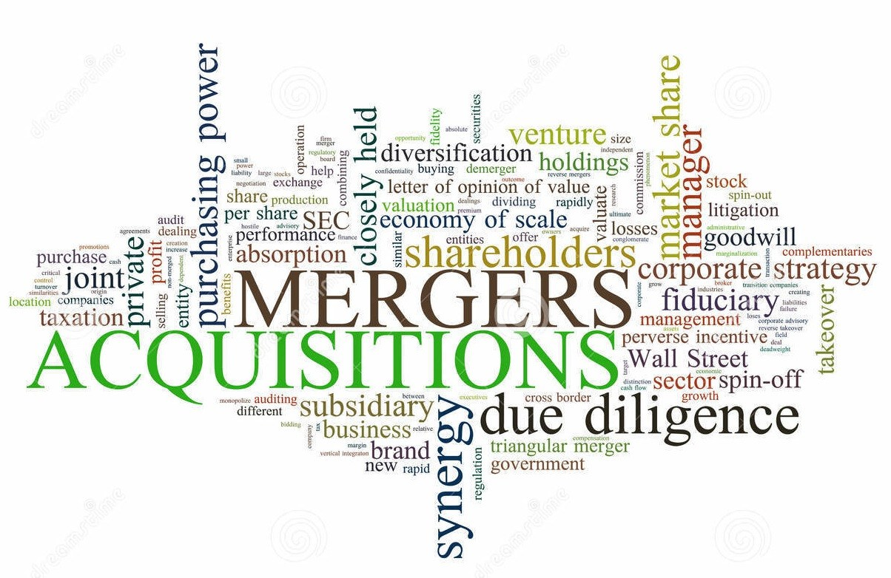

### Definition: Synergieeffekt

Ein Synergieeffekt ist eine positive Wirkung oder Resultat, welches durch einen Zusammenschluss oder eine Zusammenarbeit entsteht. Sie entstehen häufig durch Kostenersparnisse, die wiederum zu einem Wettbewerbsvorteil führen. [^1]

## Wobei entstehen Synergieeffekte

Synergieeffekte können durch verschiedene Kooperationen entstehen. Am Anfang solcher Kooperationen stehen oft Merger & Aquisition-Projekte, kurz M&A-Projekte. Damit sind generell Unternehmensfusionen oder -übernahmen gemeint. [^1]
Sinnvoll ist ein solches M&A-Projekt erst dann, wenn es interessante Überschneidungen zwischen den Produkten, Dienstleistungen oder Aktionsfeldern der beiden Unternehmen gibt. Anders können keine Synergieeffekte erzielt werden. Gesprochen wird bei solchen Überschneidungen von Ergänzungspotentialen oder operativem und strategischem Fit. Nicht sinnvoll wäre demnach eine Fusion eines Maschienenbau-Unternehmens und einer Bäckerei. Es könnten sich in der Theorie zwar Synergien in Verwaltungsbereichen ergeben, diese würden in der Praxis jedoch eher zu Mehrkosten durch die wachsende Komplexität führen. [^2]

## Ziele eines M&A-Projektes

[^3] 

Das Ziel eines M&A-Projektes ist es in einem reifen Markt weiterhin wachsen zu können. Dadurch kann in weitere Regionen expandiert werden oder neue Produkte können besser vermarktet werden. Blockiert wird dies vor der Akquisition durch fehlende Vertriebsstrukturen oder das nötige Know-How, um Innovationen wie die anderen Unternehmen voranzutreiben. Es kristallisieren sich folgende Hauptgründe für eine Akquisition heraus:[^4] 
* Stärkung und Ausweitung des bestehenden Kerngeschäftes
* Verbessern der Wettbewerbschancen
* Transfer des nötigen Know-Hows
* Intention: Wettbewerbsfähig machen des gekauften Unternehmens
* Absicht: Zerteilen des Unternehmens, um nur die Vermögensstelle zu nutzen, wie Patente

## Welche Synergien entstehen bei M&A-Projekten

Damit aber aus einer Fusion auch ein Mehrwert folgt, müssen diese Synergien herbeigeführt werden. Allein durch den Zusammenschluss unter einer Instanz sind noch keine Effekte bemerkbar. Aus Folgendem entstehen bei einem M&A-Projekt eine Synergie: [^1]
* Verwaltungsaufwand wird reduziert durch das Vereinen von Verwaltungseinheiten
* Gemeinkosten werden durch Verwendung der gleichen Infrastruktur, wie gleiche Rechenzentren, gesenkt
* Gemeinsame Vermarktung von Produkten steigen Verkaufszahlen
* Durch das Know-How beider Unternehmen erreicht man eine höhere Produktqualität
* Gemeinsame Nutzung von Patenten und Lizenzen führt zu Entwicklung neuer Produkte 

## Bekannte M&A-Projekte

Jährlich finden kleine sowie große Fusionen statt, die nicht nur auf regionaler, sondern auch internationaler Ebene stattfinden. Im Jahr 2019 gab es rund 50000 Merges & Aquisitions. [^5]
Eine der größten Fusionen war die von Google und Android im Jahr 2005. Google ist bekannt für ihre großen M&A-Projekte doch besonders dieser ist herausgestochen, da das Unternehmen Android für circa 50 Billionen Dollar gekauft wurde. Dabei war es zu diesem Zeitpunkt noch ein kleines Startup Unternehmen, welches noch keine Bekanntheit erlangt hat. Das durch Android erlangte Know-How verhalf Google sich in einem von Microsoft und Apple dominiertem Markt zu etablieren. [^5]

## Synergien aus Schnittstellenmanagement

Ein weiterer Teilaspekt der internen Synergieeffekte ist es die einzelnen Bereiche eines Unternehmens für ein Projekt mit sinnvollem Schnittstellenmanagement zu koordinieren. Dies ist im speziellen auch bei M&A-Projekten notwendig, um überhaupt einen Mehrwert zu erzielen. Wichtige Informationen durch die gezielte Kommunikation in alle Teilprojekte weiterzugeben kann zu einem Wertzuwachs führen, indem die Wiederverwendbarkeit eines Lösungsansatzes genutzt wird. Das Wissen eines Fachbereiches wird somit Abteilungsübergreifend verwendet und kann auch zu einer neuen Betrachtungsweise führen. [^6]
Für Schnittstellenmanagement werden sogenannte Project Management Offices aufgestellt, oder auch kurz PMO. Sie sind für die zentrale Steuerung von Projekten verantwortlich. Dadurch gestaltet sich die Kommunikation zwischen den Stakeholdern effizienter. Die Mitarbeiter unterstützen strategisch sowie operativ, um der Qualitätssicherung und effizienteres Arbeiten durch Wissens- und Ressourcenmanagement auszuhelfen. [^6]

# Siehe auch

* [Externe Synegieeffekte](Externe_Synergieeffekte.md)
* [Projektkommunikation](Projektkommunikation.md)
* [Projektsteuerung](Projektsteuerung.md)

# Weiterführende Literatur

* [Teamsynergie aufbauen](https://asana.com/de/resources/what-is-synergy)
* [Video zu Synergieeffekten](https://studyflix.de/wirtschaft/synergieeffekte-1899)
* [Synergieeffekte nutzen: Wie Sie Teamwork in allen Unternehmensbereichen stärken](https://www.wlw.de/de/inside-business/aktuelles/synergieeffekte-team)

# Quellen

[^1]: [Synergieeffekt](https://www.projektmagazin.de/glossarterm/synergieeffekt#beispiele)
[^2]: [Synergieeffekte: Grund und zwingende Vorgabe für Fusionen](https://www.umsetzungsberatung.de/pmi-post-merger-integration/synergieeffekte.php)
[^3]: [Why Mergers And Acquisitions Take Place](https://www.reacpa.com/why-mergers-and-acquisitions-take-place/)
[^4]: [Mergers & Aquisition](http://www.wirtschaftslexikon24.com/d/mergers-acquisitions/mergers-acquisitions.htm)
[^5]: [The 7 biggest Mergers and aquisitions](https://www.globalexpansion.com/blog/the-largest-mergers-and-acquisitions)
[^6]: [Zentrales Projektmanagement - Alles an einem Ort](https://www.nordantech.com/de/blog/project-management/zentrales-projektmanagement)
