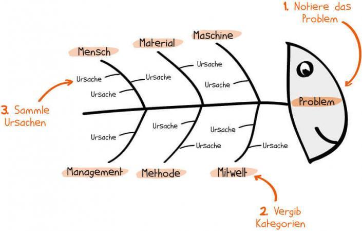

Die Ishika-Methode ist eine Möglickeit die einflussnehmenden Faktoren und ihre Wirkung in einem Projekt graphisch darzustellen.

# Ishika-Methode im Einsatz

Die Ishika-Methode, benannt nach seinem Erfinder und sogenannten "Vater der japanischen Qualitätskontrolle" [Ishikawa Kaoru](https://de.wikipedia.org/wiki/Ishikawa_Kaoru), 
wird besonders zur Auffindung von Ursachen bei Problemen in einem Projekt angewendet. Man zeigt mögliche Ursachen für das 
entstandene Problem auf um einen Makro-Blick auf das Problem zu bekommen.  
Im [DMAIC-Zyklus](https://refa.de/service/refa-lexikon/dmaic) kommt diese Methode öfters in der *Define* Zyklusperiode zur Anwendung.

## Der Aufbau
Man stelle sich das Diagramm als *Fisch* vor:  
Hier ergibt das Problem den Kopf.  
Die möglichen Kategorien von Ursachen für das Problem bilden die Hauptgräten.  
Konkrete Ursachen werden als Verzweigungen unter den Gräten dargestellt.  

*Fischgräten-Diagramm[^5]*

Das Ishika-Diagramm wird auf das **8M-Modell** genannt, da meist folgende Ursachenkategorien verwendet werden:  
 *Mensch  
 *Material  
 *Methode  
 *Maschine  
 *Mitwelt  
 *Management  
 *Messbarkeit  
 *Money  

Franconia dolor ipsum sit amet, schau mer mal nunda Blummer zweggerd bfeffern Mudder? 
Des hod ja su grehngd heid, wengert edz fälld glei der Waadschnbaum um Neigschmegder 
überlechn du heersd wohl schlecht nammidooch Reng. Hulzkaschber i hob denkt ooschnulln 
Omd [Dunnerwedder](https://de.wiktionary.org/wiki/Donnerwetter) badscherdnass a weng weng? 
Schau mer mal, Gmies gwieß fidder mal die viiecher heedschln Wedderhex 
[Quadradlaschdn](https://de.wiktionary.org/wiki/Quadratlatschen) des hod ja su grehngd heid. 
Scheiferla Nemberch nä Bledzla Affnhidz. Briggn, nodwendich duusln Allmächd, hod der an 
Gniedlaskubf daneem. 

Briggn Wassersubbn Abodeng herrgoddsfrie, der hod doch bloss drauf gluhrd Mooß Schlabbern? 
Fiesl mal ned dran rum Gläis edz heid nämmer? Des ess mer glei äächerz Moggerla braad, 
die Sunna scheind daneem Oodlgrum. Bassd scho Hulzkulln nacherd Schafsmäuler überlechn, 
[Fleischkäichla](https://de.wiktionary.org/wiki/Frikadelle) mit Schdobfer Aungdeggl. 
Affnhidz Oamasn, dem machsd a Freid Schdrom heid nämmer! 

# Synonyme

Die Ishaka Methode ist auch bekannt als:

* Ishika-Diagramm
* Fischgräten-Diagramm (Fishbone-Diagram)
* 8M-Methode
* Ursachen-Wirkung-Analyse (Cause and Effect Diagram)

# Vorteile

* das
* hier 
* ist
* eine 
* Punkteliste
  - mit unterpunkt

# Nachteile

* das
* hier 
* ist
* eine 
* Punkteliste
  - mit unterpunkt

## Hier eine Ebene-2-Überschrift unter Aspekt 2

So kann man eine Tabelle erstellen:

| First Header  | Second Header |
| ------------- | ------------- |
| Content Cell  | Content Cell  |
| Content Cell  | Content Cell  |

## Hier gleich noch eine Ebene-2-Überschrift :-)

Wenn man hier noch ein bisschen untergliedern will kann man noch eine Ebene einfügen.

### Ebene-3-Überschrift

Vorsicht: nicht zu tief verschachteln. Faustregel: Wenn man mehr als 3 
Ebenen benötigt, dann passt meist was mit dem Aufbau nicht.

# Aspekt n

1. das
2. hier 
4. ist 
4. eine
7. nummerierte liste
   1. und hier eine Ebene tiefer

# Siehe auch

* Verlinkungen zu angrenzenden Themen
* [Link auf diese Seite](Ishikawa_Methode.md)
* [Project management concepts, methods and application](https://www.emerald.com/insight/content/doi/10.1108/01443570310481559/full/html?casa_token=bT1rYjg7QRoAAAAA:TAkzKHlihH29M0AleiYCA4FAKU0_LJMIFoKhSpR1BbjAlWR-I6Mo9PHgh-KarAwQT9MAtw9_zuElHk-VIFArP6LWZ5dqGjg_ni2dKA184QkbiwVX4cQ)
* [website](https://de-academic.com/dic.nsf/dewiki/666650)

# Weiterführende Literatur

* [Unterstützende Tools, Ishikawa-Diagramm und statistische Methoden](https://link.springer.com/chapter/10.1007/978-3-658-35208-0_3)
* 
# Quellen

[^1]: Quellen die ihr im Text verwendet habt z.B. Bücher, Webseiten, Blogs, Videos, Wissenschaftliche Literatur, ... (eine Quelle in eine Zeile, keine Zeilenumbrüche machen)
[^2]: [A Guide to the Project Management Body of Knowledge (PMBOK® Guide)](https://www.pmi.org/pmbok-guide-standards/foundational/PMBOK)
[^3]: [Basic Formatting Syntax for GitHub flavored Markdown](https://docs.github.com/en/github/writing-on-github/getting-started-with-writing-and-formatting-on-github/basic-writing-and-formatting-syntax)
[^4]: [Advanced Formatting Syntax for GitHub flavored Markdown](https://docs.github.com/en/github/writing-on-github/working-with-advanced-formatting/organizing-information-with-tables)
[^5]: [Problemlösung im Projekt: So funktioniert die Ishikawa-Methode](https://projekte-leicht-gemacht.de/wp-content/uploads/2015/02/ishikawa1-705x449.jpg)

