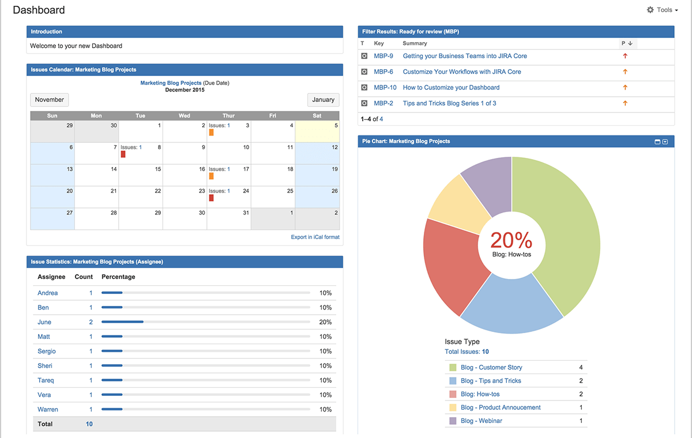

Jira ist eine von der Firma Atlassian entwickelte Software, die Ursprünglich für die Planung bei agile Softwareentwicklung erstellt wurde. Mittlerweile haben sich aber aus dem Ursprünglichen Programm die Unterprodukte Jira Software, Jira Service Management, Jira Work Management und Jira Align entwickelt[^1].
Für den Themenbereich des Projektmanagements ist das Produkt Jira Software relevant. Hier können Workflows definiert, Aufgaben erstellt und zugewiesen, sowie Fortschritt und Produktivität verfolgt werden[^2] . Neben den Grundfunktionen die Atlassian in Jira selbst anbieten, hat man als Nutzer die Möglichkeit mit Hilfe des Marketplace Applikationen von Drittanbietern zu installieren und somit noch mehr Funktionen zur Verfügung zu haben.

## 1. Hosting
Jira kann sowohl als Cloud-Hosting oder als selbstverwaltetes Hosting betrieben werden[^3]. Beim selbstständigen Hosten kann mittels Jira Software Data Center die Umgebung auf der eigenen Serverlandschaft oder bei Infrastructure-as-a-Service-Anbietern (IaaS)[^4], wie bei Amazon Web Services, Microsoft, Google oder diversen Anbietern verwalten. 

## 2. Preisliste
Bei Atlassian gibt es mehrere Preismodelle[^5]. Hier wird zwischen Cloud- und selbstverwaltetem Hosting unterschieden, aber auch die Nutzerzahl spielt eine Rolle. Ausgehend von 500 Benutzern ergeben sich bei jährlichem Zahlungsturnus folgende Preise: 


| Cloud-Hosting | Cloud-Hosting | Selbstverwaltetes Hosting |
| ------------- | ------------- | -------------|
| 500 Nutzer | 500 Nutzer | 500 Nutzer |
| Standard  | Premium  | Data Center |
| $30.000 pro Jahr  | $48.500 pro Jahr  | $42.000 pro Jahr |

Tabelle 1: Preisliste
Quelle: Atlassian. (2021). Modelle und Preise. https://www.atlassian.com/de/software/jira/pricing

## 3. Funktionsweise
In Jira muss zunächst vom Administrator ein Projekt angelegt werden. Im Anschluss kann eine Vorlage für das Projekt ausgewählt werden, was die Darstellung der Aufgaben beeinflusst. Man kann sich bei Jira-Software zwischen [Scrum](Jira_PM_Tool.md#61-scrum-board)- und [Kanban Boards](Jira_PM_Tool.md#62-kanban-board) entscheiden[^7]. Im Jira-Projekt können sogenannte [Vorgänge](Jira_PM_Tool.md#4-vorgänge) erstellt werden, die als Aufgaben, Risiken, Bugs aber auch diverse andere Typen gekennzeichnet werden[^8]. Diese Vorgänge müssen während ihrer Bearbeitung einen Workflow durchlaufen, der in den Projekteinstellungen definiert werden kann und für jede Aufgabe gilt. Auf den Projektboards oder extra erstellen [Dashboards](Jira_PM_Tool.md#63-dashboards) können die Vorgänge nach bestimmten Kriterien gefiltert dargestellt werden und somit eine leichtere Auswertung erfolgen.

## 4. Vorgänge
Aufgaben oder Tickets werden in Jira als Vorgang angelegt. Hierbei kann je nach Bedarf entschieden werden, um welche Art es sich dabei Handeln soll und aus verschiedenen Formaten wie „Aufgabe“, „Unteraufgabe“, „Themes“ eine passende Vorlage auswählen. Beim Erstellen muss ein Titel, sowie eine Beschreibung der Aufgabe hinzugefügt werden bevor diese angelegt werden kann[^9].


## 5. Filter
Mit Hilfe von Filtern kann nach bestimmten Vorgängen gesucht werden. Zum einen kann man als Benutzer direkt auf dem Projektboard mit hinzugefügten Schnell-Filtern per Auswahlliste oder Suchfeld die Ergebnisse einschränken, andererseits hat man die Möglichkeit über Jira-Query-Language (JQL)[^10] erweiterte suchen auszuführen. Diese erweiterten Suchen können auch getrennt von dem Projektboard als eigene Filter abgespeichert werden[^11] und so an verschiedenen Stellen wiederverwendet werden.

### 5.1 JQL-Code Beispiel
 
**Ausgabe alle Vorgänge, die dem aktuell angemeldeten Benutzer zugewiesen sind**[^12]

```
Project = Test AND assignee in (currentUser()) 
```

## 6. Jira-Boards
Neben den Projektboards gibt es noch [Dashboards](Jira_PM_Tool.md#63-dashboards), die unabhängig davon befüllbar sind. Hier können mit sogenannten Gadgets verschiedene Ergebnisse visualisiert werden. Neben Filterergebnissen, die mit JQL erstellt worden sind, können hier auch Grafiken und Reports eingebunden werden um einen schnellen Überblick über ein bestimmtes Thema innerhalb eines Projekts zu gewinnen.

### 6.1 Scrum Board


### 6.2 Kanban Board


### 6.3 Dashboards


## 7. Herausforderungen
Jira kann durch die Menge an Funktionalitäten sehr unübersichtlich wirken. Als Unternehmen muss hier eine klare Vorgehensweise beim Anlegen und Arbeiten mit den Vorgängen gesetzt werden, da sonst hoher Anpassungsbedarf und Mehraufwand entstehen kann. 

# Siehe auch

* [Kanban](https://github.com/ManagingProjectsSuccessfully/ManagingProjectsSuccessfully.github.io/blob/main/kb/Kanban.md)
* [Kanban Boards](https://github.com/ManagingProjectsSuccessfully/ManagingProjectsSuccessfully.github.io/blob/main/kb/Kanban_Boards.md)
* [Scrum](https://github.com/ManagingProjectsSuccessfully/ManagingProjectsSuccessfully.github.io/blob/main/kb/SCRUM.md)
* [Product Backlog](https://github.com/ManagingProjectsSuccessfully/ManagingProjectsSuccessfully.github.io/blob/main/kb/Product_Backlog.md)
* [Sprint Backlog](https://github.com/ManagingProjectsSuccessfully/ManagingProjectsSuccessfully.github.io/blob/main/kb/Sprint_Backlog.md)

# Weiterführende Literatur

* Weiterfuehrende Literatur zum Thema z.B. Bücher, Webseiten, Blogs, Videos, Wissenschaftliche Literatur, ...
* [Kanban Boards in Jira](https://support.atlassian.com/jira-software-cloud/docs/monitor-work-in-a-kanban-project/)
* [Jira Issue Types](https://support.atlassian.com/jira-cloud-administration/docs/what-are-issue-types/)
* [Jira Best Practices](https://www.atlassian.com/de/software/jira/guides/getting-started/best-practices)
* [What is a Jira-SoftwareBoard](https://support.atlassian.com/jira-software-cloud/docs/what-is-a-jira-software-board/

# Quellen

[^1]: [Jira-Produktfamilie](https://www.atlassian.com/de/software/jira/guides/getting-started/overview#about-the-jira-platform)
[^2]: [Jira für Projektmanagementteams](https://www.atlassian.com/de/software/jira/guides/use-cases/what-is-jira-used-for#jira-for-project-management-teams)
[^3]: [Hosting Modelle](https://www.atlassian.com/migration/assess/compare-cloud-data-center)
[^4]: [Infrastructure-as-a-Service-Anbietern (IaaS)](https://azure.microsoft.com/en-us/overview/what-is-iaas/)
[^5]: [Preismodelle Jira](https://www.atlassian.com/de/software/jira/pricing)
[^6]: [Create a Project](https://www.atlassian.com/de/software/jira/guides/getting-started/basics#step-1-create-a-project)
[^7]: [Vorlagenauswahl](https://www.atlassian.com/de/software/jira/guides/getting-started/basics#step-2-pick-a-template)
[^8]: [Create Issues](https://support.atlassian.com/jira-software-cloud/docs/create-an-issue-and-a-sub-task/)
[^9]: [What is an issue](https://support.atlassian.com/jira-software-cloud/docs/what-is-an-issue/)
[^10]: [Jira Advanced Search (JQL)](https://support.atlassian.com/jira-software-cloud/docs/save-your-search-as-a-filter/)
[^11]: [Eigene Filter erstellen](https://support.atlassian.com/jira-software-cloud/docs/save-your-search-as-a-filter/)
[^12]: [JQL Syntax](https://www.atlassian.com/software/jira/guides/expand-jira/jql#jql-syntax)
[^13]: [What is a Jira Dashboard](https://support.atlassian.com/jira-work-management/docs/what-is-a-jira-dashboard/)


## Bilder
 4. Jira Issue https://stiltsoft.com/blog/2020/06/best-practices-for-creating-a-jira-issue-with-templates/
 6.1 Scrum Backlog https://confluence.atlassian.com/jirasoftwareserver/using-your-scrum-backlog-938845361.html
 6.2 Kanban Board https://support.atlassian.com/jira-software-cloud/docs/monitor-work-in-a-kanban-project/
 6.3 Jira Dashboard https://www.atlassian.com/blog/jira-core/jira-core-dashboard-project-status-glance

 

