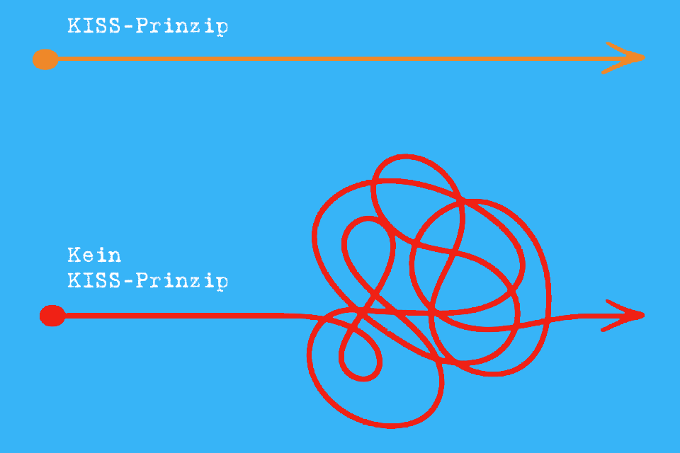
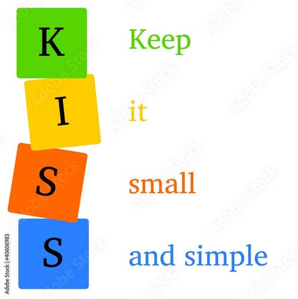

Der Luftfahrt- und Forschungsingenieur Clarence Johnson (1910-1990) verwendete erstmals den Satz “Keep It Simple, Stupid”, aus dem Englischen "Halte es einfach, Dummkopf!".[^1] “Stupid” gibt dem Satz eine wohlmeinende Bedeutung: "Zerbrich dir den Kopf nicht, wenn es auch einfach geht."[^2] Daraus entstand das KISS-Prinzip, welches heutzutage allerdings diverse Übersetzungen zur Grundlage haben kann.
Schon früher sagte Albert Einstein: “Wenn du es nicht einfach erklären kannst, hast du es nicht gut genug verstanden.” Damit drückte er kurz und knapp das “keep it simple, stupid” (KISS) aus. [^3]

# Definition

Etwas „simple“ zu halten bedeutet unter anderem, Ziele zeitlich zu terminieren und den Weg zum Ziel einzuteilen – wiederum mit terminierten Zwischenzielen. [^11]
**Minimalistisch, verständlich** und so, dass jeder damit zurechtkommt.[^4] Egal ob Studierende, unerfahrene Internet-Nutzer:innen, jemand aus einer anderen Branche oder eine außenstehende Person, die gar keine Ahnung von dem Thema hat. Jeder kann es problemlos verstehen, wenn man es einfach hält.
Hierbei gilt es als Leitsatz, [Kommunikation](https://managingprojectssuccessfully.github.io/kb/Projektkommunikation.html) möglichst einfach zu gestalten, sodass es zu **keinen Missverständnissen** oder unnötig komplexen Bearbeitungszeiten kommt.[^5] Auch in einer Zeit von rasanten Veränderungen konzentriert man sich bei gleichzeitig hohen Leistungsanforderungen auf das Wesentliche. 

Abbildung 1: KISS-Prinzip[^6]

# Mögliche Übersetzungen

Die beiden Buchstaben S in KISS können verschieden interpretiert werden. Für das erste S kommen folgende Übersetzungen in Frage: Simpel, Small, Short oder Silly. Das zweite S könnte wie folgt übersetzt werden: Stupid, Smart, Simpel, Straightforward. Das Akronym KISS bildet selbst wieder ein Wort (englisch kiss, deutsch Kuss). 

## Mögliche Bedeutungen der Abkürzung [^7]

1. Keep it simple, stupid
2. Keep it short and simple 
4. Keep it simple and straightforward 
4. Keep it simple and smart
5. Keep it simple [and] stupid
   *1. Keep it simply stupid*

Abbildung 2: KISS-Prinzip[^8]

# Funktion

Das KISS-Prinzip dient der **Reduzierung von Komplexität**.[^9] Es kann auch als eine Methode des [Selbstmanagements](Self_Management.md) verstanden werden. Viele Menschen erreichen ihre Ziele nicht, weil sie sich zu viel vornehmen. Stattdessen müssen sie diese daher mehr „smart and simple“ formulieren.[^2] Wenn ein Produkt nicht einfach und leicht verständlich ist, wird es schnell durch ein besseres ersetzt, das den Nutzer:innen eine höhere Usability bietet.
Außer **Einfachheit** und **Verständnis** ist auch der **Erinnerungswert** ein Bestandteil des Prinzips. Je umfangreicher etwas gestaltet ist, desto verworrener ist die Wahrnehmung damit.

# Anwendungsgebiete [^9][^10]

Besonders hohe Anwendung findet KISS im **Marketing, der Kommunikation, der Werbung und dem Management**. In der Produktentwicklung und Werbung ist es besonders wichtig, damit Vorgaben eingehalten werden und die Zielgruppe (oft von Kunden) bestens erreicht wird. KISS wird hierbei maßgeblich auf Botschaften und Gestaltung angewandt. Es wird aber auch in Bereichen wie **Webdesign, Produktdesign und Softwareentwicklung und auch [Projektmanagement](Projektmanagement.md)** eingesetzt. Im Ingenieurwesen erlangt das KISS-Prinzip viel Aufmerksamkeit, da es eine gute Grundlage für viele Projekte darstellt. Auch für CEOs, Trainer:innen und Ausbilder:innen bietet KISS viele Vorteile.

# Priorisierung nach Effektivität und Effizienz [^13]
[Ziele](Ziel_Planung.md) sind immer zu priorisieren, wobei die Prioritäten nach Effizienz und Effektivität bei der Erreichung sortiert werden müssen. Das bedeutet: Wenn ein bestimmtes Ziel erreicht wird, erzeugt es einen großen Effekt. Es steht aber die Frage, wie viel Aufwand die Erreichung kostet. Möglicherweise ist dieser Aufwand zu hoch und die angestrebte Effektivität verpufft. Manchmal lassen sich kleinere Ziele mit einem nicht so großen Effekt wesentlich effizienter erreichen und sollten daher eher priorisiert werden.

| Effizienz                | Effektivität                |
| -------------------------| --------------------------- |
| "Die Dinge richtig tun." | "Die richtigen Dinge tun."  |
| "Management"             | "Leadership"                |
Tabelle 1 [^12]

# Halten Sie es einfach, aber...

Einige Produkte sind von Natur aus komplexer als andere. Komplexität sollte dann vermieden werden, wenn sie nur um ihrer selbst willen existiert und sie keine Verbesserung für den Benutzer:innen darstellt.

# Siehe auch

* [Projektplanung](Projektplanung.md)
* [mehr Info zum KISS-Prinzip](https://startupwissen.biz/was-bedeutet-eigentlich-kiss)
* [Das KISS-Prinzip - Was ist das? / Wie kannst du es für dich nutzen?](https://www.youtube.com/watch?v=9q_nI2AkpKI&ab_channel=PhilippevonHogendorf)
* [Link auf diese Seite](KISS_Prinzip.md)

# Quellen

[^1]: [DAS KISS-PRINZIP](https://www.joker-agentur.de/das-kiss-prinzip/#top)
[^2]: ["KEEP IT SIMPLE STUPID!" (KISS) Prinzip. Mit weniger Zeitansatz bessere Ergebnisse erzielen!](https://www.youtube.com/watch?v=1gv8JNSlYio&ab_channel=DIEDIREKTKONTAKTER)
[^3]: [E-Learning meets KISS](https://www.hklearning.ch/e-learning-meets-kiss/)
[^4]: [Living #Minimalism explained by #Dummies author: Kiss #Simplicity rule](https://www.youtube.com/watch?v=k7AM9mcYpJ4&ab_channel=Minimalismus)
[^5]: [KISS-Prinzip in der Kommunikation](https://www.projektmagazin.de/glossarterm/kiss-prinzip)
[^6]: [KISS-Prinzip](https://stock.adobe.com/de/images/kiss-prinzip/40606983?as_campaign=ftmigration2&as_channel=dpcft&as_campclass=brand&as_source=ft_web&as_camptype=acquisition&as_audience=users&as_content=closure_asset-detail-page)
[^7]: [KISS Principle - Keep it simple and stupid! (Mit Profi-Tipp)](https://www.youtube.com/watch?v=_-pmzdQS5sI&ab_channel=DavidTielke)
[^8]: [KISS-Prinzip](https://stock.adobe.com/de/images/kiss-prinzip/40606983?as_campaign=ftmigration2&as_channel=dpcft&as_campclass=brand&as_source=ft_web&as_camptype=acquisition&as_audience=users&as_content=closure_asset-detail-page)
[^9]: [KISS-Prinzip](https://www.projektmagazin.de/glossarterm/kiss-prinzip)
[^10]: [DAS KISS-PRINZIP](https://www.arocom.de/fachbegriffe/projektmanagement/kiss-prinzip)
[^11]: [Ziele erreichen mit der KISS-Strategie - So bleibst du dauerhaft auf Ziel-Kurs](https://www.youtube.com/watch?v=6aJ7ZwMeBz4&ab_channel=UlrichM%C3%B6ssinger)
[^12]: [KISS-Prinzip in der Kommunikation](https://people-with-passion.com/kiss-effektivitaet-effizienz)
[^13]: [K.I.S.S - Wie Sie mit erfolgreichem Selbstmanagement Ihre Ziele erreichen](https://www.steinbeis-smt.com/blogreader/k-i-s-s-wie-sie-mit-erfolgreichem-selbstmanagement-ihre-ziele-erreichen.html)
