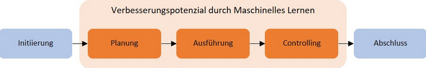
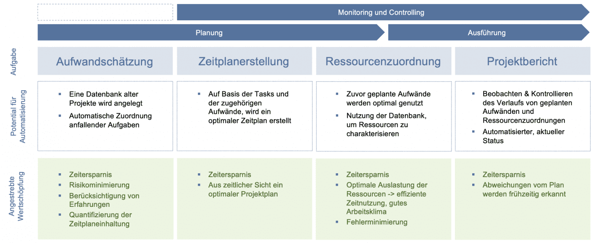

Künstliche Intelligenz (KI) oder im Englischen Artificial Intelligence (AI) genannt, ist ein Teilbereich von Data Science, welcher abermals ein Teilbereich der Informatik ist. 
KI als Oberbegriff lässt sich dementsprechend in [Maschinelles Lernen](Machine_Learning_im_Projektmanagement.md) (eng. [Machine Learning](Machine_Learning_im_Projektmanagement.md)), Neuronale Netze und Deep Learning unterteilen. 
Das Forschungsgebiet der KI versucht, menschliche Wahrnehmung und menschliches Handeln sowie Denken durch Maschinen zu erfassen und nachzubilden (Bollmann, Janiak, 2021)[^1]. 
  
# 1. Allgemeines über die Künstliche Intelligenz

Heutzutage gewinnt die Künstliche Intelligenz aufgrund von großen Datenmengen, hoch entwickelter Algorithmen und Verbesserungen bei Rechenleistung und Datenspeicherung immer mehr an Bedeutung. 
Dadurch werden die KI und ihre Fähigkeiten nun auch in verschiedenen Bereichen wie dem Gesundheitswesen, der Forschung, dem Sport als auch in der Unternehmenswelt vermehrt eingesetzt [^2].

## 1.1 Aufgaben der Künstlichen Intelligenz

Eine der Hauptaufgaben der KI ist es, Maschinen die Fähigkeit zu verleihen, Aufgaben autonom und mit der Hilfe von Algorithmen ausführen zu können. 
Außerdem wird gleichzeitig versucht menschliches Lernen und Denken auf einen Computer zu übertragen und ihm damit Intelligenz zu verleihen, sodass dieser aus Erfahrung lernen, sich auf neu eingehende Informationen einstellen und verschiedene Aufgaben und Probleme bewältigen kann (Stadler, 2021)[^3]. 

## 1.2 Bedeutsamkeit der Künstlichen Intelligenz

Warum künstliche Intelligenz so wichtig ist, lässt sich durch verschiedene Aspekte begründen. 
Zum einen ermöglicht die KI mithilfe von neuronalen Netzen die Analyse größerer Datenmengen. Zum anderen ist sie mittels progressiven Lernalgorithmen viel wandlungsfähiger. 
Außerdem schöpft die künstliche Intelligenz das volle Potenzial von Daten aus und kann Unternehmen somit einen Wettbewerbsvorteil verschaffen [^2].

# 2. Künstliche Intelligenz im Projekmanagement 

Künstliche Intelligenz gewinnt auch im [Projektmanagement](Projektmanagement.md) der Unternehmensbranche immer mehr an Wichtigkeit. 
Bis heute können [Projekte](Projekt.md) noch nicht vollumfänglich durch die KI gesteuert werden, jedoch sind diese mittlerweile im Arbeitsalltag deutlich bemerkbar. 
Auf lange Sicht gesehen wird die AI Projektmanager*Innen weitestgehend von administrativen Tätigkeiten entlasten, sodass zwischenmenschliche Kernkompetenzen, wie beispielsweise Kommunikation, Führung und Empathie stärker in den Fokus gerückt werden können (Treffenstädt, 2021)[^4].

## 2.1 Voraussetzungen der Künstlichen Intelligenz im Projektmanagement

Es werden drei Faktoren als wichtig für die Einführung von KI im Bereich des [Projektmanagements](Projektmanagement.md) angesehen. 
Eine der wichtigsten Triebkräfte sind grundsätzlich die Verfügbarkeit von KI-gesteuerten Systemen innerhalb der Organisation, die vorhandene Erfahrung, sowie die Nachfrage nach Innovation und Wertschöpfung. 
Außerdem gehören die Produktivitätssteigerung, die Entscheidungsfindung und die Gesamtleistung im [Projektmanagement](Projektmanagement.md) zu den wichtigsten Vorteilen der Einführung von KI-Technologien in [Projekten](Projekt.md) (Wagner, 2020)[^5].

## 2.2 Einführung in Projektmanagement-KI

Das Projektmanagement-KI ist ein System, welches in der Lage ist, das Tagesgeschehen in verschiedenen [Projekten](Projekt.md) zu managen, ohne dabei auf den menschlichen Input angewiesen zu sein.
Zum einen bedeutet dies die Automatisierung von Routinetätigkeiten, wie zum Beispiel die Erstellung von Statusreports. 
Zum anderen generiert das System neue Einsichten in die Projekt-Performance. 
KI ist also in der Lage, im Rahmen der [Software](KI_Software_fuer_Projektmanagement.md)-Entwicklung jede Änderung am Quellcode nachzuvollziehen, sodass sich eine Verbindung zwischen auftretenden Bugs, den zugehörigen Codes und den damit verbundenen Arbeitspaketen herstellen lässt. 
Eine solche Analyse deckt die Feinheiten in den Arbeits- und Verhaltensmustern des Projektteams auf. 
Sie befähigt es allen Mitarbeiter*Innen, das angemessenste Arbeitspaket in Bezug auf individuelle Fähigkeiten und Arbeitstempo auszufiltern. Somit wird schneller aus Fehlern gelernt und damit ein nachhaltigeres Wissensmanagement aufgebaut (Treffenstädt, 2021)[^4].

## 2.3 Einsatz von Künstlicher Intelligenz in [Projekten](Projekt.md)

Die KI hat das Potential das [Projektmanagement](Projektmanagement.md) an mehreren Stellen entscheidend zu entlasten. 
So können Anpassungen und Optimierungen von Projektplänen aufgrund von Verzögerungen, Kapazitätsengpässen oder anderen Elementen des [Risikomanagements](Risikomanagement.md) vorgenommen werden. 
Außerdem können große Datenmengen schnell analysiert werden und nebenbei auf Erfahrungswerte zurückgegriffen werden [^6].  
KI gibt den Unternehmen des Weiteren die Möglichkeit durch das [Maschinellen Lernen](Machine_Learning_im_Projektmanagement.md) einige Schritte im Verlauf eines [Projektes](Projekt.md) besser zu organisieren. 
Verbesserungspotenzial durch Machine Learning ist in Phasen wie der Planung, Ausführung und dem Controlling möglich (Bollmann, Janiak, 2021)[^1].  

  

*Verbesserungspotential durch Machine Learning* [^1]

## 2.4 Einsatz von Künstlicher Intelligenz in Invensity

[Invensity](https://www.invensity.com/) ist eine globale Technologie- und Innovationsberatung, die ihre Unternehmenspartnern und Kunden bei Produktentwicklungen unterstützen. 
Sie hat sich die KI und ihr [Maschinelles Lernen](Machine_Learning_im_Projektmanagement.md) zu Nutze gemacht und mit der „AI Use Case Analysis“ eine Methode entwickelt, um das [Projektmanagement](Projektmanagement.md) zu optimieren. 
Hierbei gibt es kein zentrales Tool, sondern ein Set an unterschiedlichen Werkzeugen in Form von Algorithmen, die ineinandergreifen. 
Ihre Absicht ist es, verschiedene Arten von Daten zu analysieren und auszuwerten, damit Probleme in Projekten gelöst werden können, die bislang nicht lösbar erschienen, wie beispielsweise in den Bereichen der Aufwandsschätzung, [Zeitplanerstellung](Zeitplanung.md), Ressourcenzuordnung oder im Projektreporting [^6].  

  

*KI im Projektmangement* [^6]

# Abkürzungsverzeichnis
KI = Künstliche Intelligenz  
AI = Artificiale Intelligence  
PM = Projektmanagement

# Siehe auch

- [Projekt](Projekt.md)  
- [Projektmanagement](Projektmanagement.md)
- [Machine Learning im Projekmanagement](Machine_Learning_im_Projektmanagement.md)
- [KI Software für Projektmanagement](KI_Software_fuer_Projektmanagement.md)
- [Risikomanagement](Risikomanagement.md)
- [Zeitplanung](Zeitplanung.md)

# Quellen

[^1]: https://www.projektmagazin.de/artikel/kuenstliche-intelligenz-ki-projektmanagement
[^2]: https://www.sas.com/de_de/insights/analytics/what-is-artificial-intelligence.html 
[^3]: https://mindsquare.de/knowhow/kuenstliche-intelligenz/ 
[^4]: https://www.assure.de/de/blog/projektmanagement-ki-chance-oder-risiko 
[^5]: https://www.tiba.de/wie-kuenstliche-intelligenz-ki-das-projektmanagement-beeinflusst/ 
[^6]: https://www.invensity.com/consulting/project-management/ki-im-projektmanagement/ 

