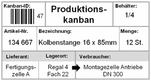

[Kanban](Kanban.md) wörtlich aus dem japanischen Übersetzt bedeutet „visuelle Karte / Zeichen“. Mit dem Ziel einen transparenten Workflow zu generieren und Ausschuss zu vermeiden, sollten ursprünglich die einzelnen Arbeitselemente im Prozess auf einzelnen, damals aus Papier bestehenden, sogenannten Kanban-Karten abgebildet werden. Die einzelnen Arbeitselemente können so den gesamten Prozess über verfolgt werden. Diese Kanban-Karten wiederum werden auf dem [Kanban-Board](Kanban_Boards.md) festgehalten.
Die Karten bilden das Kernelement eines Kanban-Systems. Sie enthalten viele wichtige Informationen zu den Aufgaben: Status, Aufgabenübersicht, Verantwortliche, Frist, etc. Sie dienen außerdem als Informationsknotenpunkt, da sie frei zugänglich sind und erhöhen somit auch die Transparenz des Gesamtprozesses. Durch die Informationsteilung, wird zudem der Bedarf an Meetings zum Informationsaustausch reduziert.
Inzwischen wurden die physischen Kanban-Modelle Großteils durch digitale Online-Lösungen ersetzt. Die digitalen Kanban-Karten sind nun besser zugänglich und können ortsunabhängig eingesehen werden. Darüber hinaus können die Karten ansprechender und übersichtlicher gestaltet werden[^1][^2].

# Aufbau einer Kanban-Karte

*Beispiel einer physischen Kanban-Karte [^3]*

Die Kanban-Karten haben in der Regel eine Vorder- und eine Rückseite. Die Vorderseite zeigt grundlegende Informationen zur Aufgabe, wie: Beschreibung, Titel, Bearbeiter, Zyklusdauer, Priorität und Unteraufgaben. Die Vorderseite dient also dem Erlangen eines schnellen Überblicks, da sie auf dem [Kanban-Board](Kanban_Boards.md) direkt einsehbar ist. Die Rückseite bildet Details ab. Hier können wichtige Kennzahlen und Informationen vermerkt werden, eigene Kommentare erstellt werden sowie Dateien und externe Links angehängt werden[^1].

Folgende Informationen könnten auf der einer Kanban-Karte abgebildet werden:

| Information | Beschreibung |
| ------------- | ------------- |
| Kanbanart | Es sollte leicht erkennbar sein, um welche [Kanbanart](https://de.wikipedia.org/wiki/Kanban#Kanban-Karten) es sich handelt. |
| Kanban-Karten-Nr. / Kanban-ID | Kanban-Karten sind durch eindeutige Kennzeichnungen markiert. |
| Gesamt-Anzahl der Kanban-Karten | Es sollte sowohl erkennbar sein, wie viele Kanban-Karten für einen Artikel im Umlauf sind, als auch um die wievielte Karte es sich bei diesem Exemplar handelt. |
| Artikel-Nr. | Die Artikel-Nr. entspricht der Nummer aus dem MRP-System |
| Artikel-Bezeichnung | Die Bezeichnung des Artikels entspricht der Bezeichnung des MRP-Systems |
| Kanban-Menge | Die Kanban-Menge ist die Menge, die von der [Kanbanart](https://de.wikipedia.org/wiki/Kanban#Kanban-Karten) betroffen ist, also beispielsweise produziert wird. |
| Quelle / Lieferant | Je nach [Kanbanart](https://de.wikipedia.org/wiki/Kanban#Kanban-Karten) wird hier der Fertigungsbereich, Lieferanten-Nummer und Name, oder der Lagerbereich angegeben. |
| Lagerort an der Quelle | Der konkrete Lagerort ist wichtig, um Suchzeiten gering zu halten. |
| Ziel / Verbraucher | Zielbereich wo die Kanban-Menge verbraucht oder umgelagert wird. |
| Lagerort am Ziel | Konkreter Lagerort im Zielbereich |
| Produktbild | Zur Visualisierung des Artikels auf der Kanban-Karte. |
| Barcodes | Barcodes dienen der Beschleunigung der EDV-Eingabe der Kanban-Karten. |

[^2][^3]

# Gestaltung einer Kanban-Karte

Aufgrund von unterschiedlichen Arbeitsweisen und Prioritäten, werden Kanban-Karten in der Regel speziell auf die individuellen Anforderungen des Unternehmens angepasst. Wichtig hierbei ist, dass stets alle für das Projekt wichtigen Informationen abgebildet werden. Dementsprechend finden nicht immer alle der oben aufgeführten Angaben Einzug auf die Kanban-Karten. Zur besseren Übersichtlichkeit können bei der Gestaltung auch Farbcodes eingesetzt werden. Angestellte erkennen auf diese Weise direkt anhand der Farbe der Karte beispielsweise um welche [Art von Kanban](https://de.wikipedia.org/wiki/Kanban#Kanban-Karten) es sich handelt [^3].

# Siehe auch

* [Kanban](Kanban.md)
* [Kanban-Boards](Kanban_Boards.md)
* [Kanban_Pull_Prinzip](Kanban_Pull_Prinzip.md)
* [Kanban_Swim_Lanes](Kanban_Swim_Lanes.md)
* [Kanban_Work_in_Progress](Kanban_Work_in_Progress.md)

# Weiterführende Literatur

* [Kanban - der Weg ist das Ziel](https://link.springer.com/content/pdf/10.1007/978-3-540-34338-7_4.pdf)
* [Lean Six Sigma - Methoden zur Produktionsoptimierung](https://link.springer.com/content/pdf/10.1007%2F978-3-662-63008-2.pdf)

# Quellen

[^1]: [Was ist eine Kanban-Karte?](https://kanbanize.com/de/kanban-ressourcen/kanban-erste-schritte/was-ist-kanban-karte)
[^2]: [Überblick zu Kanban](https://de.wikipedia.org/wiki/Kanban#Kanban-Karten)
[^3]: [Kanban-Kartengestaltung](https://www.lean-production-expert.de/kanban-kartengestaltung)

