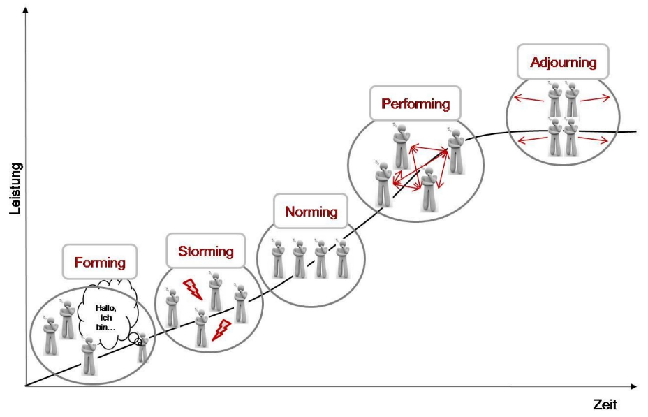

Kennenlernspiele im Arbeitskontext dienen dazu, ein Team, dessen Teilnehmer sind nicht bzw. kaum kennen und vor einer Kooperation stehen, in der ersten Phase des [Projekts](Projekt.md) zu unterstützen. Sie können sowohl in Präsenz, als auch online in abgewandelter Form eingesetzt werden.

# Einsatz in Projekten

Die Bereitschaft zum Wissensaustausch und zur Kollaboration ist bei Mitgliedern eines Teams geringer je  größer die Diversität und Unbekanntheit in der Gruppe ist[^1]. 
Um den Einstieg in und die Grundlage für eine erfolgreiche Zusammenarbeit zu schaffen, können Kennenlernspiele, die in einer Vielzahl existieren, verwendet werden[^2].

Ihr Einsatz eignet sich insbesondere beim [Projekt-Kick-Off](Projekt-Kick-Off.md) in der *Forming-Phase* des Phasenmodells nach Tuckman (1965)[^3]. Hier treffen die Teammitglieder zum ersten Mal aufeinander und lernen sich kennen. Dabei besteht noch Unklarheit bezüglich der Rollen und Positionen im Team. „Diese Phase ist [als Folge dessen] oft von einem eher formellen und vorsichtigen „Abtasten“ gekennzeichnet“[^4]. Es werden jedoch auch die Grenzen des zwischenmenschlichen und des aufgabenbezogenen Verhaltens erforscht und Abhängigkeitsbeziehungen zu den übrigen Gruppenmitgliedern und zu möglichen Leitern aufgebaut[^5]. 

*Phasenmodell nach Tuckman*

[Projektleiter](Projektleiter.md) können, mit Blick auf den Gruppenzusammenhalt und damit den Projekterfolg, u.a. folgende Maßnahmen koordinativ ergreifen[^4][^6]: 

* Rahmenschaffung durch gemeinsam vereinbarte Regeln
* Stärkung des Vertrauens und des Commitments der Einzelnen
* Schaffung eines guten Klimas und eines Willkommenseinsgefühls
* Förderung des Kennenlernprozesses, der Einfindung im Team und des Zusammenhalts
* Erkennen und Sichtbar-Machen der Kompetenzen im verteilten Team

# Beispiele

Je nach Kontext, Umfang und geplanter Dauer des Projekts, der Größe des Teams, sprachlicher und technologischer Gegebenheiten, sowie weiterer Einflussfaktoren kommen unterschiedliche Kennenlernspiele in Frage.

Einige davon erfordern das Zusammenkommen vor Ort, während andere auch im Home Office durchführbar sind.

|               |  Vor Ort                         |  Home Office                     |
| ------------- | -------------------------------- | ---------------------------------|
|Oberflächlich  |- [Fadennetz](#Fadennetz)         |- [Alle, die...](#Alle,_die_...)  |
|               |- Speed Meeting[^7]               |- Touch_blue[^13]                 | 
|               |- Zip-Zap[^8]                     |- Two kinds[^14]                  |
|               |- Sales Pitch[^9]                 |- Hashtags nutzen[^15]            |
|Tiefergehend   |- [Gerüchteküche](#Gerüchteküche) |- [Schlüsselbund](#Schlüsselbund) |
|               |- Value Activity[^10]              |- Gemeinsamkeiten finden[^16]     |
|               |- Was gehört wem?[^11]            |- 10 things to do in life[^17]    | 
|               |- Namen malen[^12]                |                                  |
               
*Beispiele für Kennenlernspiele*               
               
## Kennenlernspiele vor Ort

Kennenlernspiele vor Ort lassen sich sowohl unter Zuhilfenahme von Hilfsmitteln, als auch ohne diese organisieren.  

Beim Spiel *Fadennetz* bilden die Teilnehmer sitzend einen Kreis. Das Ende des Fadens haltend, wirft der Spielleiter einen Wollknäuel einer Person zu, welche etwas über sich erzählt, den Faden um eine Hand legt und den Knäuel weiterwirft. Im Spielverlauf bildet sich ein Netz aus dem Faden und jeder Teilnehmer stellt sich kurz vor, sodass ein oberflächliches Kennenlernen erfolgt[^18].

Einen tiefergehenden Austausch ermöglicht das Spiel *Gerüchteküche*. Dabei erzählt jeder Teilnehmer einem Mitspieler eine kleine Geschichte über sich, woraufhin dieser sie dem nächsten Partner wiedergibt. Dadurch sind alle Beteiligten gefordert gut zuzuhören und es entstehen Anknüpfpunkte für weitere Gespräche[^19].

## Kennenlernspiele im Home Office

Die Covid-19-Pandemie hat in Deutschland zu einer signifikanten Verlagerung der Arbeit in das Home Office geführt.[^20] Virtuelle Kennenlernspiele haben das Potential, diesen Übergang für alle Beteiligten zu erleichtern.

Bei *Alle, die...* schalten die Mitspieler ihre Kameras ein, kleben sie mit einem farbigen Klebezettel ab und aktivieren die Gallerie-Ansicht. Der Moderator stellt Fragen, die mit „Alle, die …“ beginnen, z.B. „Alle, die heute schon sportlich waren.“ oder „Alle, die nicht ohne Kaffee können.“ Jene Teammitglieder, die sich dazu zählen, decken die Kamera ab. Das Verschaffen eines ersten Eindrucks sowie die Identifikation von Gemeinsamkeiten, Unterschieden sowie dem Ausmaß an Diversität des Teams wird möglich[^21].

Das Spiel *Schlüsselbund* gibt den Teilnehmenden die Gelegenheit sich über ihre Wohnsituation, Freizeitgestaltung, Fortbewegung und weitere Aspekte ihres Alltags auszutauschen. Durch das Beschreiben der einzelnen Schlüssel kommen verschiedenste Informationen über deren Besitzer gebündelt zu Tage, sodass ein facettenreiches Kennenlernen der Teammitglieder gelingt. Alternativ kann das Spiel mit sonstigen persönlichen Gegenständen durchgeführt werden[^22].

# Siehe auch

* [Digitale_Kommunikation](Digitale_Kommunikation.md)
* [Herausforderungen_bei_internationalen_Projekten](Herausforderungen_bei_internationalen_Projekten.md)
* [Faehigkeiten_Projektleiter](Faehigkeiten_Projektleiter.md)
* [Global_Project_Management_Survey](Global_Project_Management_Survey.md)
* [Internationale_Projektteams](Internationale_Projektteams.md)

# Weiterführende Literatur

* [https://www.gisi.ch/dienstleistungen/prozesse-strukturen-und-virtualitaet/prozess-und-projektmanagement/grundlagen-fuer-ein-erfolgreiches-projekt/](https://www.gisi.ch/dienstleistungen/prozesse-strukturen-und-virtualitaet/prozess-und-projektmanagement/grundlagen-fuer-ein-erfolgreiches-projekt/)
* [https://de.wikipedia.org/wiki/Teambildung](https://de.wikipedia.org/wiki/Teambildung)
* [https://dieprojektmanager.com/checkliste-kick-off-meeting-projekte/](https://dieprojektmanager.com/checkliste-kick-off-meeting-projekte/)

# Quellen

[^1]: https://www.marconomy.de/vier-erstaunliche-erfolgsfaktoren-fuer-die-agile-zusammenarbeit-a-853629/
[^2]: https://asana.com/de/resources/icebreaker-questions-team-building
[^3]: https://lehrbuch-psychologie.springer.com/sites/default/files/atoms/files/web-exkurs.008.05.pdf
[^4]: [Volker Johanning, *Organisation und Führung der IT: Die neue Rolle der IT und des CIOs in der digitalen Transformation*, Springer Vieweg, Marl am Dümmersee, 2020, S. 190](https://link.springer.com/book/10.1007%2F978-3-658-12008-5)
[^5]: [Bruce W. Tuckman, *Developmental sequence in small groups.* In: Psychological Bulletin, 1965](https://psycnet.apa.org/record/1965-12187-001)
[^6]: [Simone Kauffeld, *Arbeits-, Organisations- und Personalpsychologie für Bachelor*, 3. Auflage, Springer, 2019](https://link.springer.com/content/pdf/10.1007%2F978-3-662-56013-6.pdf)
[^7]: https://www.teamgeist.com/blog/kennenlernspiele/
[^8]: https://www.seminar-tools.com/8-kennenlernspiele-fuer-erwachsene/
[^9]: https://www.stellenanzeigen.de/arbeitgeber/wecruit/5-kennenlernspiele-fuer-erwachsene/
[^10]: https://scrumburg.wordpress.com/2012/06/27/spielerischer-projekt-kickoff/
[^11]: https://www.factro.de/blog/teambuilding-spiele/
[^12]: https://www.lernen.net/artikel/kennenlernspiele-8115/
[^13]: https://www.workshop-spiele.de/aufwaermspiel-fuer-video-call-workshops/
[^14]: https://blog.fundraisingbox.com/16-virtuelle-teambuilding-spiele-fuer-remote-teams-im-homeoffice
[^15]: https://www.lernen.net/artikel/kennenlernspiele-8115/
[^16]: https://www.factro.de/blog/teambuilding-spiele/
[^17]: https://blog.fundraisingbox.com/16-virtuelle-teambuilding-spiele-fuer-remote-teams-im-homeoffice
[^18]: https://karrierebibel.de/teambuilding/
[^19]: https://www.factro.de/blog/teambuilding-spiele/
[^20]: [https://de.statista.com/statistik/daten/studie/1204173/umfrage/befragung-zur-homeoffice-nutzung-in-der-corona-pandemie/, Stand 21.11.21](https://de.statista.com/statistik/daten/studie/1204173/umfrage/befragung-zur-homeoffice-nutzung-in-der-corona-pandemie/)
[^21]: https://www.workshop-spiele.de/schnelles-kennenlernspiel-fuer-video-meetings-und-online-seminare/
[^22]: https://www.xing.com/communities/posts/kennenlern-uebung-schluesselbund-1002838141                                                                                       
