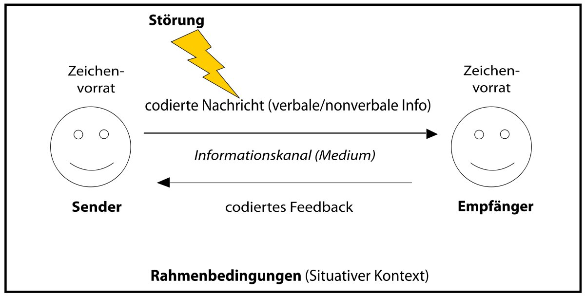

# Inhaltsverzeichnis

1. [Definition Kommunikation](#definition-kommunikation)  
2. [Kommunikationsarten](#kommunikationsarten)  
2.1 [Paraverbale Kommunikation](#paraverbale-kommunikation)  
2.2 [Nonverbale Kommunikation](#nonverbale-kommunikation)
3. [Der Weg zur effizienten Kommunikation unter Projektbeteiligten](#der-weg-zur-effizienten-kommunikation-unter-projektbeteiligten)
4. [Sender Empfänger Modell](#sender-empfänger-modell)
5. [Quellen](#quellen)

# Definition Kommunikation 

Das Mittel zur Verständigung unter Menschen ist die Kommunikation. Mit Hilfswerkzeugen, wie Mimik, Gestik, Stimme, Körperhaltung und die menschliche Sprache können die Menschen miteinander interagieren. Sowohl im Privat- als auch im Berufsleben kommunizieren wir ständig und sind auf die Kommunikationsfähigkeit der anderen angewiesen. Das Problem ist hier jedoch, dass die Hilfswerkzeuge anfällig für Störungen sind und somit Informationen falsch weitergegeben und aufgenommen werden. Dadurch können Streitigkeiten und Missverständnisse entstehen und die zwischenmenschliche [Interaktion](https://github.com/SimaSol/ManagingProjectsSuccessfully.github.io/blob/main/kb/Interaktion.md) wird gestört.[^1]

# Kommunikationsarten 
Es wird vor allem unter nonverbaler und paraverbaler Kommunikation unterschieden.[^2]
## Paraverbale Kommunikation
Der Begriff paraverbale Kommunikation umfasst das ganze Spektrum der verbalen Kommunikation, mit der wir Informationen vermitteln. Folgende Komponenten spielen dabei eine wichtige Rolle:
*	Stimmlage (hoch/tief, tragend/zitternd/krächzend),
*	Lautstärke (angenehm/unangenehm laut / allzu leise)
*	die Aussprache (deutlich/undeutlich/genuschelt)
*	die Betonung einzelner Wörter oder Satzteile
*	das Sprechtempo (schnell/langsam)
* die Sprachmelodie (Modulation – eintönig/moduliert/singend)

Das Schweigen und Redepausen spielen ebenfalls eine wichtige Rolle und sind ein Teil der Komponenten.
Die paraverbalen Faktoren sind außerdem Kultur bzw. Region abhängig. Das bedeutet Informationen können je nach empfinden anders wahrgenommen werden und haben folglich eine andere Bedeutung [^3][^4]
## Nonverbale Kommunikation
Bei der nonverbalen Kommunikation wird im Gegenteil zur paraverbalen die Kommunikation nicht durch Worte bzw. Sprache geäußert. Informationen werden also vermittelt, ohne etwas zu sagen jedoch damit ist nicht die Schriftsprache noch die Gebärdensprache gemeint. Folgende Komponenten spielen dabei eine wichtige Rolle: 
*	Blick (Blickkontakt fixieren, halten oder wegschauen, Augen rollen etc.)
* Mimik (Bewegung der Mundwinkel, Augenlider, Nasenflügel etc.)
*	Gestik (einhändig, beidhändig, gar keine, ruhig, nervös, ausholend, etc.)
*	Habitus (Frisur, Make-up, Kleidung, «Accessoires» wie Hund, Auto etc.)
*	Haltung (aufrechte/gebeugte Haltung, fester/unsicherer Stand/Gang etc.) 

 Laut Studien wird die zu übermitteln Botschaft zu 90 Prozent mit notverbaler und paraverbaler Kommunikation zum Ausdruck gebracht.[^5][^6]
# Der Weg zur effizienten Kommunikation unter Projektbeteiligten
Die Kommunikation unter Projektbeteiligten ist eines der wichtigsten Bestandteile eines erfolgreichen Projektes. Da in Projekten die Aufgaben meist unter den Teampartnern aufgeteilt werden, hilft die Kommunikation dabei die ausgearbeiteten Informationen auszutauschen. Bei guter Kommunikation können des weiteren Missverständnisse vermieden werden. Die im [Projekt](https://github.com/jonaskarg187/ManagingProjectsSuccessfully.github.io/blob/main/kb/Projekt.md) beteiligten bzw. die Stakeholdern-/innen müssen sich dazu persönlich weiterentwickeln, um eine reibungslose Kommunikation erzielen zu können. Dies kann durch sogenannten Kommunikation Skills erreicht werden. Dazu gehört es nicht nur Informationen gut übermitteln zu können, sondern auch die Information der anderen Teilnehmer richtig interpretieren und deuten zu können. Die Kommunikationsfähigkeit lässt sich wie jede andere Fähigkeit durch [Events](https://github.com/Tjara1/ManagingProjectsSuccessfully.github.io/blob/main/kb/Events.md), Training und Übungen verbessern. Es gibt Seminare und Kurse, in denen man explizit darauf eingeht, wie eine erfolgreiche Kommunikation auszusehen hat. 
Seit längerer Zeit beschäftigten sich auch schon Große Philosophen mit dem Thema Kommunikation und arbeiteten verschieden [Methoden](https://github.com/Theresa1703/ManagingProjectsSuccessfully.github.io/blob/main/kb/Methoden.md) und Modelle aus.[^7] 
# Sender Empfänger Modell 
Eines der grundlegendsten Kommunikationsmodelle ist das Sender Empfänger Modell nach Shanon Weaver. Es beschreibt die den Kommunikationsverlauf zwischen dem Sender und dem Empfänger. Hier wird eine Nachricht vom Sender kodiert und nach der Übertragung auf der Empfängerseite wieder dekodiert. Im ideal fall funktioniert das, jedoch kann es durch aus passieren das Störungen auftreten und beispielsweise Informationen auf der Empfänger Seite verfälscht ankommen. Die Störungen können unterschiedliche Ursachen haben. „Dies können einerseits uneinheitlicher Code auf Sender- und Empfängerseite z. B. Mehrdeutigkeiten, implizit vorausgesetztes Vorwissen, Transformationseffekte, unterschiedliche Sprachen und evtl. daraus entstehende Übersetzungsfehler, kulturelle Unterschiede und andererseits Störungen während der Übertragung sein“.[^8]

*Abbildung 1* [^9]

# Quellen

[^1]: [Kommunikation(landsiedel-seminare)](https://www.landsiedel-seminare.de/coaching-welt/wissen/lexikon/kommunikation.html)
[^2]: [Kommunikationsarten(knowunity)](https://knowunity.de/knows/deutsch-kommunikationsarten-verbal-nonverbal-paraverbal-87115)
[^3]: [ParaverbaleKommunikation(ikud)](https://www.ikud.de/glossar/paraverbal.html)
[^4]: [ParaverbaleKommunikation(kuerzeundwuerze)](https://kuerzeundwuerze.ch/wissenswertes/wissen-von-a-z/paraverbale-kommunikation/)
[^5]: [NonverbaleKommunikation(onpulson)](https://www.onpulson.de/lexikon/nonverbale-kommunikation/)
[^6]: [NonverbaleKommunikation(kuerzeundwuerze)](https://kuerzeundwuerze.ch/wissenswertes/wissen-von-a-z/nonverbale-kommunikation/)
[^7]: [DerWegzureffizientenKommunikationunterProjektbeteiligten(proventis)](https://www.proventis.net/de/projektmanagement-begriff/kommunikation-im-projektteam)
[^8]: [SenderEmpfängerModell(sophist)](https://www.sophist.de/fileadmin/user_upload/Bilder_zu_Seiten/Publikationen/RE7/Webinhalte_BT2/Kapitel_8/Kommunikationsmodelle.pdf)
[^9]: [SenderEmpfängerModell(Wikipedia)](https://de.wikipedia.org/wiki/Datei:Sender-Empfänger-Modell.svg)
