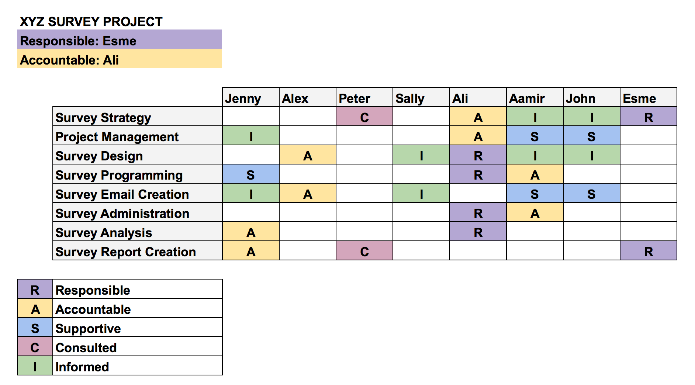

„Konfliktmanagement bezeichnet den Prozess der Konflikterkennung, -analyse, -lösung und der nachhaltigen Konfliktvermeidung.“[^1]  
Dabei stellt sich die Frage, was überhaupt ein Konflikt ist.
Das Wort „[…] Konflikt leitet sich ab vom lateinischen Substantiv „conflictus“, das so viel wie „Zusammenstoß“ bedeutet […]“[^2]
und beschreibt dementsprechend eine Situation, in der unterschiedliche Ansichten und Vorlieben aufeinandertreffen.[^3]

Konflikte können bereits sehr früh erkannt werden, da „der Ansatz von Konflikten […] 
schon in der [Projektstart-Phase](Projektphasen_klassisch.md) entstehen [kann]."[^4]
Auf einen fehlgeschlagenen Projektstart folgt meist ein Konflikt.[^5]  
Die frühzeitige Erkennung und Vermeidung von Konflikten spielt somit bei dem Konzept des klassischen Projektmanagements eine wichtige Rolle, 
da diese bei der umfangreichen [Projektplanung](Projektplanung.md) berücksichtigt werden können.  
Zentrale Aufgaben der Projektleitung, im klassischen Projektmanagement, sind Uneinigkeiten mittels eindeutiger Ansagen und durchdachtem Vorgehen zu umgehen.[^6]

Um Konflikte bestmöglich zu lösen, hat man sich Gedanken gemacht, welche verschiedenen Arten es von Konflikten gibt. 
Im Folgenden sind einige dieser Möglichkeiten aufgelistet:

| SACHLICHE KONFLIKTE  | PSYCHOSOZIALE KONFLIKTE |
| ---------------------| ---------------------- |
| Zielkonflikt         | Wertekonflikt          |
| Beurteilungskonflikt | Beziehungskonflikt     |
| Verteilungskonflikt  |                        |
| Rollenkonflikt       |                        |

[^7]
 
Mithilfe dieser Untergliederung, kann man auf die einzelnen Konflikte mit bestimmten Lösungsansätzen, wie beispielsweise der Rasic-Matrix oder ausgeprägtem Verhandlungsgeschick, besser und schneller reagieren.[^7]

# 1. Erkennen, analysieren und lösen eines Konflikts am Beispiel des Rollenkonflikts

Ein Rollenkonflikt im Allgemeinen ist eine Auseinandersetzung von zwei oder mehreren Personen eines Projektteams,
die sich uneinig über die Aufgabenverteilung sind.[^7]
Deswegen ist es wichtig, im klassischen Projektmanagement 
„Rollen, also Status, Aufgaben und Verantwortungsbereiche der einzelnen Teammitglieder, bei Projektstart“[^8] klar voneinander abzugrenzen und zu verteilen.

## 1.1 „Using RASIC Roles for Successful Collaborations“[^9]

Mithilfe der R.A.S.I.C Matrix kann im klassischen Projektmanagement vorab die Rollenverteilung veranschaulicht und verwaltet werden,
wobei die Abkürzung R.A.S.I.C für Responsible, Accountable, Support, Informed und Consultet steht.[^7]
Somit handelt es sich hier um die Rollen der Verantwortlichkeit, der Rechenschaftspflichtigkeit, der Unterstützung, der Information und der Konsultation.
Die R.A.S.I.C Matrix ist eine erweiterte Form der Standard-Matrix [RACI](RACI.md),
welche die Rolle der Verantwortlichkeit noch in die Rolle der Unterstützung unterteilt.[^10]

Im Folgenden ist eine solche RASIC [Matrix] (https://wirtschaftslexikon.gabler.de/definition/matrix-37186) vereinfach dargestellt:

 [^11]
*Rasic-Matrix*

Durch die Abbildung lässt sich zeigen, dass eine solche [Matrix](Matrix_Projektorganisation.md) vorab erstellt werden kann, um Auseinandersetzungen bezüglich der Rollenverteilung, die während des Projekts entstehen können, zu vermeiden. „Sollte es nun doch [vorab] zu Uneinigkeiten in Bezug auf die Aufgabenverantwortlichkeiten kommen, ist die Erstellung einer RASIC-Matrix ein gutes Instrument, um Transparenz und Klärung herbeizuführen.“ [^8]

# 2. Fazit und Kritik am Konfliktmanagement in Bezug auf unterschiedliche Projektmanagement-Ansätze

## 2.1 Kritik

Menschen handeln beispielsweise in Werte- und Beziehungskonflikten aus Emotionen heraus.[^7] Deshalb ist es teilweise nicht abschätzbar, wann einer dieser Konflikte entsteht. Um darauf besser eingehen zu können, ist der Ansatz des agilen Projektmanagements von Vorteil, da hier in „zeitlich beschränkten Zyklen (Sprints) [ge]arbeite[t] [wird], um flexibel auf Veränderungen zu reagieren“[^12] „Agiles Projektmanagement gilt [somit] als Antwort auf die Nachteile klassischer Methoden, wenn beispielsweise Anforderungen nicht im Vorhinein präzise und nachvollziehbar formuliert werden können“.[^13]

## 2.2 Fazit

Wie bereits erwähnt ist "eines der wesentlichen Elemente des Konfliktmanagements […] die Fähigkeit, mögliche Konflikte und Konfliktpotenziale bereits im Vorfeld zu erkennen und entsprechende Verhandlungsstrategien zu entwickeln, um den Konflikt gar nicht erst entstehen zu lassen"[^8]. Folglich stellt sich zuletzt die Frage, ob Konfliktmanagement im klassischen Projektmanagement sinnvoll ist. Die Antwort ist, ja. Konflikte lassen sich durch einige Methoden, wie beispielsweise die R.A.S.I.C. Matrix, im klassischen Projektmanagement schon bei der anfänglichen Planung des definierten Endzustandes eines Projektes erkennen und vermeiden.[^14] Bezüglich der Kritik wäre es jedoch möglich den Ansatz des hybriden Projektmanagements in Betracht zu ziehen, da hierbei die positiven Eigenschaften des Projektmanagements übernommen werden und die negativen Aspekte ersetzt werden durch innovative Ideen des agilen Projektmanagements.[^14]

# Siehe auch

* [Projektstart-Phase](Projektphasen_klassisch.md)
* [Projektplanung](Projektplanung.md)
* [RACI](RACI.md)
* [Matrix](Matrix_Projektorganisation.md)

# Weiterführende Literatur zum Thema Konfliktmanagement 

* https://www.youtube.com/watch?v=adoexrCtcjU

# Quellen

[^1]: [Holger Timinger, Wiley-Schnellkurs Projektmanagement (2015)]
[^2]: [Wytrzens Hans Karl, Projektleitung (2018)]
[^3]: [Vgl Wytrzens Hans Karl, Projektleitung (2018)]
[^4]: [Sabine Peipe, Crashkurs Projektmanagement; Grundlagen für alle Projektphasen (2020)]
[^5]: [Vgl. Sabine Peipe, Crashkurs Projektmanagement; Grundlagen für alle Projektphasen (2020)]
[^6]: [Vgl Raffael, Konfliktmanagement in Projekten (5.11.2013)](https://derwirtschaftsinformatiker.de/2013/11/05/projektmanagement/konfliktmanagement-in-projekten/)
[^7]: [Vgl. Anne Schüßler & Peter Schüßler, Weniger schlechte Projekte Managen; Ohne Krise zum Projekterfolg (4.9.2020)]
[^8]: [Anne Schüßler & Peter Schüßler, Weniger schlechte Projekte Managen; Ohne Krise zum Projekterfolg (4.9.2020)]
[^9]: [iDOGrants, How to Use a R.A.S.I.C Roles, Accountability and Responsibility Matrix (20.4.2018)](https://idogrants.org/2018/04/20/how-to-use-a-r-a-s-i-c-roles-accountability-and-responsibility-matrix/)
[^10]: [Vgl. Responsibility assignment matrix (last edit: 11.10.21)](https://en.wikipedia.org/wiki/Responsibility_assignment_matrix)
[^11]: [Bildquelle: Amber Bezahler, RASCI 101: How to move from chaos to order (2.4.2019)](https://medium.com/@abezahler/rasci-101-how-to-move-from-chaos-to-order-5b25db0869f4)
[^12]: [Mahir Kulalic, Was ist agiles Projektmanagement? (19.09.2021)](https://www.factro.de/blog/agiles-projektmanagement/)
[^13]: [Nadine Ebel, Projektmanagement](https://www.materna.de/Microsite/Monitor/DE/2020-01/Management-und-Strategie/pm-methoden/pm-methoden)
[^14]: [Vgl. Nadine Ebel, Projektmanagement](https://www.materna.de/Microsite/Monitor/DE/2020-01/Management-und-Strategie/pm-methoden/pm-methoden)

