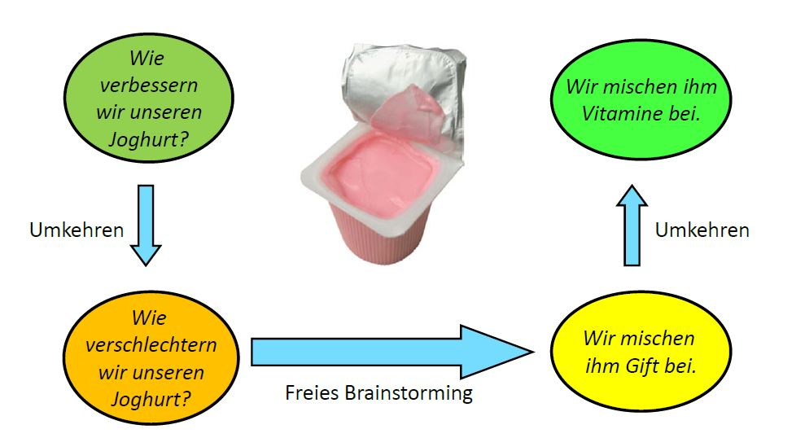

# Einführung
Die Kopfstandtechnik ist eine Kreativitätstechnik und wird auch als Umkehrtechnik oder Flip-Flop-Technik bezeichnet. [^1]
Ziel ist es, mit Hilfe eines unkonventionellen Denkmusters den Lösungsraum für ein Problem zu erweitern.
Da die Technik das Ziel verfälscht, ist sie eine [Provokationstechnik](Provokationstechnik.md). [^2]

# Gliederung

* [Einführung](Kopfstandtechnik.md#Einführung)
* [Gliederung](Kopfstandtechnik.md#Gliederung)
* [Vorgehensweise](Kopfstandtechnik.md#Vorgehensweise)
* [Erweiterungen und Tipps](Kopfstandtechnik.md#Erweiterungen und Tipps)
* [Vorteile & Nachteile](Kopfstandtechnik.md#Vorteile & Nachteile)
* [Beispiele](Kopfstandtechnik.md#Beispiele)
* [Fazit](Kopfstandtechnik.md#Fazit)
* [Weiterführende Links](Kopfstandtechnik.md#Weiterführende Links)
* [Weiterführende Literatur](Kopfstandtechnik.md#Weiterführende Literatur)
* [Quellen](Kopfstandtechnik.md#Quellen)

# Vorgehensweise

1. Die Tatsächliche Aufgabe formulieren.
2. Eine passende Anti-Aufgabe finden.
3. Ein Brainstorming zu möglichen Lösungen durchführen.
4. Alle Lösungen umkehren, sodass sie wieder zur ursprünglichen Aufgabe passen.

# Erweiterungen und Tipps

## 1. Schritt

Je detaillierter die tatsächliche Aufgabe formuliert wird, desto einfacher findet man im 2. Schritt die Anti-Aufgabe.
Insbesondere kann man für Adjektive leicht Gegensatzpaare finden.

## 2. Schritt

Auch im zweiten Schritt ist es wichtig eine aussagekräftige Formulierung zu finden.
Zum einen sind aussagekräftige Verben wichtig und zum anderen sollten Verneinungen wie **Nicht** und **Kein** nicht verwendet werden.

## 3. Schritt

* Um Lösungen für die Anti-Aufgabe zu finden, kann man eine Brainwriting Methode benutzen. (z.B. die [6_3_5_Methode](6_3_5_Methode.md))
* Damit die Taktrate hoch bleibt, kann man die Zeit für das Brainstorming begrenzen. (z.B. mit [Timeboxing](Timeboxing.md))
* Mit Hilfe der [Walt_Disney_Methode](Walt_Disney_Methode.md) kann man zusätzlich von der eigenen Perspektive noch von 3 weiteren der Lösung annähern.
* Als kleine Abwandlung und Abkürzung kann man eine [Negativkonferenz](Negativkonferenz.md) durchführen und sich so auch den 4. Schritt sparen :slightly_smiling_face:.

## 4. Schritt

Im letzten Schritt ist es hilfreich alle Ideen für alle gut sichtbar im Raum zu verteilen.

# Vorteile & Nachteile

| Vorteile | Nachteile |
| :---:| :---: |
| Die Regeln sind leicht verständlich. | Häufig sind die Ergebnisse Selbstverständlichkeiten.[^3] |
| Wenig Aufwand und Vorbereitung sind erforderlich. | Nicht jede Anti-Lösung kann umgekehrt werden. |
|  Es können unerwartete und nützliche Einsichten in die Problemstellung entstehen. | Für die Antilösungen wird ähnliches Fachwissen benötigt, wie zur Lösung der eigentlichen Aufgabenstellung.|
| Die Methode hat eine niedrige Hemmschwelle für Introvertierte. | Bei komplexen Ideenfindungsaufgaben ist die Methode sehr schwierig anzuwenden. |
| Die Betriebsblindheit wird durch die ungewöhnliche Art zu denken umgangen. |  |
| Funktioniert auch als Einzelperson. | |
| Das Brainstorming kann sehr viel Spaß machen. | |

# Beispiele

## 1. Beispiel: Newsletter-Anmeldeformular

1.	Wie gestalten wir das Newsletter-Anmeldeformular, damit es alle Interessenten sicher abonnieren?
2.	Wie gestalten wir das Newsletter-Anmeldeformular, damit es jeden Interessenten sicher vergrault?
3.	Viele Pflichtfelder; Viele Seiten, damit Interessenten einen hohen Aufwand vermuten; Keine Autovervollständigung; Navigation per Tabulator-Taste deaktivieren
4.	Unser Online-Formular zur Newsletter-Anmeldung besteht aus einem einzigen Feld, in dem die E-Mail-Adresse mit Vorschlägen in einer Drop-Down Liste eingetragen wird.

## 2. Beispiel: Fehlerquote in einer Fabrik

1.	Wie reduzieren wir die Fehlerquote in unserer Fabrik?
2.	Wie erhöhen wir die Fehlerquote in der Fabrik?
3.	Wir vergeben einen Preis für die meisten Fehler.
4.	Wir belohnen die Einhaltung einer Qualitätsvorgabe.

## 3. Beispiel: Joghurt Herstellung

| Abbildung 1 |
| :--- |
| *Kopfstandtechnik zu der Aufgabe: "Wie verbessern wir Joghurt?". [^2]* |
|  |

# Fazit

Die Kopfstandtechnik ist eine einfache und sehr mächtige Kreativitätstechnik, sofern sie für die spezifischen Aufgaben anwendbar ist.
Dies kann man allerdings zu Beginn nicht vorhersagen.
Trotzdem kann sie eine Bereicherung im Alltag sein.

# Weiterführende Links

* [Provokationstechnik](Provokationstechnik.md)
* [6_3_5_Methode](6_3_5_Methode.md)
* [Timeboxing](Timeboxing.md)
* [Walt_Disney_Methode](Walt_Disney_Methode.md)
* [Negativkonferenz](Negativkonferenz.md)

# Weiterführende Literatur

Edward de Bono. (1996). Serious Creativity: Die Entwicklung neuer Ideen durch die Kraft lateralen Denkens.

# Quellen

[^1]:	 Was ist die Kopfstandtechnik? (o.D.). T2 Informatik. https://t2informatik.de/wissen-kompakt/kopfstandtechnik/
[^2]: Horton, G. (2001). Die Kopfstandtechnik. Ideenfindung durch Umkehrung der Aufgabenstellung. Magdeburg: Idea Development and Application Lab
[^3]: Kopfstandtechnik (2021, 03. Februar). Wikipedia. https://de.wikipedia.org/wiki/Kopfstandtechnik
