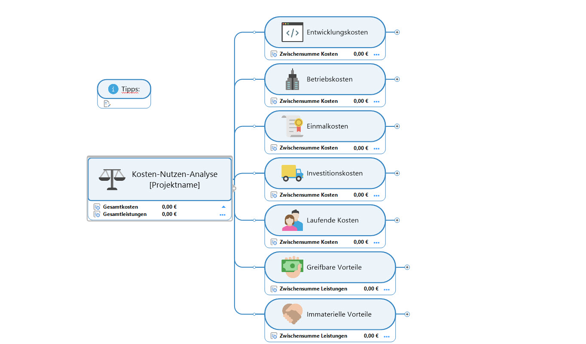

Die Kosten-Nutzen-Analyse ist ein Bewertungsverfahren, das die Wirtschaftlichkeit von [Projekten](Projekt.md) prüft und den monetär bewerteten Nutzen mit den Kosten einer Maßnahme vergleicht.
> „Zweck der Analyse ist die Auswahl der Alternative aus einer Menge von möglichen Alternativen, deren Realisierung ein Gesamtziel am effektivsten erfüllt.“(Hüftle, 2006)[^1]

# Kosten-Nutzen-Analyse
Im [Projektmanagement](Projektmangement.md) hat der [Projektleiter](Faehigkeiten_Projektleiter) die Aufgabe, Aufträge sinnvoll zu erteilen, sodass diese zum Projekterfolg beitragen. Hierbei kann eine Kosten-Nutzen-Analyse hilfreich sein.

## Definition

Die Kosten-Nutzen-Analyse ist eine Wirtschaftlichkeitsuntersuchung, d.h. sie bewertet den prognostizierten, monetären Aufwand aller anfallenden Kosten und entstehendem Nutzen. Dementsprechend wird versucht, dem Nutzen sowie den Kosten einen [Geldwert](https://de.wikipedia.org/wiki/Geldwert) beizumessen, um eine einfache Vergleichbarkeit zwischen verschiedenen Alternativen zu ermöglichen.[^2]

Die Ergebnisse der Analyse tragen maßgeblich zu richtungsweisenden Entscheidungen bezüglich z.B. der [Projektplanung](Projektplanung.md) oder -budgetierung bei. 

## Rahmenbedingungen 
Im Vorfeld der Durchführung müssen gewisse Rahmenbedingungen bestimmt werden, sowie Voraussetzungen erfüllt sein, welche für einen reibungslosen Ablauf sorgen sollen. 

* Zuallererst wird die zu untersuchende Situation, also die Problem- und Aufgabenstellung, beschrieben. 
* Dem folgt die Benennung von Bewertungskriterien, anhand deren der Nutzen definiert wird. 
* Um der Analyse einen festen Rahmen zu geben, wird ein [Analyse-Umfeld](Umfeldanalyse.md) festgelegt.
* Als letztes werden die zu analysierenden Maßnahmen genannt und definiert.[^2]

Um die Analyse fundiert durchsetzen zu können, sind vorher noch einige wichtige Aspekte zu berücksichtigen.
| Checkliste[^3]  |
| ------------- |
| Ziel der Analyse ? | 
| Alleiniges Entscheidungskriterium ?  | 
| Ausmaß des Einflusses auf Entscheidung  |
| Wer führt die Analyse durch ? |
| Wurden genügend qualitative Merkmale ausgewählt ? |
| Woher kommen Informationen, Daten, Fakten ? |
| Wie können Merkmale bewertet werden ? |
| Angemessener Zeitraum angesetzt ? |

Innerhalb dieses Rahmens erfolgt die eigentliche Analyse. 

## Vorgang der Analyse 

Der detaillierte Ablauf der Analyse unterscheidet sich in manchen Quellen bezüglich Reihenfolge und Wortlaut. Im Grunde zielen jedoch alle auf dasselbe Ergebnis.

Nach Hüftle beinhaltet die Analyse 11 Schritte, wie im folgenden aufgelistet[^1]: 

1.	Aufstellen des Zielsystems: Struktur des Zielsystems muss standfest sein, damit daraus wichtige mess- bzw. schätzbare Indikatoren herausgelesen werden können
2.	Bestimmung von Indikatoren, mithilfe derer abgeleitet werden kann welche Wirkung die Ausführung einer Alternative hat.
3.	Analyse der Rahmenbedingungen, ob und welche die Entscheidung verzerren können
4.	Festlegung von Alternativen, sowie der [Nullalternative]( https://wiki.baw.de/de/index.php/Nullalternative)
5.	Definition von möglichen Auswirkungen der Alternativen auf die Ziele
6.	Monetäre Bewertung der möglichen Auswirkungen
7.	Anwendung einer [Sensitivitätsanalyse]( https://www.bwl-lexikon.de/wiki/sensitivitaetsanalyse/) 
8.	[Diskontierung]( https://www.compeon.de/glossar/diskontieren/#modal-1 ) aller Kosten und Nutzen auf einen gemeinsamen Stichtag
9.	Vergleich der Nutzen und Kosten und Berechnung der erforderlichen Kennzahlen 
10.	Gesonderte Bestimmung von nicht-monetär beschreibbaren Indikatoren
11.	Entscheidung: Nach Berücksichtigung der monetären Kennzahlen sowie nicht-monetären Auswirkungen, 
                  Auswahl der Alternative mit dem besten Kosten-Nutzen-Verhältnis
                  
*Mögliche Modellierung eines Diagramms einer Kosten-Nutzen-Analyse*

[^4]

Literatur kann via Fußnoten angegeben werden[^1]. Es gibt auch das PMBOK[^2].
Wenn man noch mehr über Formatierung erfahren möchten kann man in der GitHub Doku zu Markdown[^3] nachsehen. 
Und wenn man es ganz genau wissen will gibt es noch mehr Doku[^4]. 

Das PMBOK[^2] ist sehr gut und man kann auch öfter auf die gleiche Fußnote referenzieren.

# Aspekt 1

Aspekte zu Themen können ganz unterschiedlich sein:

* Verschiedene Teile eines Themas 
* Historische Entwicklung
* Kritik 

*lustiges Testbild*

# Aspekt 2

* das
* hier 
* ist
* eine 
* Punkteliste
  - mit unterpunkt

## Hier eine Ebene-2-Überschrift unter Aspekt 2

So kann man eine Tabelle erstellen:

| First Header  | Second Header |
| ------------- | ------------- |
| Content Cell  | Content Cell  |
| Content Cell  | Content Cell  |

## Hier gleich noch eine Ebene-2-Überschrift :-)

Wenn man hier noch ein bisschen untergliedern will kann man noch eine Ebene einfügen.

### Ebene-3-Überschrift

Vorsicht: nicht zu tief verschachteln. Faustregel: Wenn man mehr als 3 
Ebenen benötigt, dann passt meist was mit dem Aufbau nicht.

# Aspekt n

1. das
2. hier 
4. ist 
4. eine
7. nummerierte liste
   1. und hier eine Ebene tiefer

# Siehe auch

* Verlinkungen zu angrenzenden Themen
* [Link auf diese Seite](Kosten_Nutzen_Analyse.md)

# Weiterführende Literatur

* Weiterfuehrende Literatur zum Thema z.B. Bücher, Webseiten, Blogs, Videos, Wissenschaftliche Literatur, ...

# Quellen

[^1]: Hüftle, M.(2006); Bewertungsverfahren, http://www.optiv.de/Methoden/BewVerfa/BewVerfa.pdf (aufgerufen am 12.11.2021)
[^2]: Angermeier, G.(2005); Kosten-Nutzen-Analyse, https://www.projektmagazin.de/glossarterm/kosten-nutzen-analyse (aufgerufen 09.11.1021)
[^3]: Kosten-Nutzen-Analyse, https://www.lexoffice.de/lexikon/kosten-nutzen-analyse/ (aufgerufen am 15.11.2021)
[^4]: Wenzelis, N. (2021); Diagramme zur Kosten-Nutzen-Analyse: Was sie sind und wie man sie einsetzt, https://blog.mindmanager.com/de/blog/diagramme-zur-kosten-nutzen-analyse-was-sie-sind-und-wie-man-sie-einsetzt/ (aufgerufen am 16.11.2021)

