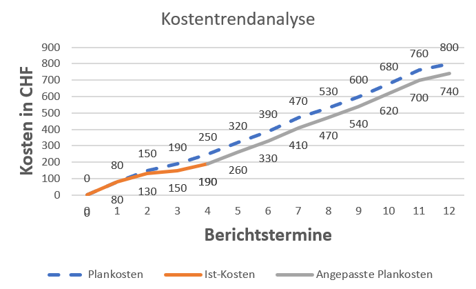

Genau wie Terminverzögerungen sind Kostenabweichungen ein wichtiges Thema, welche im [Projektmanagement](Projektmanagement.md) gut durchdacht werden muss. Wenn beispielsweise ein Teil der Lieferkette nicht so funktioniert, wie vorgesehen, können Mehrkosten entstehen, wodurch es ziemlich schnell zu einer Überschreitung der geplanten Kosten kommen kann. Deshalb ist es in der Planung wichtig, gewisse Kostenrisiken schon vorher abschätzen zu können. Dabei wird im klassischen Projektmanagement sehr oft die Kostentrendanalyse als Hilfsmittel genutzt! [^1]

## Inhalte 
>1. [Ziele der Kostentrendanalyse](#ziele-der-kostentrendanalyse)   
>2. [Vorteile der Kostentrendanalyse](#vorteile-der-kostentrendanalyse)   
>3. [Nachteile der Kostentrendanalyse](#nachteile-der-kostentrendanalyse)  
>4. [Ablauf einer Kostentrendanalyse](#ablauf-einer-kostentrendanalyse)  
  >>* 4.1  [Schritt 1: Diagramm erstellen](https://github.com/thujavanj/ManagingProjectsSuccessfully.github.io/blob/main/kb/Kosten_Trend_Analyse.md#schritt-1-diagramm-erstellen)  
  >>* 4.2  [Schritt 2: Plankosten zusammenstellen](https://github.com/thujavanj/ManagingProjectsSuccessfully.github.io/blob/main/kb/Kosten_Trend_Analyse.md#schritt-2-plankosten-zusammenstellen)
  >>* 4.3  [Schritt 3: Berichtstermine definieren](https://github.com/thujavanj/ManagingProjectsSuccessfully.github.io/blob/main/kb/Kosten_Trend_Analyse.md#schritt-3-berichtstermine-definieren)  
  >>* 4.4  [Schritt 4: Kosten eintragen](https://github.com/thujavanj/ManagingProjectsSuccessfully.github.io/blob/main/kb/Kosten_Trend_Analyse.md#schritt-4-kosten-eintragen)   
  >>* 4.5  [Schritt 5: Kostenabweichungen erkennen](https://github.com/thujavanj/ManagingProjectsSuccessfully.github.io/blob/main/kb/Kosten_Trend_Analyse.md#schritt-5-kostenabweichungen-erkennen)   
>5. [Siehe auch](#siehe-auch)  
>6. [Weiterführende Literatur](#weiterführende-literatur)  
>7. [Quellen](#quellen)

## Ziele der Kostentrendanalyse 
Die Kostentrendanalyse ist in ihrer Umsetzung und Darstellung ähnlich zur [Meilensteintrendanalyse](Meilensteintrendanalyse.md). Jedoch wäre anders als dort, hier auch die Kosten als Faktor miteinbezogen. Die anfangs geplanten Kosten eines jeden Teilprojekts, werden den Ist-Kosten gegenübergestellt und durch geschätzte Restkosten bis zum Projektende ergänzt. So erhält man Angaben zu den anfallenden Kostendifferenzen. Zudem können so Risiken frühzeitig erkannt und Prognosen für den weiteren Verlauf des Projekts erstellt werden. [^2] 

## Vorteile der Kostentrendanalyse
Die wichtigsten Vorteile dieser Methode im Bereich Kostencontrolling ist, dass zu jedem Zeitpunkt des Projekts die Kostenentwicklung inklusive eine Prognose für die Zukunft betrachtet und eventuelle Kostenrisiken frühzeitig erkannt werden können. Die Darstellung ist dabei übersichtlich, verständlich und unterscheidet sich nicht von der Meilensteintrendanalyse. Durch diese Ähnlichkeit zur [Meilensteintrendanalyse](Meilensteintrendanalyse.md) wird es möglich, beide Methoden optimal zu kombinieren. [^1]

## Nachteile der Kostentrendanalyse
Jede Analyse sowie jede Prognose ist nur so gut wie die Daten, aus der sie hervorgehen. Deshalb ist es wichtig, die Ist-Kosten der Teilprojekte so genau wie möglich zu erfassen. Zudem handelt es bei der Kostentrendanalyse lediglich um eine Kostenbetrachtung, wodurch inhaltliche Fortschritte des Projekts hierbei vernachlässigt werden. Genau aus diesem Grund ist die Kombination mit der [Meilensteintrendanalyse](Meilensteintrendanalyse.md) sehr empfehlenswert. Eine Methode, die ebenfalls einen inhaltlichen Einblick in das Projekt verschafft und daher mit der KTA kombiniert werden kann, ist die detailliertere <Earned Value Analyse. [^1]

## Ablauf einer Kostentrendanalyse
Die folgenden fünf Schritte sind grundsätzlich immer gleich bei einer Kostentrendanalyse. Je nach Projekt können jedoch die Berichtstermine wöchentlich, monatlich, quartalsweise oder jährlich angesetzt werden. [^2]

### Schritt 1: Diagramm erstellen 
Genau wie bei der [Meilensteintrendanalyse](Meilensteintrendanalyse.md) benötigt man auch hier ein Diagramm bestehend aus zwei Achsen. Dabei wird, wie in Abbildung 1 zu sehen ist, die X-Achse üblicherweise für die Berichtstermine und die Y-Achse für die Kosten verwendet. [^1]

  
*Abbildung 1: Diagramm Kostentrendanalyse* [^2]

### Schritt 2: Plankosten zusammenstellen 
In diesem Schritt werden mithilfe des Projektplans die [geplanten Kosten](Kostenplanung.md) für alle Teilprojekte festgelegt. Dazu wird zunächst der zeitliche Aufwand jedes Teilprojekts ermittelt. Zudem sollte überlegt werden, ob fremde Hilfe, wie zum Beispiel Dienstleister, benötigt werden. Anschließend werden die nötigen Ressourcen definiert. Für diese Daten werden im nächsten Schritt die entsprechenden Kosten festgelegt und auf die Y-Achse eingetragen. [^1]

### Schritt 3: Berichtstermine definieren 
Vorab muss festgelegt werden, in welcher Frequenz Berichtstermine stattfinden sollen. Diese dienen dazu, einen Zwischenstand festhalten zu können. [^1]

### Schritt 4: Kosten eintragen 
Für jedes Teilprojekt werden in diesem Schritt die tatsächlich entstandenen Kosten entlang der Berichtstermine eingetragen. Diese sind die bereits bekannten Ist-Kosten und eine Prognose, wie sich die Kosten weiterentwickeln werden, die Restkostenabschätzung. [^1]

### Schritt 5: Kostenabweichungen erkennen 
Wenn nun die eingetragenen Kosten über das gesamte Projekt miteinander verbunden werden, so entstehen für jedes Teilprojekt zwei Kurven. Jeweils eine Kurve stellt die Ist - und die geplante Kosten dar. Diese können nun miteinander verglichen werden, um zu erkennen, ob die Kosten von den Erwartungen abweichen. [^1]

## Siehe auch
* [Kostenplanung](Kostenplanung.md)
* [Zeitplanung](Zeitplanung.md)
* [Kosten_Nutzen_Analyse](Kosten_Nutzen_Analyse.md)

## Weiterführende Literatur
* [Kostentrendanalyse (Projektmagazin)](https://www.projektmagazin.de/methoden/kostentrendanalyse)
* [Kostentrendanalyse- wie Sie Ihre Projektkosten frühzeitig und richtig abschätzen](https://www.managementcircle.de/blog/kostentrendanalyse.html) 

## Quellen

[^1]: [Kostentrendanalyse – so planen Sie Kostenabweichungen frühzeitig ein](https://www.management-circle.de/blog/kostentrendanalyse/)  
[^2]: [Kosten-Trendanalyse (Controlling-Wiki)](https://wiki.hslu.ch/controlling/Kosten-Trendanalyse#Ziele)

