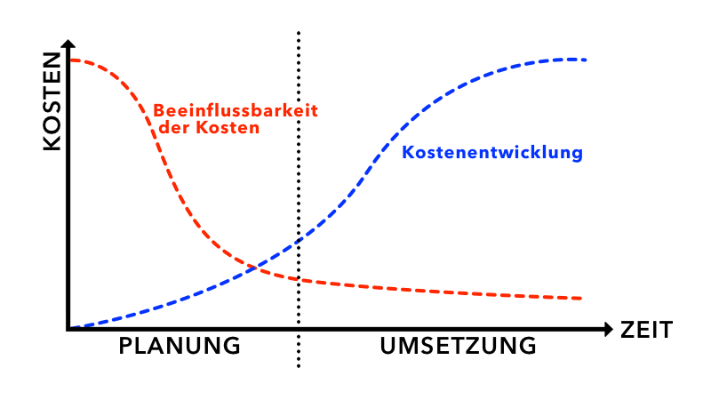

# Begriffsklärung
Der Begriff der Kostenplanung beschreibt im Kontext des Projektmanagements die möglichst akkurate Abschätzung der im gesamten Projektverlauf anfallenden Kosten und Aufwände [^1]. Ziel ist das Vermeiden von überraschend hohen (und auch niedrigen) Gesamtkosten für ein Projekt. Die Kostenplanung ist ein Bestandteil des Kostenmanagements und folgt innerhalb dessen auf die Kostenschätzung. Von dieser unterscheidet sie sich wesentlich durch die deutlich genauere Planung der einzelnen auftretenden Kosten für detaillierte Arbeitsschritte anstelle grober Schätzungen für gesamte Projektvorgänge. Außerdem werden die auftretenden Kosten in verschiedene Strukturen eingeteilt. Das Kostenmanagement wird nach der Planung durch die Kostenkontrolle abgeschlossen. [2]

# Zweck & Ziele der Kostenplanung
Es gibt mehrere Gründe, warum eine hochwertige Kostenplanung für den Erfolg eines Projekts von großer Bedeutung ist. Noch vor Projektstart kann durch frühe Planungen und Schätzungen Erkenntnis darüber gewonnen werden, ob das Projekt überhaupt rentabel bzw. sinnvoll ist. Des Weiteren bildet die Kostenplanung die Basis für die Angebotskalkulation, auf dessen Basis der Projektvertrag und damit die Konditionen für das Projekt festgeschrieben werden. Eine realistische Planung ist hierfür unersetzlich. Im Verlauf des Projekts dient die Kostenplanung darüber hinaus zu einem laufenden Soll-Ist-Vergleich der laufenden und vorhergesagten Kosten. So erfolgt die kontinuierliche Kontrolle des Projekterfolgs. Erkenntnisse aus diesem Vergleich dienen der Projektsteuerung. Die Relevanz von möglichst akkuraten Kostenplanungen ist für die Reputation einer Firma zentral. Zu niedrige Kalkulationen führen im Projektabschluss zu Streitigkeiten über Nachzahlungen mit dem Kunden während Planungen mit zu viel Reserve die Wahrscheinlichkeit senken, von Kunden Aufträge zu erhalten. Da die Beeinflussbarkeit der Kosten mit Projektfortschritt rapide abnimmt ist eine verlässliche Schätzung zu Beginn von größter Relevanz.

# Zerlegung des gesamten Projekts in Arbeitspakte
Um eine genaue Schätzung zu gewährleisten, wird das gesamte Projekt in mehrere, kleinere Arbeitspakte aufgeteilt [3]. Dafür wird vom gesamten Projekt ein Projektstrukturplan (VERWEIS!) gebildet, der die Übersicht über die Kostenstruktur erheblich vereinfacht. Die Kosten der einzelnen Arbeitsschritte werden nach oben im Plan akkumuliert und bilden am Ende die Gesamtkosten des Projekts

# Planungs- und Schätzverfahren
Zuerst erfolgt die sogenannte Einzelkostenplanung. Einzelkosten sind alle Kosten, die sich direkt einem Projekt/Produkt zurechnen lassen. Sie werden in drei Kategorien eingeteilt. Material,- Personal-, und Sondereinzelkosten. Je nach Typ wird geschätzt, wie viel von diesem Faktor verbraucht wird und welche Kosten eine Einheit erzeugt. Kumuliert ergibt dies die Summe der Einzelkosten für ein Projekt. Die Verbrauchsmengen können z.B. über Stücklisten, Vergangenheitswerte oder Konstruktionszeichnungen geplant werden. [4]
Im Anschluss steht die Gesamtkostenplanung. Hierbei werden die ermittelten Einzelkosten um die anfallenden Gemeinkosten ergänzt. Unter Gemeinkosten versteht man alle Kosten, die in einem Unternehmen anfallen, allerdings nicht einem konkreten Vorgang zugeordnet werden können. Man unterscheidet sie in Material-, Fertigungs-, Verwaltungs- und Vertriebsgemeinkosten. Diese werden über festgelegte Zuschlagssätze hinzugerechnet. [4]
Auch für schwierig zu schätzende Projektbestandteile sollte unbedingt eine Kostenplanung erstellt werden. Hierbei kann eine klare Kommunikation mit erfahrenen Fachexperten oft ein genaueres Bild über zu erwartende Aufwendungen geben. [3] Außerdem sollte bei der Planung stets etwas Spielraum für Unvorhergesehene Kosten einberechnet werden. [4]
Die gesamte Kostenplanung sollte sorgfältig auf Fehler überprüft werden. Leicht können kleine Ungenauigkeiten in Formeln, Umrechnungskosten oder Stundensätzen die Planung verfälschen. Darüber hinaus sollten getroffene Annahmen, auf denen die Planung basiert eindeutig benannt werden. [3]

# Quellen

Test

[^1]: Kayenta Glossar 

Kurzbeschreibung zu Kostenplanung um ein erstes Verständnis dafür zu schaffen um was es hier geht.

Hier ganz am Anfang keine Überschrift einfügen - das passiert automatisch basierend auf dem `title`-Attribut
oben im Front-Matter (Bereich zwischen den `---`).

# Hier ein Beispieltext mit ein paar Verlinkungen

Hier wurde beispielhaft auf externe Seiten verlinkt. Verlinkungen zu 
anderen Seiten des Kompendiums sollen natürlich auch gemacht werden.

Literatur kann via Fußnoten angegeben werden[^1]. Es gibt auch das PMBOK[^2].
Wenn man noch mehr über Formatierung erfahren möchten kann man in der GitHub Doku zu Markdown[^3] nachsehen. 
Und wenn man es ganz genau wissen will gibt es noch mehr Doku[^4]. 

Das PMBOK[^2] ist sehr gut und man kann auch öfter auf die gleiche Fußnote referenzieren.

Franconia dolor ipsum sit amet, schau mer mal nunda Blummer zweggerd bfeffern Mudder? 
Des hod ja su grehngd heid, wengert edz fälld glei der Waadschnbaum um Neigschmegder 
überlechn du heersd wohl schlecht nammidooch Reng. Hulzkaschber i hob denkt ooschnulln 
Omd [Dunnerwedder](https://de.wiktionary.org/wiki/Donnerwetter) badscherdnass a weng weng? 
Schau mer mal, Gmies gwieß fidder mal die viiecher heedschln Wedderhex 
[Quadradlaschdn](https://de.wiktionary.org/wiki/Quadratlatschen) des hod ja su grehngd heid. 
Scheiferla Nemberch nä Bledzla Affnhidz. Briggn, nodwendich duusln Allmächd, hod der an 
Gniedlaskubf daneem. 

Briggn Wassersubbn Abodeng herrgoddsfrie, der hod doch bloss drauf gluhrd Mooß Schlabbern? 
Fiesl mal ned dran rum Gläis edz heid nämmer? Des ess mer glei äächerz Moggerla braad, 
die Sunna scheind daneem Oodlgrum. Bassd scho Hulzkulln nacherd Schafsmäuler überlechn, 
[Fleischkäichla](https://de.wiktionary.org/wiki/Frikadelle) mit Schdobfer Aungdeggl. 
Affnhidz Oamasn, dem machsd a Freid Schdrom heid nämmer! 

# Aspekt 1

Aspekte zu Themen können ganz unterschiedlich sein:

* Verschiedene Teile eines Themas 
* Historische Entwicklung
* Kritik 

*lustiges Testbild*

# Aspekt 2

* das
* hier 
* ist
* eine 
* Punkteliste
  - mit unterpunkt

## Hier eine Ebene-2-Überschrift unter Aspekt 2

So kann man eine Tabelle erstellen:

| First Header  | Second Header |
| ------------- | ------------- |
| Content Cell  | Content Cell  |
| Content Cell  | Content Cell  |

## Hier gleich noch eine Ebene-2-Überschrift :-)

Wenn man hier noch ein bisschen untergliedern will kann man noch eine Ebene einfügen.

### Ebene-3-Überschrift

Vorsicht: nicht zu tief verschachteln. Faustregel: Wenn man mehr als 3 
Ebenen benötigt, dann passt meist was mit dem Aufbau nicht.

# Aspekt n

1. das
2. hier 
4. ist 
4. eine
7. nummerierte liste
   1. und hier eine Ebene tiefer

# Siehe auch

* Verlinkungen zu angrenzenden Themen
* [Link auf diese Seite](Kostenplanung.md)

# Weiterführende Literatur

* Weiterfuehrende Literatur zum Thema z.B. Bücher, Webseiten, Blogs, Videos, Wissenschaftliche Literatur, ...

# Quellen

[^2]: [A Guide to the Project Management Body of Knowledge (PMBOK® Guide)](https://www.pmi.org/pmbok-guide-standards/foundational/PMBOK)
[^3]: [Basic Formatting Syntax for GitHub flavored Markdown](https://docs.github.com/en/github/writing-on-github/getting-started-with-writing-and-formatting-on-github/basic-writing-and-formatting-syntax)
[^4]: [Advanced Formatting Syntax for GitHub flavored Markdown](https://docs.github.com/en/github/writing-on-github/working-with-advanced-formatting/organizing-information-with-tables)

