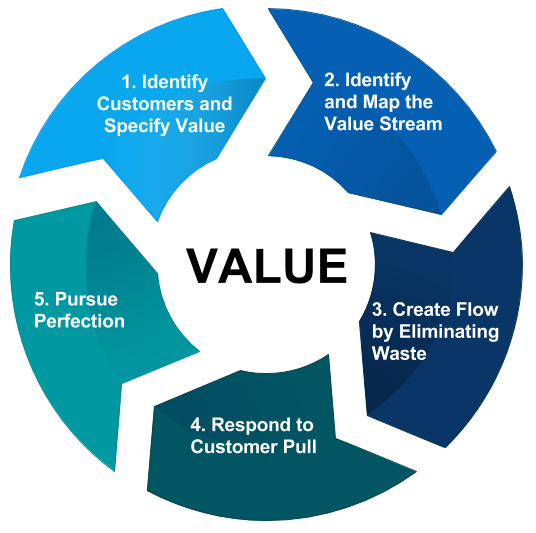

## 1.	Definition
**Lean** = Einstellung / Denkweise / systematischer Ansatz zur Beseitigung von Verschwendung

**Lean Project Management** (kurz LPM) ist in erster Linie eine Einstellung zur Durchführung von [Projekten](https://github.com/ManagingProjectsSuccessfully/ManagingProjectsSuccessfully.github.io/blob/main/kb/Projekt.md). Es ist eine Denkweise, die darauf abzielt, Verschwendung zu vermeiden, Projekte effizienter und effektiver zu gestalten und Kunden und Auftraggeber besser bedienen zu können.[^2]

## 2.	Toyota-Produktionssystem
Lean-Management findet seinen Ursprung in den 50er Jahren im japanischen [Toyota-Produktionssystem](https://github.com/ManagingProjectsSuccessfully/ManagingProjectsSuccessfully.github.io/blob/main/kb/Toyota_Produktionssystem.md), welches Verschwendung vermeidet, interne Abläufe und die Interaktion mit Lieferanten und Kunden optimiert und somit dem Prinzip der „Just-in-time-Produktion“ folgt.[^1] Toyota fasst drei Hauptquellen für Verschwendung: [Muda](https://github.com/ManagingProjectsSuccessfully/ManagingProjectsSuccessfully.github.io/blob/main/kb/Muda_7_Arten_von_Verschwendung.md), Mura und Muri.[^2]

**Muda** bedeutet verschwendete Zeit und Mühe. Es umfasst alles was getan oder an Ressourcen eingesetzt wird, was für die Stakeholder in keiner Weise einen Mehrwert oder Nutzen bringt.[^4]

**Mura** bedeutet Unausgeglichenheit. Es bedeutet, dass Dinge zu verschiedenen Zeiten auf unterschiedliche Weise getan werden. LPM versucht, Mura durch Standardisierung zu überwinden.[^2]

**Muri** bezeichnet Überlastung, Unzumutbarkeit, Stress und all die Folgen, die entstehen, wenn wir Menschen hart arbeiten und mehr leisten müssen, als wir in der zur Verfügung stehenden Zeit schaffen können, aber auch, wenn Maschinen überlastet sind und deshalb ihre Wartungsintervalle versäumt werden und diese schließlich ausfallen.[^2]

## 3.	Anwendung im Projektmanagement
Die Philosophie des Lean, wurde in den 90er Jahren erstmalig als Management-Methode eingeführt.[^3] Anfang der 2000er Jahre begann man schließlich auch damit, diese Grundsätze auf das [Projektmanagement](https://github.com/ManagingProjectsSuccessfully/ManagingProjectsSuccessfully.github.io/blob/main/kb/Projektmanagement.md) anzuwenden.[^2]

Die fünf Kernprinzipien des Lean Management von Womack und Jones eignen sich für den Übergang vom Lean Management zum Lean Project Management. Das Grundprinzip besteht darin, überflüssige Aktivitäten bzw. Verschwendung zu reduzieren.[^6]

**1. Betrachtung des Nutzens aus Sicht des Kunden.** Die Produkte werden genau auf die Bedürfnisse des Kunden zugeschnitten, um den größtmöglichen Nutzen aus Kundensicht zu erzielen.[^4] Der Wert kann die Qualität, der Zeitrahmen oder der Preis der Leistung sein - erfahrungsgemäß ist es aber ein bisschen von allen dreien.[^5]

**2. Identifizierung des Wertstroms.** Der Wertstrom beschreibt alle Aktivitäten, die zur Herstellung des Produktes erforderlich sind. Das bedeutet, dass eine detaillierte Betrachtung der Prozesse zur Erstellung des Produktes erforderlich ist. Alles was hierfür nicht notwendig ist, ist Verschwendung.[^6]

**3. Umsetzung des Flussprinzips.** Beim Flussprinzip geht es darum, den gesamten Wertstrom zu optimieren und nicht nur einzelne Abschnitte zu betrachten. Der Fokus liegt auf dem Gesamtfluss und den Engpässen innerhalb des Gesamtflusses. Die Aktivitäten des Wertstroms sollen so reibungslos wie möglich ablaufen können.[^6]

**4. Pull statt Push.** Der Kunde "zieht" das Produkt oder die Dienstleistung nach Bedarf aus dem Projekt ab. Mit anderen Worten: Die Verbesserungen aus dem vorherigen Schritt führen zu einer schnelleren Markteinführung. Der Vorteil des Pull-Systems besteht darin, dass keine Lagerhaltung oder Bestandsaufnahme erforderlich ist. Das spart dem Unternehmen Geld, das es dann an seine Kunden weitergeben kann.[^5]

**5. Perfektion.** Das bedeutet, dass Perfektion nicht erreicht werden muss, aber immer angestrebt werden sollte. Hier kommt der Gedanke des kontinuierlichen Verbesserungsprozesses auf, denn es wird immer Formen der Verschwendung und Ansätze zur Verbesserung geben.[^3]

Bei diesen fünf Kernprinzipien fällt auf, dass nur das erste Kernprinzip eine externe, d.h. kundenorientierte Sichtweise beinhaltet, während die Kernprinzipien zwei bis fünf auf interne Prozesse ausgerichtet sind.[^6]

*Lean Prinzipien* (https://i.pinimg.com/originals/7a/1b/ac/7a1bacd481a17e016b4e94a435f594fb.png)

## 4.	Lean vs Agile
Häufig werden die Begriffe Lean und Agile im selben Kontext verwendet, was nicht ganz korrekt ist. Sowohl Lean als auch Agile beschreiben eine Art und Weise, wie man wertschöpfungsorientiert an die Arbeit herangehen kann, aber sie empfehlen etwas andere Wege, dies zu erreichen. Das Ausmaß, auf das sich die beiden Ansätze in einem Unternehmen ausdehnen lassen, ist auch hier ein starkes Unterscheidungsmerkmal.[^4]

Doch fließen auch Lean-Prinzipien direkt in das agile Projektmanagement und die ihm zugrunde liegende Philosophie, sowie in einige der Methoden ein, die agile Projektmanager anwenden. Ein klares Beispiel ist [Kanban](https://github.com/ManagingProjectsSuccessfully/ManagingProjectsSuccessfully.github.io/blob/main/kb/Kanban.md), das selbst Teil des Toyota-Produktionssystems ist und in vielen Projektumgebungen, insbesondere bei [IT-Projekten](https://github.com/ManagingProjectsSuccessfully/ManagingProjectsSuccessfully.github.io/blob/main/kb/IT-Projekte.md), sehr erfolgreich eingesetzt wird.[^3] Auch das grundlegende agile Prinzip des Plan-Do-Review, welches die [SCRUM](https://github.com/ManagingProjectsSuccessfully/ManagingProjectsSuccessfully.github.io/blob/main/kb/SCRUM.md)-Methodik prägt, ist ebenso ein Bestandteil des Lean-Gedankens.[^2]

Sowohl Lean als auch Agile Teams helfen dabei, besser zu arbeiten und Kunden eine höhere Qualität zu liefern. So ist es nicht unüblich, dass Organisationen die Empfehlungen beider Methoden nutzen, um die bestmöglichen Ergebnisse zu erzielen.[^4]

# Siehe auch

* [Link auf diese Seite](Lean_Projektmanagement.md)

# Weiterführende Literatur

* Weiterfuehrende Literatur zum Thema z.B. Bücher, Webseiten, Blogs, Videos, Wissenschaftliche Literatur, ...

# Quellen

[^1]: [Abhishek Singh, Abhishek/Bahr, Ines (2019): „Der ultimative Leitfaden für das Lean Project Management“](https://www.capterra.com.de/blog/531/lean-project-management-leitfaden)
[^2]: [Clayton, Mike (2018): „What is Lean Project Management? Project Management in Under 5“](https://www.youtube.com/watch?v=Eptywqps6lw)
[^3]: [Erne, Rainer (2019): „Lean Project Management – Wie man den Lean-Gedanken im Projektmanagement einsetzen kann“](https://link.springer.com/book/10.1007/978-3-658-26988-3)
[^4]: [Kanban Tool (2021): „Was ist Lean-Projektmanagement?“](https://kanbantool.com/de/kanban-guide/lean-projektmanagement)
[^5]: [Landau, Peter (2021): „What Is Lean Project Management?“](https://www.projectmanager.com/blog/lean-project-management)
[^6]: [Wuttke, Thomas (2018): „Lean Project Management – mit weniger mehr erreichen!“ in Grote, Sven/Goyk, Rüdiger (Hrsg): „Führungsinstrumente aus dem Silicon Valley“](https://link.springer.com/book/10.1007/978-3-662-54885-1)

