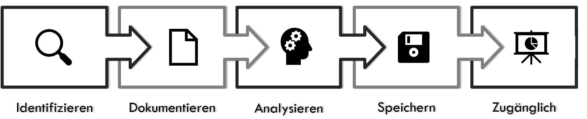

<b>Lessons Learned</b> (gewonnene Erkenntnisse) ist ein wichtiger Bestandteil des Projektmanagements.   
Ziel ist es, aus den praktischen Erfahrungen des zurückliegenden Projekts für die Zukunft zu lernen. 
Entscheidend hierbei ist das neu erlangte Wissen, sowie die positiven und negativen Erfahrungen, die im Laufe des Projekts gesammelt werden konnten.[^1] 

# Zweck von Lessons Learned? 

Die gleichen oder ähnliche Fehler bei der Durchführung eines Projekts zu wiederholen, kann durch eine konsequente Umsetzung der <b>Lessons Learned</b> kann vermieden werden. Außerdem können Ansätze, die gut funktioniert haben, identifiziert werden und bei der Umsetzung des nächsten Projekts angewandt werden.  <b>Lessons Learned</b> bietet somit zum einen den Vorteil aufgetretene Fehler beim nächsten Mal besser zu machen, sowie bereits gut funktionierendes Verhalten zu identifizieren und für zukünftige Projekte zu übernehmen. 
 

# Ablauf
Das Project Management Institute[^2] unterteilt den Prozess in 5 Schritte:  
  
_Quelle: eigene Darstellung_  

### 1. Identifizieren der Lessons Learned

In der Regel ist der erste Teil des <b>Lessons Learned</b> ein einzelnes Meeting bzw. Workshop, an dem sich die am Projektbeteiligten am Ende des Projekts zusammensetzen und über das vergangene Projekt sprechen. Wichtige Fragen, die hierbei beleuchtet werden und über die das Team redet, sind beispielsweise[^3]:   
- Was ist gut gelaufen?  
- Was ist nicht so gut gelaufen?  
- Was können wir verbessern?  
- Was sollten wir direkt stoppen?  
- Was könnte man in zukünftigen Projekten ausprobieren?  

### 2. Festhalten der Erkenntnisse
Wichtig ist es, dass die im Workshop besprochenen Erkenntnisse festgehalten und dokumentiert werden. Es bietet sich an den einzelnen Stakeholdern eine Zusammenfassung des Workshops im Nachhinein auszuhändigen, damit die Ergebnisse nicht verloren gehen. 

### 3. Analysieren 
Das Besprochene wird tiefergehend analysiert, um beispielsweise Themengebiete zu identifizieren, die häufiger vorkommen oder besonders kritisch für den reibungslosen Projektablauf sind. 

### 4. + 5. Speichern und Zugänglich machen
Abschließend müssen die <b>Lessons Learned</b> noch zum einen gespeichert werden (idealerweise in der Lessons-Learned-Datenbank des Unternehmens) und zum anderen müssen die Informationen den Mitarbeitern zugänglich gemacht werden. Lessons Learned sind nicht nur für das Unternehmen selbst oder den Projektmanager wichtig, sondern können auch dem einzelnen Mitarbeiter einen Mehrwert liefern.   

# Schwierigkeit

<b>Lessons Learned</b> bietet viele Vorteile, allerdings gibt es gewisse Faktoren, die die Durchführung der <b>Lessons Learned</b> deutlich erschweren. 
Durch den späten Zeitpunkt des Workshops kommt es teilweise dazu, dass die Mitwirkenden am Projekt sich nicht mehr an alles erinnern, was ihnen im Laufe des Projekts Schwierigkeiten bzw. Erleichterung gebracht hat. Deshalb kann das Führen eines Logbuches sinnvoll sein. 
 
Eine weitere Schwierigkeit besteht in Stakeholdern, die nicht glauben, dass sich etwas durch die <b>Lessons Learned</b> verändern wird. Sie zeigen deshalb wenig Bereitschaft am Prozess teilzunehmen und ihre Sicht der Dinge offenzulegen. Aus diesem Grund ist es umso wichtiger die zuvor genannten Punkte zu befolgen und die Erkenntnisse nicht nur zu sammeln, sondern auch weiterzureichen und umzusetzen[^4]. 

# Einordnung 
<b>Lessons Learned</b> finden sowohl im agilen als auch im [klassischen](https://managingprojectssuccessfully.github.io/kb/Projektmanagement.html) Projektmanagement Anwendung. Es ist zwar ähnlich zu der Sprint-Retrospektive, allerdings ist der Zeitpunkt und Häufigkeit der Durchführung unterschiedlich. Während die [Sprint-Retrospektive]( https://managingprojectssuccessfully.github.io/kb/Retrospective.html) am Ende eines Sprints erfolgt (also ungefähr alle 4 Wochen), findet das <b>Lessons Learned</b> am Ende eines Projekts statt. Damit werden die Verbesserungen, anders als bei den Sprint-Retros, erst im nächsten Projekt verwendet.

# Quellen

[^1]: OECD – DAC (2002) Glossary of Key Terms in Evaluation and Results Based Management. Evaluation and Aid Effectiveness
[^2]: Rowe, S. F. & Sikes, S. (2006). Lessons learned: taking it to the next level. Paper presented at PMI® Global Congress 2006—North America, Seattle, WA. Newtown Square, PA: Project Management Institute.
[^3]: Dr. Georg Angermeier: https://www.projektmagazin.de/glossarterm/lessons-learned
[^4]: Thomas Klingenberg: https://t2informatik.de/wissen-kompakt/lessons-learned/

