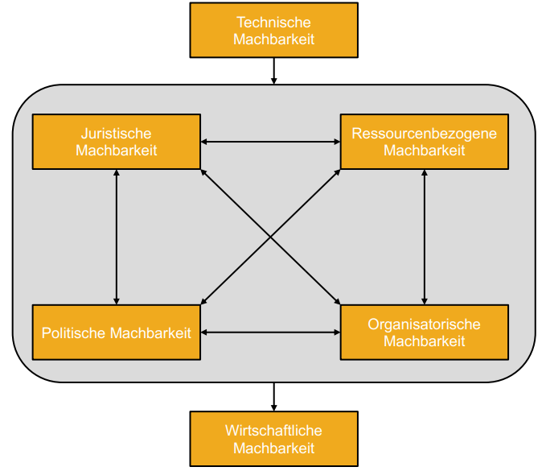

Die Machbarkeit ist ein wichtiges Entscheidungskriterium, um festzustellen, ob ein [Projekt](Projekt.md) mit den vorhandenen Mitteln durchgeführt werden kann[^1]. 

# Einordnung in den Projektverlauf

Die Machbarkeit ist Bestandteil der Initialisierungsphase eines Projekts[^2].

Die klassische Vorgehensweise in der Initialisierungsphase sind Aussagen zur Machbarkeit, zu [Risiken](Risikodimensionen.md) und zu [Stakeholdern](Stakeholdermanagement.md) zu erlangen. Dies gelingt mit Hilfe von Analysen der aktuellen Situation, mit klar vereinbarten Zielen und eindeutigen Formulierungen der Anforderungen.[^2]

Wenn sich die Ziele und Anforderungen an der Grenze des Machbaren befinden, ist es sinnvoll, vor der Realisierung des Projekts, eine Machbarkeitsstudie durchzuführen. Diese minimiert die [Projektrisiken](Risikodimensionen.md) und hilft bei der effektiven Gestaltung des Projektverlaufs.[^2]

Ziel der Initialisierungsphase ist das Ergebnis zu erlangen, ob ein Projekt durchgeführt werden kann und ob es einen ausreichenden Nutzen darlegt[^2].

# Machbarkeitsstudie

Die Machbarkeitsstudie ist ein Instrument, das zur Prüfung der Machbarkeit eines Projekts eingesetzt wird[^3][^4].

Intention, Auftrag und Ziel der Ausarbeitung einer Machbarkeitsstudie ist es, die Machbarkeit einer Projektidee nach unterschiedlichen Dimensionen zu überprüfen. Meist kommt es hierbei zur Überprüfung folgender Dimensionen[^3][^4]:

## Technische Machbarkeit

Die technische Machbarkeit kommt je nach Projekt unterschiedlich zum Tragen. Während dieser Dimension kann entweder kontrolliert werden, ob alle für das Projekt notwendigen technischen Voraussetzungen im Unternehmen vorhanden sind oder ob die Entwicklung bestimmter Komponenten während des Projekts möglich sind.[^5]

Während der technischen Machbarkeitsanalyse ist es wichtig viele Gespräche mit externen und internen [Stakeholdern](Stakeholdermanagement.md) zu führen, um eine realistische Abschätzung der technischen Machbarkeit zu erlangen[^5]. 

## Wirtschaftliche Machbarkeit

Die wirtschaftliche Machbarkeit prüft, ob der Nutzen des Projekts wirtschaftlich gewinnbringend ist. Dazu wird das Verhältnis zwischen Input und Output des Projekts analysiert.[^4][^6]

## Juristische Machbarkeit

Bei der juristischen Machbarkeit muss geprüft werden, ob das Projekt den Regelungen, Vorschriften und Gesetzen entspricht, die in dem jeweiligen Land gelten. Außerdem muss eine Verletzung von bestehenden Schutzrechten, wie zum Beispiel Patenten, ausgeschlossen werden.[^6] 

## Politische Machbarkeit

Die politische Machbarkeit unterteilt sich in zwei Bereiche, in die interne und die externe politische Machbarkeit[^4]. 

Bei der internen politischen Machbarkeit ist zu beachten, dass das Projekt zum Unternehmen und zu dessen Zielen passt. Auch die [Stakeholder](Stakeholdermanagement.md), insbesondere die Mitarbeiter, spielen bei der internen politischen Machbarkeit eine wichtige Rolle, da von ihnen das Projekt akzeptiert und umgesetzt werden muss.[^4]

Bei der externen politischen Machbarkeit wird überprüft, ob das Projekt zum aktuellen politischen Geschehen passend und realisierbar ist[^4]. 

## Ressourcenbezogene Machbarkeit

Die [ressourcenbezogene](Ressourcenplanung.md) Machbarkeitsprüfung beurteilt, ob das vorhandene Know-how der Mitarbeiter und die vorhandenen Kapazitäten im Unternehmen für das Projekt ausreichend sind[^2]. 

## Organisatorische Machbarkeit

Bei der organisatorischen Machbarkeit geht es vor allem um die Betrachtung und Anpassung der Aufbau- und Ablauforganisation des Unternehmens im Hinblick auf das Projekt[^6][^7]. 
#
Die Durchführung der Machbarkeitsstudie sollte mit der Überprüfung der technischen Machbarkeit beginnen, da diese einen Einfluss auf die restlichen Dimensionen hat. Anschließend folgen die juristische, politische, ressourcenbezogene und organisatorische Machbarkeit. Zum Schluss prüft man die wirtschaftliche Machbarkeit.[^4]

In der Abbildung 1 wird ein möglicher Ablauf der Machbarkeitsstudie grafisch veranschaulicht[^4].

*Abbildung 1: Empfohlener Ablauf der Durchführung einer Machbarkeitsstudie[^4]*

Das Gesamtergebnis einer Machbarkeitsstudie ist der Machbarkeitsnachweis, auch [Proof-of-Concept](Proof_of_Concept.md) genannt, dieser ist die Genehmigung der Durchführbarkeit eines Projekts[^3][^4].

Wenn die Machbarkeit eines Projekts nach der ersten Prüfung nicht gegeben ist, können mit Hilfe einer Simulation mehrere Einflussgrößen hinsichtlich unterschiedlicherer Szenarien getestet werden. Zeigt die Simulation, dass das [Kosten-Nutzen-Verhältnis](Kosten_Nutzen_Analyse.md) nicht passend ist, wird ein Stopp des Projekts beantragt.[^2]

# Siehe auch

* [Kosten-Nutzen-Analyse](Kosten_Nutzen_Analyse.md)
* [Projekt](Projekt.md)
* [Proof-of-Concept](Proof_of_Concept.md)
* [Ressourcenplanung](Ressourcenplanung.md)
* [Risikodimensionen](Risikodimensionen.md)
* [Stakeholdermanagement](Stakeholdermanagement.md)

# Weiterführende Literatur

* A Guide to the Project Management Body of Knowledge (PMBOK® Guide)](https://www.pmi.org/pmbok-guide-standards/foundational/PMBOK)

# Quellen

[^1]: Kleer, M., Molz, J. & Weiß, J. (2018). Ausbildung im Dialogmarketing (Band 2, 5. Auflage). Köln: Bildungsverlag EINS GmbH, S. 309. 
[^2]: Bachmann, C., Huber, E., Hubmann, M., Kuster, J., Lippmann, R., Schneider, E., Schneider, P., Witschi, U. & Wüst, R. (2019). Handbuch Projekktmanagement: Agil - Klassisch - Hybrid (4. Auflage). Berlin: Springer Gabler, S. 74-100.
[^3]: Von Känel, S. (2020). Projekte und Projektmanagement. Wiesbaden: Springer Gabler, S. 313.
[^4]: Köhler, C. & Mahl, T. (2021). Machbarkeitsanalyse hybrider Wertschöpfung - Ein Ansatz für die Analyse der Machbarkeit von Geschäftsmodellen hybrider Wertschöpfung im Kontext von KMU. Industrie 4.0 MANAGEMENT. 
[^5]: Felkai, R. & Biederwieden, A. (2015). Projektmanagement für technische Projekte: Ein Leitfaden für Studium und Beruf (3. Auflage). Wiesbaden: Springer Vieweg, S. 76f.
[^6]: Becker, J. H., Hofmann, D., Pastoors, S., Scholz, U. & Van Dun, R. (2018). Praxishandbuch Nachhaltige Produktentwicklung: Ein Leitfaden mit Tipps zur Entwicklung und Vermarktung nachhaltiger Produkte. Berlin: Springer Gabler, S. 71.
[^7]:  Berry, G. & Shabana, K.M. (2020). Adding a strategic lens to feasibility analysis. In: New England Journal of Entrepreneurship (Vol. 23, p. 71). Central Connecticut State University.
