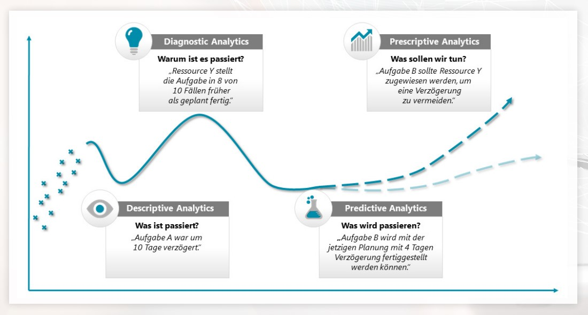
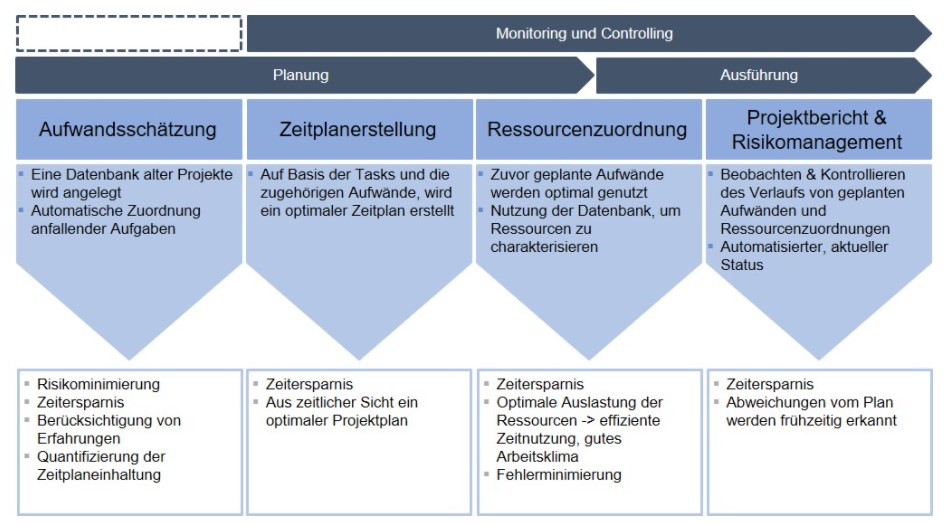

# Machine Learning – ein Teilbereich der Künstlichen Intelligenz

Machine Learning (ML) oder im Deutschen Maschinelles Lernen ist ein Teilbereich der [Künstlichen Intelligenz](KI_im_PM.md) (KI), welches wiederum ein Teilgebiet der Informatik ist. Dabei werden IT-Systeme in die Lage versetzt, auf Basis vorhandener Datenbestände und Algorithmen Muster und Gesetzmäßigkeiten zu erkennen und Lösungen zu entwickeln. Der Lernalgorithmus generiert somit künstliches Wissen aus Erfahrung und Erkenntnissen, dass für die Problembewältigung oder die Analyse von bisher unbekannten Daten verwendet werden kann. ML beschreibt somit die Fähigkeit, eigenständig zu lernen. [^1][^2]

# Arbeitsweise von ML im Projektmanagement

Die Basis der Arbeitsweise von Algorithmen im Zuge des MLs sind Daten. Das bedeutet, dass die ineinandergreifenden Algorithmen zu Beginn nur dort eingesetzt werden können, wo große Datenmengen anfallen. Sie können für das [Projektmanagement](Projektmanagement.md) (PM) den Mehrwert erzielen, den Projektmanagern bei sehr komplexen oder sehr leichten, aber häufig auftretenden Aufgaben und Problemen, zu unterstützen. Hierfür lässt sich das folgende Konzept gut in Betracht ziehen. [^3]

## Die 4 Stufen des ML: [^4]

1. Descriptive Analytics: Analyse des IST-Zustands ohne Verknüpfung von Datenpunkten

2. Diagnostic Analytics: Erkennen von Mustern in Daten ermöglicht Rückschlüsse über Ursachen bisheriger Entwicklungen, aber keine Aussagen über künftige Trends

3. Predictive Analytics: Fortschreiben der erkannten Muster in die Zukunft

4. Prescriptive Analytics: Konkrete Empfehlungen anhand der erkannten Muster, um ein vordefiniertes Ziel zu erreichen

Abbildung 1: [Entwicklungsstadien von Analytics: Von Descriptive zu Prescreptive](https://www.campana-schott.com/media/user_upload/Downloads/Case_Studies/DE/CS_Best_Practice_Predicitve_Analytics.pdf)

# Spezifische Einsatzgebiete

ML kann im Projektmanagement für verschiedene Aufgaben und Herausforderungen herangezogen werden, beispielsweise für die Bereiche Aufwandsschätzung, Zeitplanerstellung, Ressourcenzuordnung und den Projektbericht/Risikomanagement. Diese Tätigkeiten eignen sich im PM am besten zur Automatisierung. Dabei können die Teillösungen unabhängig erstellt oder miteinander verknüpft werden. [^3][^5]

Abbildung 2: [Modularer Aufbau einer ganzheitlichen Lösung zur Implementierung von maschinellem Lernen im Projektmanagement](https://www.projektmagazin.de/artikel/kuenstliche-intelligenz-ki-projektmanagement)

Zuerst ermittelt der Algorithmus für die Aufwandsschätzung die Aufwände aller geplanten Arbeitspakete und gibt die Ergebnisse dann anschließend an den Algorithmus für die Zeitplanerstellung weiter. Dieser erstellt dann mit den Informationen aus den Arbeitspaketen und den Aufwänden den bestmöglichen Projektzeitplan. Aus den Ergebnissen der beiden Algorithmen ordnet dann wiederum der Algorithmus für die Ressourcenzuordnung automatisch die Ressourcen den Arbeitspaketen zu. Am Ende erhält der Projektmanager einen Zeitplan mit möglichst wenig Leerzeiten und ohne Überlastung des Projektteams. [^3]

Des Weiteren dient Machine Learning dem Projektmanager in der Praxis, Projektverläufe zu überwachen, Prognosen und Handlungsempfehlungen zu erstellen sowie Aufgaben richtig zu gewichten. Der Algorithmus erkennt Verzögerungen, ermittelt aus vorsortierten und analysierten Informationen Auswirkungen auf das geplante Projektende und dient als Entscheidungsgrundlage, um in Meetings frühzeitige Entscheidungen oder Gegenmaßnahmen zu beschließen. [^5][^6]

# Fazit: Aktueller Stand und Chancen

Aktuell zeigt sich, dass Künstliche Intelligenz und Machine Learning kaum eine Rolle im Bereich des Projektmanagements spielen, obwohl KI längst in unserem Alltag angekommen ist. Wir lassen uns von Algorithmen Bücher und Filme empfehlen, "machen durch Assistenzsysteme die Autofahrt sicherer und sind auf Suchmaschinen angewiesen, um die Masse an verfügbaren Informationen im Internet zu verarbeiten. Also warum nutzen wir diese Technologien so selten im Projektmanagement." [^7]

Auf diese Frage gibt es eigentlich keine plausible Antwort, denn es gibt sie, die zahlreichen Möglichkeiten und Tätigkeitsfelder, in denen der unterstützende Einsatz von ML-Algorithmen hilfreich sein kann. Es würde jedem Projektmanager ein erfolgreicheres und vor allem effizienteres Arbeiten garantieren. Dennoch befindet sich der Beruf im Wandel und wird auch in den kommenden Jahren durch neue Technologien und Innovationen ganz andere Anforderungen mit sich bringen, als dies derzeit der Fall ist. [^8]

# Siehe auch

* [KI_im_PM](KI_im_PM.md)
* [KI_Software_fuer_Projektmanagement](KI_Software_fuer_Projektmanagement.md)
* [Projekt](Projekt.md)
* [Projektmanagement](Projektmanagement.md)
* [Projektmanagementsoftware](Projektmanagementsoftware.md)

# Weiterführende Literatur

* [Erstellung eines Machine Learning Prototyps zur Überprüfung von Projekten auf Zeit- und Budgetüberschreitung](https://opus4.kobv.de/opus4-haw-landshut/files/223/Erstellung_eines_Machine_Learning_Prototyps.pdf)
* [Künstliche Intelligenz im Projektmanagement – Ein Ordnungsrahmen zur Potenzialabschätzung und Lösungskonzeption](https://link.springer.com/chapter/10.1007/978-3-658-30936-7_9)
* [Per Autopilot zum Projekterfolg? Einsatzpotenziale Künstlicher Intelligenz im Projektmanagement](https://dl.gi.de/handle/20.500.12116/18922)
* [Potenziale erschließen durch Künstliche Intelligenz im Projektmanagement](https://www.gpm-ipma.de/fileadmin/user_upload/Know-How/pmaktuell/2019_03/projektManagement_aktuell-PMA_3_2019_S39.pdf)
* YouTube: [Wie funktioniert eigentlich Machine Learning?](https://www.youtube.com/watch?v=ya_6I9IVMzY)

# Quellen

[^1]: [Definition: Was ist Machine Learning?](https://www.bigdata-insider.de/was-ist-machine-learning-a-592092/)
[^2]: [PROJEKTMANAGEMENT-KI: CHANCE ODER RISIKO?](https://www.assure.de/de/blog/projektmanagement-ki-chance-oder-risiko)
[^3]: [Der Traum von stabilen und zuverlässigen Projektplänen: Künstliche Intelligenz im Projektmanagement](https://www.projektmagazin.de/artikel/kuenstliche-intelligenz-ki-projektmanagement)
[^4]: [Predictive Analytics im Projektmanagement: Probleme verhindern, bevor sie entstehen.](https://www.campana-schott.com/media/user_upload/Downloads/Case_Studies/DE/CS_Best_Practice_Predicitve_Analytics.pdf)
[^5]: [5 Wege, wie künstliche Intelligenz das Projektmanagement in Ihrem Unternehmen optimieren kann](https://www.consultport.com/de/fuer-unternehmen/5-wege-wie-kuenstliche-intelligenz-das-projektmanagement-in-ihrem-unternehmen-optimieren-kann/)
[^6]: [Projektmanager müssen sich neu erfinden – wegen Künstlicher Intelligenz](https://business-user.de/digitalisierung/projektmanager-muessen-sich-neu-erfinden-wegen-kuenstlicher-intelligenz/)
[^7]: [KI und das Projektmanagement](https://www.projektmagazin.de/blog/ki-und-projektmanagement_72543)
[^8]: [Künstliche Intelligenz im Projektmanagement](https://www.mnc-online.com/kuenstliche-intelligenz-im-projektmanagement)
