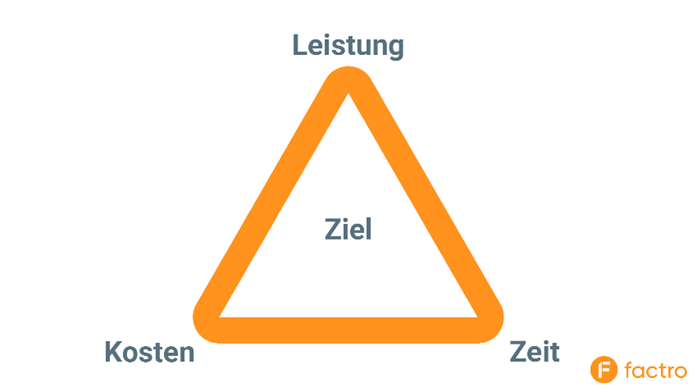

# Das magische Dreick des Projektmanagements
Das magische Dreieck ist das Symbol für die drei zentrale Faktoren des Projektmanagements: Zeit, Kosten und Leistung. In der Mitte des Dreiecks befindet sich das Projektziel. Vor Projektbeginn werden alle 3 Größen bestimmt und priorisiert. 
Während des Projektverlaufs und nach dem Abschluss gilt das magische Dreieck als Orientierung, ob und wie erfolgsversprechend die Planung und Durchführung des Projekts war. [^1]

## 1.Dimensionen des Magisches Dreiecks
### 1.1	Zeitdimension
Der Parameter Zeit beschreibt relevante Zeitpunkte und Fristen. Neben der zentralen Frage wie viel Zeit das Projekt in Anspruch nehmen soll, spielen auch Zwischentermine und Meilensteine eine wichtige Rolle.[^2]
### 1.2	Kostendimension
Die Kostendimension bezeichnet die finanziellen Aufwände und das für das Projekt verfügbare Budget. Dieses meint neben finanziellen und Sachmitteln auch das interne und externe Personal. Für die Garantie der Wirtschaftlichkeit sollte das Budget im Vorhinein bestimmt und im Laufe des Projektes nicht überschritten werden.[^2]
### 1.3	Leistungsdimension
Unter Leistungs-, oder Qualitätsdimension versteht man die zu erfüllenden Aufgaben und das daraus resultierende, erwünschte Ergebnis. Damit beeinflusst sie den Inhalt und Umfang des Projekts entscheidend und sollte mit jedem Steakholder und Beteiligten abgesprochen sein. Die Ziele der Leistungsdimension müssen nach den [SMART_Zielen](SMART_Ziele.md) aufgebaut sein.[^2]

Alle 3 Dimensionen haben eine direkte Verbindung und Wirkung zueinander. Die Hauptaufgabe des magischen Dreiecks ist dabei, diese darzustellen und somit das Planen eines Projektes zu erleichtern. Praktische Anwendungen des magischen Dreiecks sind dabei beispielsweise die umfassende Planung eines Projekts, das Festlegen von klaren Zielen, das Erkennen von Risiken, die Möglichkeit auf kurzfristige Änderungen des Projekts dynamisch und flexibel zu reagieren und die Überprüfung, ob die Ziele am Ende des Projekts erreicht wurden.[^2], [^3]

## 2. Zielkonflikte des magischen Dreiecks
Eine der Kernfunktionen des magischen Dreiecks ist es zudem, die Konflikte zwischen den einzelnen Dimensionen aufzuzeigen. Dabei fällt auf, dass die individuelle Veränderung einer Dimension zwangsläufig auch die Veränderung und Verschiebung der anderen bedeutet. 
### 2.1 Kosten vs. Zeit
Die Dimensionen Kosten und Zeit geraten besonders dann in Konflikt, wenn der angestrebte Zeitpunkt der Beendigung des Projekts nur schwer einzuhalten ist oder sich zu verschieben droht. Dann gilt es zu entscheiden, ob man die Kosten erhöht, um das angestrebte Datum einzuhalten oder die Frist verlängert. Eine solche Kostenerhöhung würde zum Beispiel mehr Überstunden für die Mitarbeiter oder die Einstellung neuen Personals bedeuten. Allerdings würde man dann das gesteckte Ziel der Kostendimension in Gefahr bringen.[^3]
### 2.2 Leistung vs. Zeit
Eine weitere Möglichkeit die Projektfrist einzuhalten wäre die Qualität des Produktes anzupassen, was zur Folge eine Beeinträchtigung der Leistungsdimension hätte. Die Ziele werden dann -außer man ist bereit zu akzeptieren, dass die Zeitdimension sich verschiebt- nicht erreicht.[^3]
### 2.3 Leistung vs. Kosten
Diese beiden Größen stehen besonders dann in Konflikt, wenn Probleme bei der Einhaltung der Leistungsdimension bestehen. Dann gilt es abzuwägen, ob man diese Probleme mit einer Kostenerhöhung anpasst und damit die Ziele der Kostendimension in Gefahr bringt oder die Leistung des Produkts und somit auch die Leistungsdimension schmälert.[^3]

Diese Konflikte sind unvermeidbar, entscheidend ist es jedoch sie möglich gering zu halten. Das passiert, indem man die beispielsweise offen kommuniziert, die Erwartung aller Stakeholder zusammenführt und ausbalanciert oder für alle Dimensionen einen Puffer einbaut, damit die Beziehung innerhalb des Dreiecks intakt bleibt, selbst wenn sich unerwartete Veränderungen ergeben.[^2], [^3]

*lustiges Testbild*

# Siehe auch

* [SMART_Ziele](SMART_Ziele.md) 
* [Zeitdimension](Zeitplanung.md)
* [Kostendimension](Kostenplanung.md)

# Weiterführende Literatur

* [Das Wesen des Projektmanagements](https://link.springer.com/chapter/10.1007/978-3-658-23714-1_2)
* [Projektmanagement: Leitfaden zur Steuerung und Führung von Projekten](https://books.google.de/books?hl=de&lr=&id=ZUgjBgAAQBAJ&oi=fnd&pg=PA1&dq=magisches+Dreieck+des+Projektmanagements&ots=7i_tGUC1oC&sig=c35P6idGeP6UYyoxwPiKqhchvIE#v=onepage&q=magisches%20Dreieck%20des%20Projektmanagements&f=false)

# Quellen

[^1]: [Magisches Dreieck](https://www.inloox.de/projektmanagement-glossar/magisches-dreieck/)
[^2]: [Magisches Dreieck im Projektmanagement](https://www.factro.de/blog/magisches-dreieck/)
[^3]: [Das magische Dreieck: Zaubern im Projektmanagement](https://blog.hubspot.de/marketing/magisches-dreieck)

