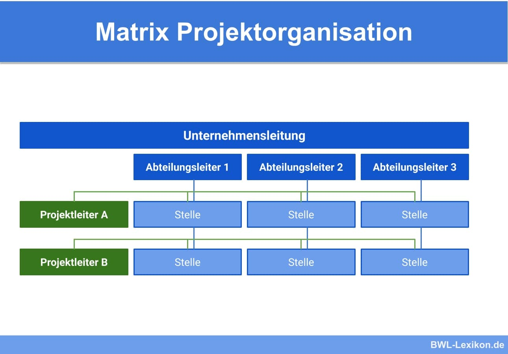

Die Matrix Projektorganisation ist eine Zusammensetzung aus einer Stabs- und reinen Projektorganisation [^1]. Sie ist die meistbenutzte Organisationsform für Projekte innerhalb von permanenten Linienorganisationen. Dabei überschneiden die temporären Projektorganisationen die Linienorganisation so, dass die Trägerorganisation und die Projekte gleichzeitig auf die Ressourcen zugreifen können, wodurch dabei ein Konfliktpotential entsteht [^2]. Diese Form wird angewendet, wenn die Projekte notwendig, aber nicht bedeutsam sind und eine ständige Teilnahme der Mitarbeiter benötigt wird [^4].

# Aufbau

## Horizontale Ebene
Die horizontale Ebene stellt die produkt-,  region- oder projektbezogene Aufgabenbereiche dar. Diese Geschäftsbereiche können beispielsweise Produkte sein.

## Vertikale Ebene
Die vertikale Ebene zeigt die funktionalen Arbeitsbereichen, auch Funktionsbereiche genannt. Beispiele hierfür sind Vertrieb oder die Produktion.

## Schnittstellen
In den Schnittstellen befinden sich die einzelnen Projektteams bzw. spezifischen Abteilungen, die jeweils einem Projekt- oder Abteilungsleiter zugeordnet sind [^9].

# Akteure

## Abteilungsleiter
Der Abteilungsleiter beschäftigt sich mit dem disziplinarischen Weisungsrecht und dem fachliche Weisungsrecht für Linienaufgaben [^1]. Dadurch besitzt er die disziplinarische Befugnis über die Zuordnung und Aufgaben der Mitarbeiter [^4].

## Projektleiter 
Der Projektleiter verfügt über das fachliches Weisungsrecht, was die Projektinhalte betrifft [^10]. Dabei beansprucht er die Arbeitskraft der Teammitglieder in Abstimmung mit dem Abteilungsleiter und besitzt die volle Zielverantwortlichkeit [^4].

## Projektmitarbeiter
Die Projektmitarbeiter pendeln während ihrer Arbeitszeit zwischen Tagesgeschäft und Projekt [^4]. Dabei sind sie während der Zeitspanne des Projekts in ihrer jeweiligen Linienorganisation integriert. Dadurch unterstehen sie ihrem Linienvorgesetzten und gleichzeitig dem Projektmanager [^3].

# Arten

Der PMBOK Guide benutzt dIe Begriffe "Schwache Matrixorganisation“, „Ausgewogene Matrixorganisation“ und  „Starke Matrixorganisation“, um den Bezug zu den anderen Erscheinungsformen der Matrixorganisation darzustellen [^5].
Er stellt die US-amerikanische Norm für Projektmanagement dar und wird vom Project Management Institute (PMI) veröffentlicht [^7].

## Schwache Matrixorganisation
Der Projektleiter übernimmt primär koordinierende Aufgaben, ohne direkten Einfluss oder Befugnisse [^3].  Die Projektorganisation untersteht ganz und gar der Linienorganisation. 
Im deutschen Sprachraum benutzt man hierfür den Begriff "Einfluss-Projektorganisation"  [^5].

## Aufgewogene Matrixorganisation 
Der Projektleiter besitzt nach Absprache mit dem jeweiligen Linienvorgesetzten über Weisungs- und Zugriffsbefugnisse [^3].  Die Projektorganisation und die Linienorganisation können gleichrangig die Ressourcen nutzen. Im  deutschen Sprachraum verwendet man hierfür das Konzept der Stabs-Projektorganisation. Die Charakteristiken der Stabs-Projektorganisation kann der schwachen und ebenso der starken Matrixprojektorganisation entsprechen [^6].

## Starke Matrixorganisation
Der Projektleiter hat direkte Autorität und Zugangsberechtigung auf allen Mitarbeitern und Ressourcen [^3].  Die Projektorganisation besitzt unbegrenzte Zugangsmöglichkeiten auf die Ressourcen der Linienorganisation. Im deutschen Sprachraum wendet man hierfür den Begriff „Matrixorganisation“. Sie stellt Eigenschaften der reinen Projektorganisation dar, da die Projekte ein wesentlicher Bestandteil der Trägerorganisation als auch der Wertschöpfung sind [^8].

# Einsatzgebiete 
Die Matrix Projektorganisation existiert meistens in wichtigen und terminkritischen Projekten bei mittelgroßen bis großen Unternehmen [^1]. Sie ist regelmäßig in großen Unternehmen aufzufinden, die international handeln und sich in mehreren Bereichen spezialisiert haben. Die Organisationsform ist stark angesehen bei projektorientierten Branchen wie dem Bauwesen oder der Fahrzeugentwicklung. Allerdings findet sie wenig Gebrauch in der Massenproduktionen oder in der Verwaltung [^9].

# Vor- und Nachteile

## Vorteile 

* keine Wiedereingliederung der Mitarbeiter nach Projektende notwendig [^1] 
* Mitarbeiter ziehen Nutzen vom Wissen und dem Austausch ihrer Fachabteilungen [^1]
* flexible Zugangsmöglichkeiten auf Ressourcen [^1]
* kein Inselwissen der einzelnen Organisationseinheiten [^4]
* kürzere Kommunikationswege und  schnellere Abstimmungen [^9]

## Nachteil 

* Widersprüche zwischen Projekt- und Abteilungsleitung [^1]
* Probleme bei der Gewichtung zwischen Linien- und Projektarbeit [^1]
* hohe Überlastungen [^4]
* hoher Anspruch an die Kommunikationsfähigkeiten des Projektleiters bzw. Projetzmanagers [^11]
* hohe Nachfrage nach Führungspersonal [^9]

# Siehe Auch 

[Linienorganisation] (https://de.wikipedia.org/wiki/Linienorganisation)

[Projektorganisation] (https://de.wikipedia.org/wiki/Projektorganisation)

[Trägerorganisation] (https://www.projektmagazin.de/glossarterm/traegerorganisation)

[PMBOK-Guide] (https://de.wikipedia.org/wiki/PMBOK-Guide)

# Weiterführende Links

Wolf,  J. (2020). Die Matrixstruktur erfolgreich einsetzen (1. Aufl.). Springer.

Wohlwender, A. (2014) Analyse der Wissenskommunikation in einer Matrixorganisation (2015. Aufl.). Springer.

# Quellen

[Beispielabbildung] (https://www.bwl-lexikon.de/wiki/matrix-projektorganisation/)

[^1]: [Projektorganisation: Diese Formen solltest du kennen] ( https://projekte-leicht-gemacht.de/blog/methoden/projektorganisation/projektorganisationsformen/)

[^2]: [Matrixorganisation] (https://www.projektmagazin.de/glossarterm/matrixorganisation)

[^3]: [Matrix Projektorganisation] (https://www.bwl-lexikon.de/wiki/matrix-projektorganisation/#was-ist-die-matrix-projektorganisation)

[^4]: [Projektorganisation: Formen und Rollen] (https://www.factro.de/blog/projektorganisation/#matrix)

[^5]: [Schwache Matrixorganisation] (https://www.projektmagazin.de/glossarterm/schwache-matrixorganisation)

[^6]: [Ausgewogene Matrixorganisation] (https://www.projektmagazin.de/glossarterm/ausgewogene-matrixorganisation)

[^7]: [PMBOK(R) Guide] (https://www.projektmagazin.de/glossarterm/pmbok-guide)

[^8]: [Starke Matrixorganisation] (https://www.projektmagazin.de/glossarterm/starke-matrixorganisation) 

[^9]: [Matrixorganisation] (https://studyflix.de/wirtschaft/matrixorganisation-1331) 

[^10]: [DREI ZENTRALE PROJEKTORGANISATIONSFORMEN UND IHRE ANWENDUNG] (http://blog.bepartner.de/drei-projektorganisationsformen/)

[^11]: [Die richtige Projektorganisation für Ihr Unternehmen] (https://drblaschka.de/projektorganisation/) 

