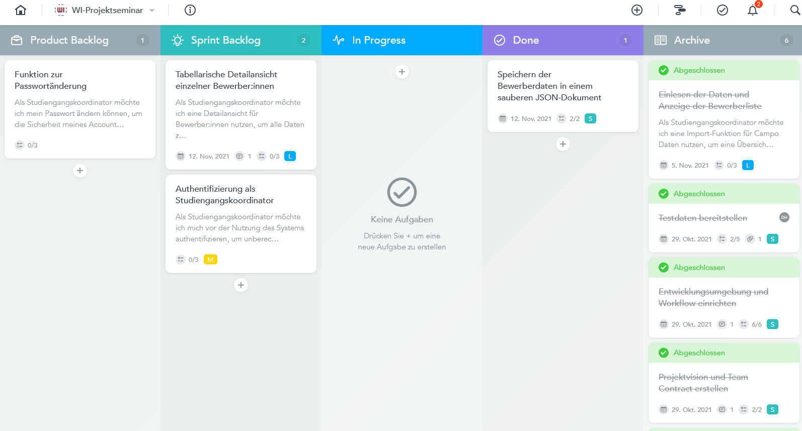

# MeisterTask PM Tool

Meister Task ist ein Online-Tool der deutsch-österreichischen Softwarefirma Meisterlabs, das agiles Arbeiten ermöglichen soll. Der Nutzer hat die Möglichkeit über ein Cloud-System Projekte und Aufgaben zu visualisieren, zu teilen und mit einer Benutzergruppe zu organisieren.

1.	Überblick
2.	Entwicklung
3.	Vergleich mit Trello
4.	Funktionen

## Überblick

Meister Task, wie auch aus dem Namen hervorgehen kann, ist ein Task Management- Tool , das Anwendern ein Weg bietet kollaborativ Aufgaben zu organisieren und koordinieren. Das Tool eignet sich nicht nur für einzelne Aufgaben, es unterstützt auch Kanban Projekte mit einem virtuellen Board. Für größere Projekte können alle Tools der Meister Suite integriert werden, um einen reibungslosen Workflow für Teams zu ermöglichen. Zudem wird Meistertask weiterentwickelt, um eine Synchronisation mit anderen Tools für das agile Projektmanagement zu ermöglichen. Das Motto der Firma lautet “Im Mittelpunkt unserer Arbeit stehen die Menschen und die Vision, gemeinsam etwas Großes aufzubauen.”, was ausdrücken soll, dass bei Meistertask auf Kommunikation der Anwender großen Wert gelegt wird. Meister Task ist ein Freemium Produkt. Der Nutzer hat die Wahl zwischen Basic, Pro, Businnes und Enterprise Versionen, wobei nur die Basic Version frei zugänglich ist. Die kostenpflichtigen Versionen bieten wenige funktionelle und hauptsächlich quantitative Vorteile, daher ist für die private Anwendung mit wenigen Projekten die Basis Version keine Einschränkung für die Funktionalität.

*MeisterTask Oberfläche*

## Entwicklung

MeisterLabs, die Firma, die MeisterTask entwickelt hat, wurde 2007 von Michael Hollauf und Till Vollmer gegründet und ist somit eine österreichisch-deutsche Firma mit derzeitigem Sitz in Österreich. Die Idee für Gründung der Firma entstand, als die beiden gemeinsam an einem Projekt arbeiteten. Dabei nutzten sie Google Docs und MindManager. Da MindManager ein Mind Mapping- Tool ist, dass lokal installiert werden musste, haben sich die Gründer entschieden eine Cloud-basierte Lösung zu finden, die eine einfachere und standortübergreifende Kollaboration unterstützen soll. Daraus entstand erstmal das Mind Mapping Tool Mindmeister. 2015 wurde schließlich auch MeisterTask veröffentlicht, mit dem Hintergrund eine Gesamtlösung für agiles Arbeiten anbieten zu wollen.

## Vergleich mit Trello

Trello ist ebenfalls ein Task Management- Tool, das vergleichbar mit Meister Task ist. Die Oberfläche und Funktionalität sind ähnlich und an vielen Stellen gleich. Ein großes Unterschied sind die Stadorte für die Server. Trello’s Server sind nicht in Europa und damit unterliegt das Tool nicht europäischen Sicherheitsrichtlinien. 

## Funktionen

So kann man eine Tabelle erstellen:

| Funktionsart  | Beschreibung |
| ------------- | ------------- |
| Content Cell  | Content Cell  |
| Content Cell  | Content Cell  |

# Siehe auch

* Verlinkungen zu angrenzenden Themen
* [Link auf diese Seite](MeisterTask_PM_Tool.md)

# Weiterführende Literatur

* Weiterfuehrende Literatur zum Thema z.B. Bücher, Webseiten, Blogs, Videos, Wissenschaftliche Literatur, ...

# Quellen

[^1]: Quellen die ihr im Text verwendet habt z.B. Bücher, Webseiten, Blogs, Videos, Wissenschaftliche Literatur, ... (eine Quelle in eine Zeile, keine Zeilenumbrüche machen)
[^2]: [A Guide to the Project Management Body of Knowledge (PMBOK® Guide)](https://www.pmi.org/pmbok-guide-standards/foundational/PMBOK)
[^3]: [Basic Formatting Syntax for GitHub flavored Markdown](https://docs.github.com/en/github/writing-on-github/getting-started-with-writing-and-formatting-on-github/basic-writing-and-formatting-syntax)
[^4]: [Advanced Formatting Syntax for GitHub flavored Markdown](https://docs.github.com/en/github/writing-on-github/working-with-advanced-formatting/organizing-information-with-tables)

