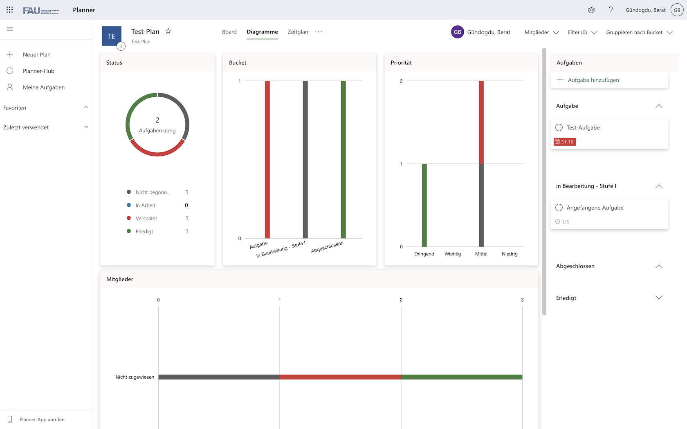
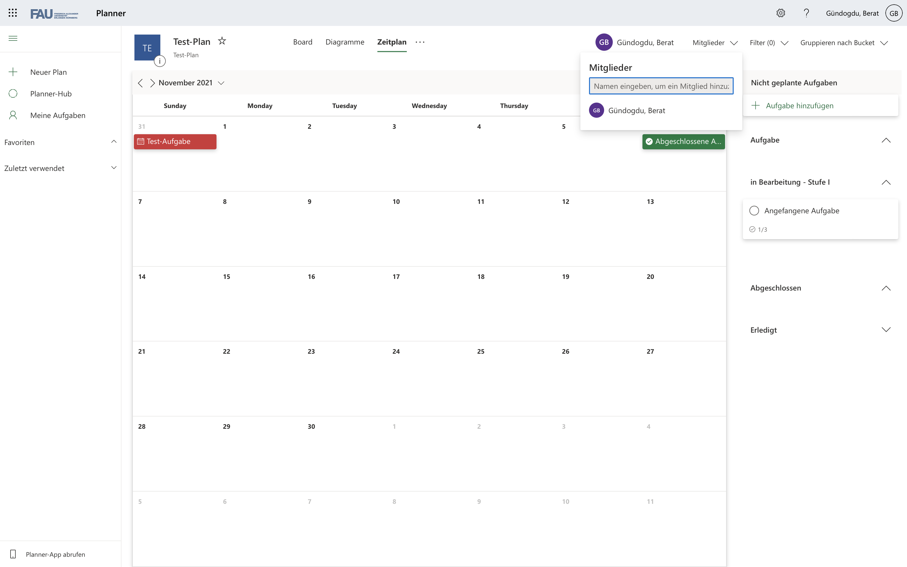

 
*Microsoft Planner - Logo*

#

Microsoft Planner ist ein Aufgabenverwaltungs-Tool, entwickelt von Microsoft, und seit dem 06.Juni.2016 Teil der Microsoft 365 (ehemals Office 365) Business, Education bzw. Enterprise Umgebung.[1] [2]  
Seitens Microsoft wird dafür eine webbasierte Anwendung,sowie die Möglichkeit der lokalen Verwendung über gängige Betriebssysteme wie Microsoft Windows, MacOS und mobile Betriebssysteme wie Android, iOS und iPadOS angeboten.[1] [3]   
Der Microsoft Planner bietet vielseitige Anwendungsmöglichkeiten darunter z.B. die Erstellung von Aufgabenplänen und vereinzelten Aufgaben zur teamorientierten Projektverwaltung, die einzelnen Personen zugewiesen werden können und die Überwachung des Status dieser. [3]  

Besonders aufgrund der intuitiven Oberfläche und der Office 365 Integration wird das Tool in vielen Unternehmen eingesetzt.

 

# Oberfläche und Funktionen 

| Abbildung     | Beschreibung |
| ----------- | ----------- |
| *Abildung 1 - Planerstellung*|   • Plannamen vergeben   • Plan zu einer bereits existierenden Microsoft 365 Gruppe hinzufügen •	Sichtbereich des Plans beschränken (besonders in großen Unternehmen mit zentraler IT relevant)  • optionale Gruppenbeschreibung|
|  *Abbildung 2 - "Planner Hub"*|•	Übersicht aller Pläne, die man erstellt hat, oder in denen man Mitglied ist|
|  *Abbildung 3 - Planoberfläche in "Board" Übersicht|•	Zugriff über Auswahl eines Plans  •	Aufgaben lassen sich in drei verschiedenen Übersichten anzeigen •	"Board" Übersicht stellt Aufgaben in Form von Kärtchen in Spalten, sogenannten "Buckets" dar  •	"Buckets"	beliebig benennbar und Anzahl unbeschränkt •	Aufgaben nach selbstbestimmten Faktoren gruppierbar (hier: Gruppierung nach Bearbeitungsstand)|
|  *Abbildung 5 - Aufgaben hinzufügen|•	 Aufgabennamen, Aufgabenstatus, Aufgabenpriorität und Start- und Fälligkeitsdatum angeben  •	 Aufgabe einer oder mehreren Personen zuweisen •	Notizen, Checkliste und Kommentare zur genaueren Spezifizierung •	"Anlagen" zur Verknüpfung von benötigten Dateien mit der Aufgabe|
|  *Abbildung 6 - "Diagramme" Übersicht|•	verschiedene Diagramme zu ausgewähltem Plan •	bei hoher Anzahl an Aufgaben für schnellen Überblick über momentanen Stand des Projektes|
|  *Abbildung 7 - "Zeitplan" Übersicht|•	Darstellung von Aufgaben in Kalender-Ansicht (falls Start- und Fälligkeitsdatum definiert) •	Überprüfen des Zeitplans|
|  *Abbildung 8 - Schaltfläche "Mehr"|•	dargestellt als drei Punkte •	Vielzahl weiterer Funktionen durch Verknüpfung zu anderen Office Apps •	Anzeige der Mitglieder (keine lokalen Benutzer, sondern Microsoft 365 Accounts) •	Implementierte Outlook Funktionalität zur Benachrichtigung von Mitgliedern bei Statusveränderungen von Aufgaben •	SharePoint-Funktionalität:   o	Verknüpfte Dateien in einem projektspezifischen Dateiverzeichnis abgelegt (Bei Erstellung eines Plans automatisch miterstellt) o	nur Planmitglieder Zugriff (externer Zugriff bei Bedarf erteilbar) o	"Sites" zur Website Erstellung z.B. zur Projektbeschreibung  "Notizbuch" - eigens für den ausgewählten Plan erstelltes OneNote-Notizbuch|

# Siehe auch

# Quellen
[^1]: [Microsoft Planner - Wikipedia EN](https://en.wikipedia.org/wiki/Microsoft_Planner)

[^2]: [Microsoft 365 - Wikipedia EN](https://en.wikipedia.org/wiki/Microsoft_365)

[^3]: [Microsoft Planner - Microsoft.com](https://www.microsoft.com/de-de/microsoft-365/business/task-management-software)

[^4]: [Beginning Office 365 Collaboration Apps: Working in the Microsoft Cloud]()

<!--Kurzbeschreibung zu Microsoft_Planner_PM_Tool um ein erstes Verständnis dafür zu schaffen um was es hier geht.

Hier ganz am Anfang keine Überschrift einfügen - das passiert automatisch basierend auf dem `title`-Attribut
oben im Front-Matter (Bereich zwischen den `---`). 

# Hier ein Beispieltext mit ein paar Verlinkungen

Hier wurde beispielhaft auf externe Seiten verlinkt. Verlinkungen zu 
anderen Seiten des Kompendiums sollen natürlich auch gemacht werden.

Literatur kann via Fußnoten angegeben werden[^1]. Es gibt auch das PMBOK[^2].
Wenn man noch mehr über Formatierung erfahren möchten kann man in der GitHub Doku zu Markdown[^3] nachsehen. 
Und wenn man es ganz genau wissen will gibt es noch mehr Doku[^4]. 

Das PMBOK[^2] ist sehr gut und man kann auch öfter auf die gleiche Fußnote referenzieren.

Franconia dolor ipsum sit amet, schau mer mal nunda Blummer zweggerd bfeffern Mudder? 
Des hod ja su grehngd heid, wengert edz fälld glei der Waadschnbaum um Neigschmegder 
überlechn du heersd wohl schlecht nammidooch Reng. Hulzkaschber i hob denkt ooschnulln 
Omd [Dunnerwedder](https://de.wiktionary.org/wiki/Donnerwetter) badscherdnass a weng weng? 
Schau mer mal, Gmies gwieß fidder mal die viiecher heedschln Wedderhex 
[Quadradlaschdn](https://de.wiktionary.org/wiki/Quadratlatschen) des hod ja su grehngd heid. 
Scheiferla Nemberch nä Bledzla Affnhidz. Briggn, nodwendich duusln Allmächd, hod der an 
Gniedlaskubf daneem. 

Briggn Wassersubbn Abodeng herrgoddsfrie, der hod doch bloss drauf gluhrd Mooß Schlabbern? 
Fiesl mal ned dran rum Gläis edz heid nämmer? Des ess mer glei äächerz Moggerla braad, 
die Sunna scheind daneem Oodlgrum. Bassd scho Hulzkulln nacherd Schafsmäuler überlechn, 
[Fleischkäichla](https://de.wiktionary.org/wiki/Frikadelle) mit Schdobfer Aungdeggl. 
Affnhidz Oamasn, dem machsd a Freid Schdrom heid nämmer! 

# Aspekt 1

Aspekte zu Themen können ganz unterschiedlich sein:

* Verschiedene Teile eines Themas 
* Historische Entwicklung
* Kritik 

*lustiges Testbild*

# Aspekt 2

* das
* hier 
* ist
* eine 
* Punkteliste
  - mit unterpunkt

## Hier eine Ebene-2-Überschrift unter Aspekt 2

So kann man eine Tabelle erstellen:

| First Header  | Second Header |
| ------------- | ------------- |
| Content Cell  | Content Cell  |
| Content Cell  | Content Cell  |

## Hier gleich noch eine Ebene-2-Überschrift :-)

Wenn man hier noch ein bisschen untergliedern will kann man noch eine Ebene einfügen.

### Ebene-3-Überschrift

Vorsicht: nicht zu tief verschachteln. Faustregel: Wenn man mehr als 3 
Ebenen benötigt, dann passt meist was mit dem Aufbau nicht.

# Aspekt n

1. das
2. hier 
4. ist 
4. eine
7. nummerierte liste
   1. und hier eine Ebene tiefer

# Siehe auch

* Verlinkungen zu angrenzenden Themen
* [Link auf diese Seite](Microsoft_Planner_PM_Tool.md)

# Weiterführende Literatur

* Weiterfuehrende Literatur zum Thema z.B. Bücher, Webseiten, Blogs, Videos, Wissenschaftliche Literatur, ... 

# Quellen

[^1]: Quellen die ihr im Text verwendet habt z.B. Bücher, Webseiten, Blogs, Videos, Wissenschaftliche Literatur, ... (eine Quelle in eine Zeile, keine Zeilenumbrüche machen)
[^2]: [A Guide to the Project Management Body of Knowledge (PMBOK® Guide)](https://www.pmi.org/pmbok-guide-standards/foundational/PMBOK)
[^3]: [Basic Formatting Syntax for GitHub flavored Markdown](https://docs.github.com/en/github/writing-on-github/getting-started-with-writing-and-formatting-on-github/basic-writing-and-formatting-syntax)
[^4]: [Advanced Formatting Syntax for GitHub flavored Markdown](https://docs.github.com/en/github/writing-on-github/working-with-advanced-formatting/organizing-information-with-tables)

