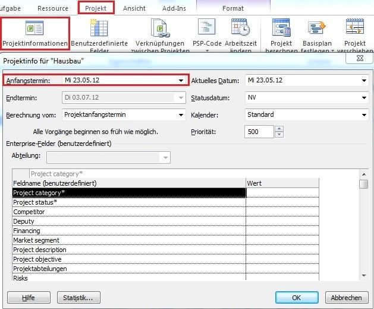
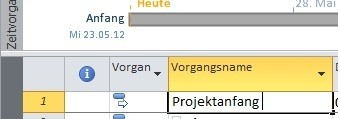
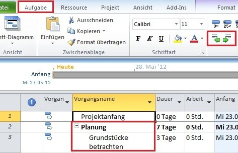
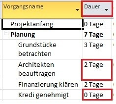
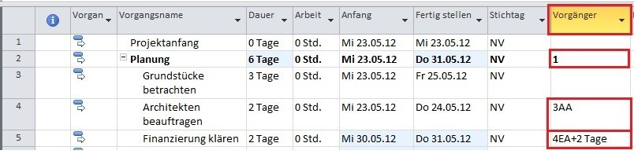
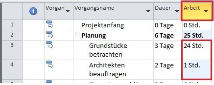
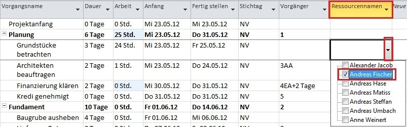
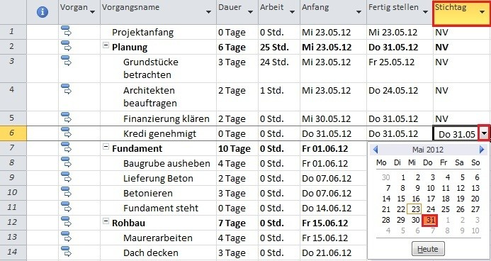
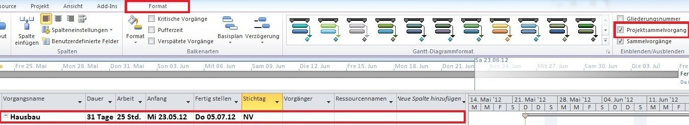
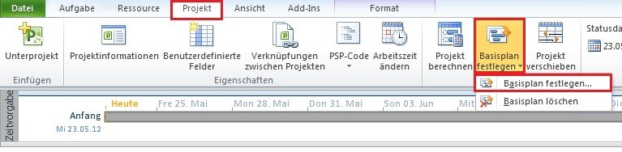

# Einleitung

[Microsoft Project](https://de.wikipedia.org/wiki/Microsoft_Project) bezeichnet eine Projektmanagementsoftware des Entwicklers Microsoft Corporation und ist Bestandteil der Office Familie. 
Neben der Microsoft Project Standard Software, als Einzelplatzversion, steht Microsoft Project Professional als Serverversion zur Verfügung.
Microsoft Project ist im Jahre 1984 erschienen und wird seit diesem Zeitpunkt regelmäßig aktualisiert und überarbeitet. 
Die aktuelle Version der Microsoft Corporation lautet Project 2019 und wird über das Betriebssystem Windows genutzt.
Die Software soll Projektmanagern das Planen, Steuern und Überwachen von Projekten ermöglichen.[^1]

Doch zu welchem Zeitpunkt ist dieses Management Tool erforderlich und was genau kann mit diesem [EDV-Programm](https://www.wortbedeutung.info/EDV-Programm/) abgebildet werden?

# Beschreibung

Zuerst sollte die Frage geklärt werden, zu welchem Zeitpunkt das Werkzeug seinen Zweck erfüllt. Dies ist laut Herrn Josef Schwab der Fall, wenn ein Planungsbedarf besteht und dieser das Projekt definiert.
Der Planungsbedarf resultiert aus einem anstehenden Vorhaben, bei welchem die Abläufe noch nicht vollständig ausgearbeitet sind und Unsicherheiten bestehen.
Kurzgefasst, werden mit dem Programm Prozesse und Meilensteine visuell sowie tabellarisch verknüpft und je nach Detaillierungsgrad abgebildet.
Bevor die Einarbeitung mit dem Programm startet, wäre es nach Herrn Schwab sinnvoll, sich folgende Fragen zu stellen: 
* wie lauten die Vorhaben, 
* wie lange dauern sie an, 
* welche Abhängigkeiten existieren und
* welche Ressourcen sind von Nöten?

Diese Fragestellungen oder Überlegungen zur Strukturierung des Projektes, können in Projects unter:
* Vorgänge, 
* Dauer,
* Vorgänger / Nachfolger sowie
* Ressourcen 

angewendet werden (vgl. Abbildung 1).
Für die Gliederung eines Projektes gibt es unterschiedliche Anzeigemöglichkeiten. Die hier beschriebene Ansicht verkörpert das Gantt-Diagramm, welches in Kombination mit einer Tabelle angezeigt wird.
Mit dem Terminmanagement, der Ressourcenplanung und der Projektüberwachung bedient das Programm zentrale Aufgaben eines Projektsteuerers.[^2]

*Abbildung 1: Die Grundbegriffe der Planung*[^2]

# Benutzeroberfläche

Die Benutzeroberfläche von MS Project verwendet das übliche Design der Office Familie. Am oberen Bildschirmrand befindet sich eine grüne Bildschirmleiste, mit dem Menüband und dessen Reiter. In der Abbildung 2 ist der Reiter "Vorgang" geöffnet, welcher die Grundfunktionen für die Tabelle auf der linken sowie dem Balkendiagramm auf der rechten Seite enthält. Unterhalb des Menüs befindet sich eine Timeline, die die Meilensteine des Projekts widerspiegelt.
Die Tabelle gliedert das Projekt in Form von Sammelvorgängen (Überpunkten) und Prozessen (Unterpunkten).
Die sich in der Beschreibung befindliche Abbildung 1 ist in der Tabelle als Kopfzeile aufzufinden.
Die Auflistung der Prozesse ist mit dem Balkendiagramm verknüpft, sodass eine Änderung in der Visualisierung mit einem Nachtrag in der Gliederung und umgekehrt einhergeht.
Im Gantt-Diagramm sind Vorgänge abgebildet, die nach Fortschritten prozentual bewertet und farblich gekennzeichnet werden.
Der Meilenstein am unteren, rechten Bildschirmrand repräsentiert ein Zwischenziel mit angehängtem Datumsformat, auf welches hingearbeitet wird.

[^4]

*Abbildung 2: Rahmenterminplan*[^2]

# In 10 Schritten zum Projektplan mit MS Project

Im Anschluss folgt eine Anleitung für die Nutzung des Programms MS Project.

### 1. Projektstart: über Register „Projekt“ unter „Projektinformationen“ definieren

Der erste Schritt in einem Projekt sollte mit der Definition des Projektstarts beginnen. 
Der Projektstart ist zugleich ein Fixpunkt, an diesem sich alle neuen Vorgänge orientieren.

*Abbildung 3: Projektstart*[^5]

### 2. Vorgänge anlegen

Bevor die „Vorgangsnamen“ eingetragen werden, sollten die Schritte für das Projektziel eindeutig definiert und Zuständigkeiten für die Vorgänge geklärt sein (Verwendung von einheitlichen Namenskonventionen).

*Abbildung 4: Vorgang*[^5]

### 3.	Projektinhalte strukturieren

Mit dem Einrücken von Vorgängen werden Projektinhalte tiefergestuft und es erfolgt die Erzeugung eines Sammelvorgangs. 
Dieser soll ein Projekt in logische Phasen untergliedern und eine übersichtlichere Darstellung ermöglichen.

*Abbildung 5: Projektinhalt*[^5]

### 4.	Dauer: Vorgänge und Meilensteine festlegen

Die Dauer entspricht den Arbeitstagen, wird für ein Intervall abgeschätzt und im Projektverlauf fortgeschrieben. 
Meilensteine werden auf null Tage gesetzt und sollten möglichst zur Vollendung eines Sammelvorgangs / Zwischenstandes verwendet werden.

*Abbildung 6: Dauer*[^5]

### 5.	Abhängigkeiten durch Vorgangsverknüpfungen

Wenn Vorgänge und Meilensteine gesetzt sind, folgen über Verknüpfungen inhaltlich, logische Beziehungen, die nicht unbedingt chronologisch abgebildet werden müssen. Neben der Ende-Anfang-Beziehung (kurz: EA) kann der User drei weitere Beziehungsarten wählen (EE, AE, AA).
Falls Verzögerungen / Beschleunigungen erfasst werden müssen, kann dies über die Angabe von Tagen mit einem Plus / Minus Zeichen angepasst werden. Die hierfür verwendeten Spalten lauten Vorgänger / Nachfolger.

*Abbildung 7: Verknüpfungen*[^5]

### 6.	Aufwand der Vorgänge festlegen

Für die Aufwandsplanung wird die Spalte „Arbeit“ verwendet und die eingegebene Zahl in Stunden berechnet. 
Hier wird die Summe der Arbeitsstunden geplant, die die Ressource für diesen Vorgang zu leisten hat. 

*Abbildung 8: Aufwand*[^5]

### 7.	Ressourcen anlegen und verwalten

Nach der Aufwandsschätzung werden Ressourcen auf Vorgänge verplant. Über „Ressource: Tabelle“ werden im lokalen Ressourcenpool Ressourcen angelegt. 
Ressourcen können als Material, Arbeit oder Kosten definiert sein. Im Ressourcenpool sollten daher klare Einheiten für die Errechnung der jeweiligen Ressourcen hinterlegt sein (Bsp.: Arbeit, Stundensatz).
Sind diese Schritte abgearbeitet können mittels einer Auswahlliste Ressourcen in der Spalte „Ressourcennamen“ gewählt werden.

*Abbildung 9: Ressourcen*[^5]

### 8.	Stichtage für Rahmentermine setzen

Um Rahmentermine in einem Projekt abzustecken, werden Meilensteine oder Vorgänge zeitlich fixiert.
Die Fixierung kann über Einschränkungen, hartes Terminziel, oder Stichtag, weiches Terminziel, erfolgen. 
Es sollte ein gesunder Mix aus beiden Festlegungsmaßnahmen verwendet werden.

*Abbildung 10: Stichtage*[^5]

### 9.	Projektsammelvorgang über das Register „Format“ einblenden

Diese Funktion dient zur Betrachtung des Projekts auf Projektebene. Somit können schnell und übersichtlich die essenziellsten Daten zusammengefasst eingeblendet werden. Der Anwender kann in dieser Ansicht lediglich den Namen des Projektes anpassen.

*Abbildung 11: Projektsammelvorgang*[^5]

### 10.	Basisplan über Register „Projekt“ festlegen

Damit die Ist-Daten der jetzigen Planungsphase fixiert werden können, wird ein Basisplan, unter Register „Projekt“ mit dem „Befehl Basisplan“ festlegen, abgespeichert. Der Basisplan kann im späteren Verlauf nach dem Fortschreiben des Rahmenterminplans zum tabellarischen sowie visuellen Abgleich genutzt werden.

*Abbildung 12: Basisplan*[^5]

# Vor- und Nachteile des EDV - Programms

| Vorteile      | Nachteile     |
| ------------- | ------------- |
| umfangreiche Funktionen innerhalb der Projektplanung                    | anspruchsvolle Einarbeitung verlangt Grundlagenschulung        |
| Detaillierungsschärfe der Visualisierung                                | hohe Anschaffungskosten für Lizenz                             |
| auf Knopfdruck ansprechend, gestaltete Reportings / Berichte            | Fehlende Intuition bei der Handhabung                          |
| effizientes Managementsystem komplexer, klassischer Projekte            | beansprucht hohen Pflegeaufwand der bespielten Daten           |
| etablierter Standard in vielen mittelständischen und großen Unternehmen |

[^3]

# Siehe auch
* [Projektmanagement](Projektmanagement.md)
* [Projektsteuerung](Projektsteuerung.md)
* [Projektstart](Projektstart.md)
* [Meilensteine](Meilensteine.md)
* [Datenmanagement im Projektmanagement](Datenmanagement_im_PM.md)
* [Gantt-Diagramme](Gantt_Diagramme.md)

# Weiterführende Literatur

[Schwab, Josef: Projektplanung mit Project 2010, Carl Hanser Verlag GmbH & Co. KG, 2011](https://www.hanser-elibrary.com/doi/book/10.3139/9783446428423)

[Rosenstock, Jürgen: Microsoft Project 2016, Das umfassende Handbuch, Rheinwerk Computing, 3. aktualisierte Auflage, 2016](https://www.rheinwerk-verlag.de/microsoft-project-2016-das-umfassende-handbuch/)

[Holert, Renke: Microsoft Project 2019, holert, 7. aktualisierte Auflage, 2020https://shop.holert.com/products/microsoft-project-2019](https://shop.holert.com/products/microsoft-project-2019)

[YouTube: MS Project Tutorials](https://www.youtube.com/results?search_query=ms+project+tutorial)

# Quellen

[^1]: https://de.wikipedia.org/wiki/Microsoft_Project
[^2]: [Schwab, Josef: Projektplanung mit Project 2010, Carl Hanser Verlag GmbH & Co. KG, 2011](https://www.hanser-elibrary.com/doi/book/10.3139/9783446428423)
[^3]: https://www.projektmanager-blog.de/post/ms-project
[^4]: https://bilder.buecher.de/zusatz/08/08755/08755986_lese_1.pdf 
[^5]: https://www.arksolutions.de/themen/in-10-schritten-zu-einem-guten-projektplan-mit-ms-project/
