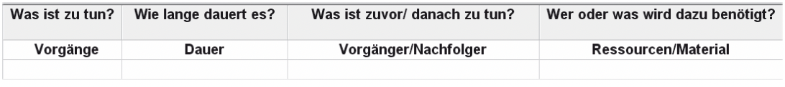
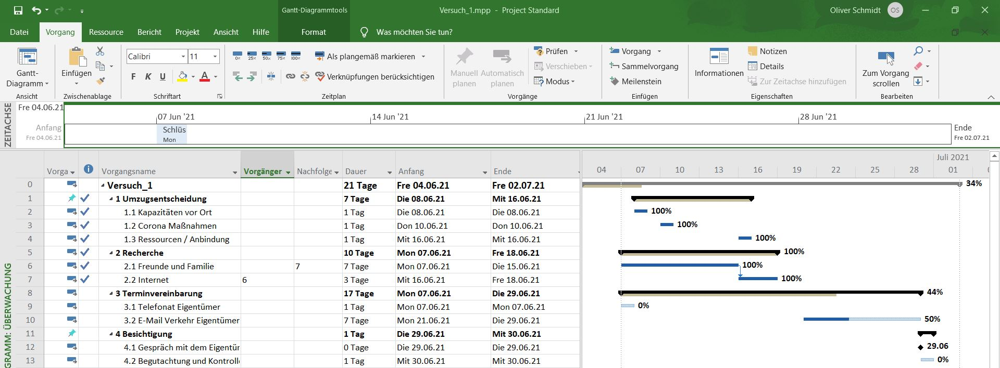

# Einleitung

[Microsoft Project](https://de.wikipedia.org/wiki/Microsoft_Project) bezeichnet eine Projektmanagementsoftware des Entwicklers Microsoft Corporation und ist Bestandteil der Office Familie. 
Neben der Microsoft Project Standard Software, als Einzelplatzversion, steht Microsoft Project Professional als Server Version zur Verfügung.
Microsoft Project ist im Jahre 1984 erschienen und wird seit diesem Zeitpunkt regelmäßig aktualisiert und überarbeitet. 
Die aktuelle Version der Microsoft Corporation lautet Project 2019 und wird über das Betriebssystem Windows genutzt.
Die Software soll Projektmanagern das Planen, Steuern und Überwachen der Projekte ermöglichen.[^1]

Doch zu welchem Zeitpunkt ist dieses Management Tool erforderlich und was genau kann mit diesem EDV-Programm abgebildet werden?

# Beschreibung

Zuerst sollte die Frage geklärt werden, zu welchem Zeitpunkt das Werkzeug seinen Zweck erfüllt. Dies ist laut Herrn Josef Schwab der Fall, wenn ein Planungsbedarf besteht und dieser das Projekt definiert.
Der Planungsbedarf resultiert aus einem anstehenden Vorhaben, bei welchem die Abläufe noch nicht vollständig ausgearbeitet sind und Unsicherheiten bestehen.
Kurzgefasst, werden mit dem Programm Prozesse und Meilensteine visuell sowie tabellarisch verknüpft und je nach Detaillierungsgrad abgebildet.
Bevor die Einarbeitung mit dem Programm startet, wäre es nach Herrn Schwab sinnvoll sich folgende Fragen zu stellen: 
* wie lauten die Vorhaben, 
* wie lange dauern sie an, 
* welche Abhängigkeiten existieren 
* und welche Ressourcen sind von Nöten?

Diese Fragestellungen oder Überlegungen zur Strukturierung des Projekts, können in Projects unter:
* Vorgänge, 
* Dauer, 
* Vorgänger / Nachfolger 
* sowie Ressourcen
 
angewendet werden (vgl. Abbildung 1).
Für die Gliederung eines Projekts gibt es unterschiedliche Anzeigemöglichkeiten. Die hier beschriebene Ansicht verkörpert das Gantt Diagramm, welches in Kombination mit einer Tabelle angezeigt wird.
Mit dem Terminmanagement, der Ressourcenplanung und der Projektüberwachung bedient das Programm zentrale Aufgaben eines Projektsteuerers.[^2]

*Abbildung 1: Die Grundbegriffe der Planung*[^2]

# Benutzeroberfläche

Die Benutzeroberfläche von MS Project verwendet das übliche Design der Office Familie. Am oberen Bildschirmrand befindet sich eine grüne Bildschirmleiste, mit dem Menüband und dessen Reiter. In der Abbildung 2 ist der Reiter "Vorgang" geöffnet, welcher die Grundfunktionen für die Tabelle auf der linken sowie dem Balkendiagramm auf der rechten Seite enthält. Unterhalb des Menüs befindet sich eine Timeline, die die Meilensteine des Projekts widerspiegelt.
Die Tabelle gliedert das Projekt in Form von Sammelvorgängen (Überpunkten) und Prozessen (Unterpunkten).
Die sich in der Beschreibung befindliche Abbildung 1 ist in der Tabelle als Kopfzeile aufzufinden.
Die Auflistung der Prozesse ist mit dem Balkendiagramm verknüpft, sodass eine Änderung in der Visualisierung mit einem Nachtrag in der Gliederung und umgekehrt einhergeht.
Im Gantt Diagramm sind Vorgänge abgebildet, die nach Fortschritten prozentual bewertet und farblich gekennzeichnet werden.
Der Meilenstein am unteren, rechten Bildsschirmrand repräsentiert ein Zwischenziel mit angehängtem Datumsformat, auf welches hingearbeitet wird.

[^4]

*Abbildung 2: Rahmenterminplan*[^4]

# Vor- und Nachteile des EDV - Programms

| Vorteile      | Nachteile     |
| ------------- | ------------- |
| umfangreiche Funktionen innerhalb der Projektplanung                    | anspruchsvolle Einarbeitung verlangt Grundlagenschulung        |
| Detaillierungsschärfe der Visualisierung                                | hohe Anschaffungskosten für Lizenz                             |
| auf Knopfdruck ansprechend, gestaltete Reportings / Berichte            | Fehlende Intuition bei der Handhabung                          |
| effizientes Managementsystem komplexer, klassischer Projekte            | beansprucht hohen Pflegeaufwand der bespielte Daten            |
| etablierter Standard in vielen mittelständischen und großen Unternehmen |

[^3]

# Siehe auch
* [Projektmanagement](Projektmanagement.md)
* [Projektsteuerung](Projektsteuerung.md)

# Weiterführende Literatur

[Schwab, Josef: Projektplanung mit Project 2010, Carl Hanser Verlag GmbH & Co. KG, 2011](https://www.hanser-elibrary.com/doi/book/10.3139/9783446428423)

[Rosenstock, Jürgen: Microsoft Project 2016, Das umfassende Handbuch, Rheinwerk Computing, 3. aktualisierte Auflage, 2016](https://www.rheinwerk-verlag.de/microsoft-project-2016-das-umfassende-handbuch/)

[Holert, Renke: Microsoft Project 2019, holert, 7. aktualisierte Auflage, 2020https://shop.holert.com/products/microsoft-project-2019](https://shop.holert.com/products/microsoft-project-2019)

# Quellen

[^1]: https://de.wikipedia.org/wiki/Microsoft_Project
[^2]: [Schwab, Josef: Projektplanung mit Project 2010, Carl Hanser Verlag GmbH & Co. KG, 2011](https://www.hanser-elibrary.com/doi/book/10.3139/9783446428423)
[^3]: https://www.projektmanager-blog.de/post/ms-project
[^4]: Schmidt, Oliver (2021) 

