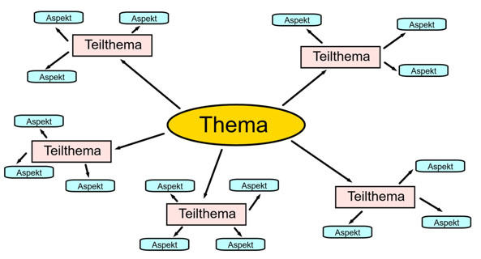
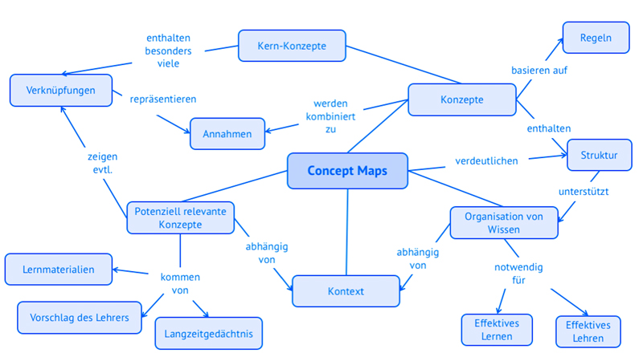

# Mind-Mapping

## Einführung & Definition

Um innerhalb des [Projektmanagements](https://github.com/ManagingProjectsSuccessfully/ManagingProjectsSuccessfully.github.io/blob/main/kb/Projektmanagement.md) den Erfolg eines [Projekts](https://github.com/jonaskarg187/ManagingProjectsSuccessfully.github.io/blob/main/kb/Projekt.md) zu sichern, gibt es viele Methoden, die Arbeitsweise und den Projektabschluss bzw. [Projektabschlussbericht](https://github.com/ManagingProjectsSuccessfully/ManagingProjectsSuccessfully.github.io/blob/main/kb/Projektabschlussbericht.md) positiv zu beeinflussen und zu optimieren.
Eine altbewährte Methode, kreatives, flexibles und hirngerechtes Arbeiten zu ermöglichen, ist das sogenannte Mind-Mapping, welches dazu dient möglichst übersichtlich und einfach Informationen zu einem Überthema grafisch darzustellen. 
Hierbei werden das zentrale Thema in der Mitte der Karte platziert und Notizen dazu rund um den Themabegriff gesammelt. Dies eignet sich, um eine schnelle und gehaltvolle Übersicht auf den ersten Blick bereitzustellen.
Vom mittleren Hauptthema gehen Verzweigungen aus, die zu Gedanken und Unterpunkten führen.
Diese Unterpunkte können sich wiederum in weiterführende Zweige aufgliedern.[^1]

 [^2]

**„Mind-Mapping ist der meines Wissens nach effektivste Mechanismus, um die erhöhte Flexibilität des Denkens wirklich werden zu lassen.“**
So formuliert Peter Kline, ein renommierter Dichter und Lehrer an der University of San Francisco, eine Definition von Mind-Mapping [^3]

Das Konzept des Mind-Mappings wurde von Tony Buzan konzipiert, indem er sich die Frage stellte, wie man sich am besten Dinge merken kann. Er sah darin das Potential, durch Verbildlichung von Texten sowohl die linke als auch die rechte Gehirnhälfte gleichzeitig zu aktivieren und so die Erinnerungsleistung zu optimieren.

Dieser Behaltensprozess wird schon durch das reine Anfertigen der Grafik angetrieben, welches durch Suchen nach Schlüsselbegriffen und der Gestaltung mit Farben und Formen geschieht. [^4]

## Programme zur Erstellung

Um Mindmaps übersichtlich visuell abzubilden, eignen sich einige computergestützte Programme sehr gut. Diese helfen dabei, das systematische Erfassen von Inhalten zu vereinfachen. 
Der Vorteil darin besteht daraus, die Mindmap relativ simpel zu verändern und gegebenenfalls zu ergänzen. Es bietet außerdem die Möglichkeit mit mehreren [Projektmitarbeitern](https://github.com/Emi1404/ManagingProjectsSuccessfully.github.io/blob/a1985504cd4d3fbcee13109d0b2090a80a2de518/kb/Projektmitarbeiter.md) gleichzeitig an einem Inhalt zu arbeiten und ihn so stetig zu verbessern. 
Die Option zusätzlicher Funktionen, wie dem Hinterlegen von Notizen zu einzelnen Schlüsselbegriffen oder ganzen Dokumenten, wird zusätzlich zu dem grafischen Potential der Gestaltung von Punkten und Unterpunkten angeboten. Auch das Anlegen von Verknüpfungen zu Mailprogrammen kann nützliche Werkzeuge bieten, wie das Verschicken von Erinnerungsterminen. [^4]
Als solche Programme sind XMind oder FreeMind aufzuführen.

## Einsatzmöglichkeiten von Mindmaps

Da die Mindmap Methode eine sehr vielseitige und in mehreren Bereichen anwendbare Vorgehensweise darstellt, sind die Einsatzmöglichkeiten vielfältig.

Somit kann Mind-Mapping ein sehr nützliches Werkzeug in der [Projektplanung](https://github.com/ManagingProjectsSuccessfully/ManagingProjectsSuccessfully.github.io/blob/main/kb/Projektplanung.md) sein oder der Strukturierung eines Vortrags dienen. Weitere Anwendungsbereiche sind die Ideenfindung, das Mitschreiben bei Vorträgen, die Texterfassung, das Strukturieren, die Neuordnung von Wissen und die Prüfungsvorbereitung. Einsetzbar ist sie sowohl bei der individuellen Anwendung als auch in kollektiven Gruppenprozessen. [^4]

## Verwandte Formen

Eine verbreitete Vorstufe des Mind-Mappings bildet das Clustern. Das Clustern stellt eine Sonderform des Brainstormings dar. Diese Methode stammt aus dem Umfeld kreativen Schreibens. Im Unterschied zur Mindmap soll beim Cluster jede Assoziation aufgeschrieben werden, ohne sie zu bewerten. Ein Cluster hilft dabei, neue Inhalte durch Assoziationen zu generieren und alle Ideen zu einem Thema zu sammeln.[^4][^5] 

Das sogenannte Conceptmapping ist eine abgewandelte Form der Mindmap, bei der Relationen zwischen den einzelnen Unterpunkten hergestellt werden. Durch das komplexe Kombinieren einzelner Stichpunkte miteinander entsteht ein aussagekräftiges Begriffsnetz. Die Beziehungen zwischen den Begriffen werden anhand von teilweise beschrifteten Linien und Pfeilen definiert. 

 [^6]

## Fazit

Das Mind-Mapping ist eine sehr nützliche Methode um Projekte zu planen und kann in viele verschiedene Projektphasen eingebunden werden.
Sie ist sehr unkompliziert anzuwenden und hilft dabei komplexe Zusammenhänge auf einen Blick darzustellen.

### Weiterführende Literatur

* Maria Beyer: Brainland – Mind Mapping in Aktion. 3. Auflage, Junfermann, Paderborn 2002
* Tony Buzan, Barry Buzan: Das Mind-Map-Buch. Die beste Methode zur Steigerung Ihres geistigen Potentials. Moderne Verlagsgesellschaft, München 2002
* Tony Buzan, Vanda North: Mind Mapping. Der Weg zu Ihrem persönlichen Erfolg. öbv & hpt Verlag, Wien 2005

### Quellen

[^1]: [Reich, K, (2003), Methodenpool](http://methodenpool.uni-koeln.de/download/mindmapping.pdf)
[^2]: [Abbildung 1, Mindmap Grafik), Methodenpool](https://www.virtuos.uni-osnabrueck.de/en/hochschuldidaktik/methoden/mindmap.html)
[^3]: Peter Kline, Das Alltägliche Genie, Paderborn 1995, S.369) 
[^4]: [Uni Frankfurt, MindMapping](https://www.uni-frankfurt.de/53571999/Mindmapping)
[^5]: [STW Berlin, Cluster und Mind-Map](https://www.stw.berlin/assets/sw-berlin/bereiche/beratung/Schreibzentrum/Lernmaterialien/Handout_Cluster_Mind_Map_Webseite_2020.pdf)
[^6]: [Abbildung 2, Clustermap Grafik](https://mint-zirkel.de/2019/08/concept-maps/)

