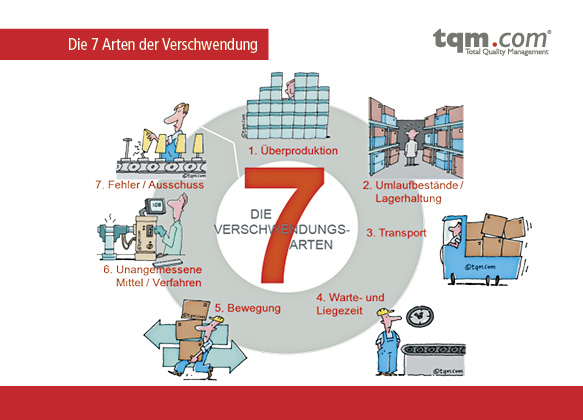

# Muda 7 Arten von Verschwendung
In der Produktion, sollte der Verschwendung immer vermieden werden. Mittels die Kenntnis der 7 Verschwendungsarten bzw. 7 Muda bekommt man dieses Problem in den Griff. [^1]

# Welche 7 Arten der Verschwendung gibt es?

In der klassichen Leher des Lean Manufacturing werden Verschwendungsarten definiert, die reduziert werden können. Folgendes gilt um zu vermeiden : Transport, Lagerbestände, Bewegungen, Warten, Überproduktion, schlechte Prozesse/ Technologien Ausschuss/ Nacharbeit. Normalerweise sind diese Arten von Verschwendungen miteinander verbunden. Beispielsweise führt eine Überproduktion zu einem erhöhten Lagerbestand, was zu höheren Transportkosten führt.[^1]

# Umgang mit der 7 Arten der Verschwendung
Die Beseitigung verschwenderischer Aktivitäten ist entscheidend für den Erfolg Ihres Unternehmens. Sie können die Rentabilität senken, die Kundenkosten erhöhen, die Qualität und sogar die Zufriedenheit der Mitarbeiter verringern. Aus diesem Grund müssen Sie die nicht wertschöpfenden Aktivitäten identifizieren und versuchen, den Prozess, in dem sie auftreten, zu verbessern oder sie letztendlich zu eliminieren[^4]

Hier führt nur ein systematisches Vorgehen zum Ziel. Das sind Komplexe Fragen: Welche Hebel führen wirklich zu Verschwendung? Wie Kann man es am effektivsten bekämpfen? Der Begriff  ‚Muda‘ kommt aus den Japanisches Wort ‚Muda‘ und es lässt sich auf deutsch als ‚sinnlose Tätigkeit‘ defnieren. Die 7 Arten der Verschwendungen sowie die Tipps um denen zu vermeiden werden unten in der Liste veranschaulicht.[^1]

 

*7 Arten der Verschwendung*

 # Muda 1 : Transport
Während Material transportiert wird, kann kein Mehrwert entstehen. Personal und      Energie werden benötigt , das heißt steigende Kosten. Schäden während des Transports könnten auch entstehen. Außerdem sollte man auch prüfen, ob Weg A nach B nicht verkürzen lässt.[^1]

Tipps: 
*	Workstations näher zueinander bringen

 # Muda 2 : Lagerbestände reduzieren
Ein überfülltes Lager ist kein Zeichen von Erfolg, ganz im Gegenteil. Dies ist ein Hinweis darauf, dass die Planung der Produktion verbessert werden muss. Übermäßige Lagerbestände bedeutet auch höhere Lagerbestände.[^2]

Tipps: 
* Standardisierte und stabile Prozesse schaffen
*	Produktion besser ‚timen‘

# Muda 3 : Nicht ergonomische Bewegungen vermeiden
Es gibt viele Schritte in der Produktion die einfach keinen Wert haben. Hierzu zählen überflüssige Laufwege Ihrer Mitarbeiter. Fehlhaltungen und Beugungen Beispielsweise  führen zu Knochen und Muskeln  Belastungen der Mitarbeiter. [^1]

Tipps: 
* Modulares, ergonomisches Arbeitsplatzsystem aufsetzen

# Muda 4 : Wartezeiten

Wenn sich Güter oder Aufgaben nicht bewegen, kommt es zu Wartezeiten. Dies sind zum Beispiel Waren, die darauf warten, ausgeliefert zu werden, Ausrüstung, die darauf wartet, repariert zu werden, oder ein Dokument, das auf die Genehmigung von Führungskräften wartet.[^3]

# Muda 5 : Überproduktion

Dieser Punkt ist vergleichbar mit der Verschwendung von Lagerbeständen. Auch hier liegt eine falsche Bewertung der Anfrage vor. Dadurch wird das Kapital länger immobilisiert und auch eine Qualitätsminderung während der Lagerungszeit ist ebenfalls denkbar. Doch die Lean Produktion kennt den richtigen Ansatz, um dem entgegenzuwirken.[^4]

Tipps:

* •	Anstreben des Pull-Prinzip (Produktion nach Bedarf) [^1]

# Muda 6 : Überbearbeitung

Auch wenn die Arbeitsschritte unnötig kompliziert sind, ensteht in der Produktion Verschwendung. Es ist wichtig dass, eine Optimierung der kontinuierlichen Modernisierung von Infrastrukturen durchgeführt werden sollen. Der einfachste Weg dies zu tun, sind modulare Produktionssysteme.

Tipps: 
* 	Stetige Verbesserungen statt übertriebene Sorgfalt im Hier und Jetzt[^1]

# Muda 7 : Defekte

Mängel/Fehler können zu Nacharbeit, oder schlimmer noch zu Ausschuss führen. Generell müssten fehlerhafte Jobs wieder in Produktion genommen werden, was wertvolle Zeit kostet. Darüberhinaus ist in einigen Fällen ein zusätzlicher Nachbesserungsbereich erforderlich, der mit einer zusätzlichen Ausbeutung von Arbeitskräften und Werkzeugen verbunden ist. [^4]

# Quellen

[^1]: https://www.produktion.de/technik/die-7-verschwendungsarten-und-was-sie-dagegen-tun-koennen-335.html)

[^2]: https://der-prozessmanager.de/aktuell/wissensdatenbank/arten-der-verschwendung)

[^3]:[Die 7 Verschwendungsarten in Lean: Wie Sie Ihre Ressourcen optimieren ]   https://kanbanize.com/de/lean-management-de/wert-verschwendung/7-arten-der-verschwendung-nach-lean)

[^4]:[ Advanced Formatting Syntax for GitHub flavored Markdown](https://docs.github.com/en/github/writing-on-github/working-with-advanced-formatting/organizing-information-with-tables)

