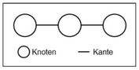

Die Netzplantechnik ist ein wichtiges Instrument für die Planung und Steuerung von Projekten und somit die Basis einer erfolgreichen Projektplanung. Dabei werden einzelne Teilschritte des Projektes als Knoten dargestellt und gemäß Ihrer zeitlichen Abhängigkeit voneinander als Netz verbunden, um die Reihenfolge aufzuzeigen, in der die Vorgänge durchgeführt werden müssen. 

# Methodik der Netzplantechnik

## Elemente von Netzplänen

Zum Verständnis der Methodik der Netzplantechnik, ist es zunächst notwendig, grundlegende Begriffe zu erklären und die Elemente von Netzplänen deutlich zu machen. Unter einem Graphen im Sinne der Netzplantechnik versteht man eine Menge von Knoten, die durch eine Menge von Kanten einander zugeordnet sind. Einen solchen Graphen zeigt Abb. 1.
Wird hierauf aufbauend einer Kante durch einen Pfeil eine Richtung gegeben und werden zwei Knoten miteinander verbunden, entsteht ein sogenannter Diagraph.
Solch ein stark vereinfachter Netzplan wird in Abb. 2 dargestellt.

In der Ablaufdarstellung mithilfe eines Netzplans existieren verschiedene Darstellungsformen, allerdings bestehen Netzpläne immer aus Vorgängen und Ereignissen. Ein Vorgang beschreibt den Sachverhalt des Projektablaufs mit einem bestimmten Anfang und einem bestimmten Ende. Es ist ein Ablaufelement, welches immer durch eine bestimmte Dauer gekennzeichnet ist, die benötigt wird um den Vorgang auszuführen. Wenn ein Vorgang beginnt oder endet, dann immer mit dem Eintritt eines Ereignisses. Solch ein Ereignis beschreibt lediglich den Eintritt eines bestimmten Zustandes, und verfügt daher über keine Dauer.

[^1]

kb/Netzplantechnik/Bild 1.jpg
!kb/Netzplantechnik/Bild 1.jpg

*Abbildung.1 Darstellung eines Graphen*     

### Arten der Netzplandarstellung
Für die Darstellung von Projektabläufen mit der In der NPT existieren verschiedene Möglichkeiten um Projektabläufe dazustellen.
Bei der Ablaufdarstellung  von Projektabläufen mithilfe der  Netzplantechnik gibt es drei Grundarten von Netzplänen. Diese bezeichnet man als [Ereignisknoten-, Vorgangspfeil- und Vorgangsknoten-Netzplan] (https://de.wikipedia.org/wiki/Netzplantechnik#Ziele_der_Netzplantechnik).
Grundsätzlich sind zwischen diesen Netzplandarstellungen auch Mischformen möglich. Bei diesen gemischtorientierten Netzplänen werden allerdings im Vergleich zu den nichtgemischten Netzplänen dennoch Vorgänge als auch Ereignisse abgebildet.

# Projektplanung der Netzplantechnik

Die Projektplanung mithilfe der Netzplantechnik wird besonders in folgende Schritte unterteilt:

1. Ablaufplanung (Strukturanalyse und Netzplanerstellung)
2. Zeitplanung (Berechnung des Netzplans)
3. Kostenplanung
4. Kapazitätsplanung

Im Rahmen der Ablaufplanung zerlegt man das Projekt in die einzelnen Vorgänge und identifiziert
die Anordnungsbeziehungen zwischen diesen Vorgängen.
Danach folgt mithilfe des Netzplans die strukturelle Darstellung des Projekts. 
Als nächstes erfolgt mit dem erstellten Netzplan die Zeitplanung des Projekts. 
Diese umfasst die Bestimmung der frühesten und spätesten Anfangs- sowie Endzeitpunkte der einzelnen Vorgänge.
Der Zeitbedarf für jeden Vorgang variiert nach den vorhandenen Ressourcen des Unternehmens. 
Zuerst werden in der Zeitplanung die frühestmöglichen Anfangs- und Endzeitpunkte der einzelnen Vorgänge durch die [Vorwärtsrechnung] (https://www.bwl-lexikon.de/wiki/netzplantechnik/#2-schritt-die-vorwaertsterminierung) ermittelt. Anschließend bestimmt man die spätestmöglichen Anfangs- und Endzeitpunkte mit der [Rückwärtsrechnung] (https://www.bwl-lexikon.de/wiki/netzplantechnik/#3-schritt-die-rueckwaertsterminierung).
Nun erhält man aus der Differenz der spätesten und frühesten Zeitpunkten die Zeitreserven für die Durchführung der Vorgänge. Diese Zeitreserven werden auch Pufferzeiten genannt. Vorgänge die keine Pufferzeiten enthalten, werden kritische Vorgänge genannt.
Die Verbindung dieser kritischen Vorgänge ergibt den kritischen Pfad und somit den längsten Weg im Netzplan. Sobald sich nur ein einziger kritischer Vorgang verzögert, verlängert sich die gesamte Projektdauer. In jedem Projekt befindet sich mindestens ein kritischer Pfad, welcher den Fertigstellungstermin des Projektes angibt.  Anhand des ermittelten Zeitbedarfs, können von den einzelnen Vorgängen die Kosten bestimmt werden und dadurch die Gesamtkosten des Projekts.
Mittels der Gegenüberstellung angefallener Ist-Kosten mit den ermittelten Plan-Kosten ist es möglich Abweichungen früh genug zu erkennen und dementsprechend zu Handeln. 
Als letzter Schritt bei der Kapazitätsplanung, sollen die kapazitätsmäßigen Voraussetzungen für die Durchführung des Projekts geschaffen werden. Dabei wird eine hohe und gleichmäßige Auslastung der vorhandenen Ressourcen angestrebt.

* Verlinkungen zu angrenzenden Themen
* [Link auf diese Seite](Netzplantechnik.md)

# Weiterführende Literatur

* Kapahnke (2018): "Grundlagen der Netzplantechnik"

# Quellen

[^1]: [NETZPLANTECHNIK: SO GELINGT DIE ERFOLGREICHE PROJEKTPLANUNG ✔] (https://www.kayenta.de/training-seminar/artikel/netzplantechnik-so-gelingt-die-erfolgreiche-projektplanung.html#ce-1142)
[^2]: [Netzplantechnik](https://www.bwl-lexikon.de/wiki/netzplantechnik/#3-schritt-die-rueckwaertsterminierung)
[^3]: [Netzplantechnik](https://de.wikipedia.org/wiki/Netzplantechnik#Ziele_der_Netzplantechnik)
[^4]: [Netzplantechnik](https://www.quality.de/lexikon/netzplantechnik/#Anwendungsempfehlung)
[^5]: [Was ist ein Netzplan?] (https://t2informatik.de/wissen-kompakt/netzplan/)
[^6]: 
[^7]:
[^8]:
[^9]:
