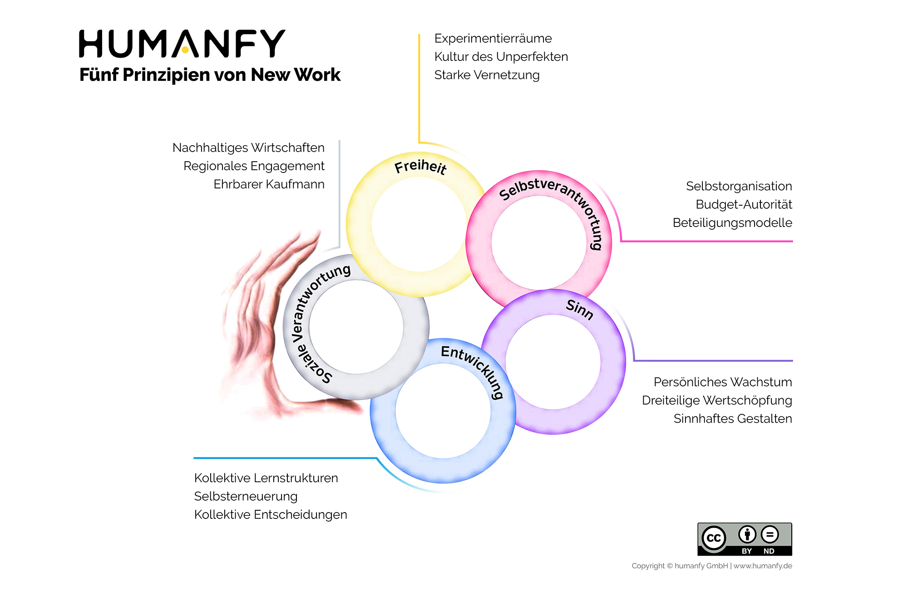

New Work ist ein philosophischer Denkansatz des Sozialphilosophen [Fithjof Bergmann](https://de.wikipedia.org/wiki/Frithjof_Bergmann) der Ende der 1980er Jahre begründet wurde. [^1][^7] Er Beschreibt die neue Art der Arbeit unter der Annahme das alte Arbeitssystem sei überholt.
Geprägt 

# Entstehungsgeschichte
New Work wurde anfang der 1980 Jahre im Zuge der Automatisierung von Frithof Bergmann beim Automobilhersteller General Motors in Flint, Michigan entwickelt. Bergmann stellte fest, dass nicht die ganze Arbeit abgeschafft wird sondern diese nur verkürzt wird. 
So erarbeitete er das Konzept "New Work". 
Es bestand daraus, dass die Angestellten sechs Monate in der Fabrik  arbeiten und den Rest des Jahres, zusammen mit dem neu gegründeten Zentrum für neue Arbeit, herauszufinden was sie "wirklich, wirklich" wollen. Das Ziel war nicht Entlassungen zu verhindernm sondern Zeit zur Berufungsfindung unter proffesioneller Betreuung zu geben[^6][^7]

# Philospophie
## Grundannahmen

New Work stellt zwei Annahmen in den Vordergund:
* Arbeit  kann Leben nehmen sowie geben.
* Menschen erkennen keine Sinnhaftigkeit in ihrer Arbeit. [^1]

Daraus leitet [Bergmann](https://de.wikipedia.org/wiki/Frithjof_Bergmann)  den Aussdruck "Armut der Begierde ab.
Menschen leiden häufig darunter, dass ihre Begierde nachlässt und das Wollen durch die Erziehung unterdrückt wird. [^5]

Es geht beim New Work darum, diesen Mangel abzubauen und in den Arbeitenden eine Verbindung zwischen Sehnsucht, Leidenschaft, Erfüllung und Arbeit herzustellen. Die Arbeit soll die Mitarbeiter mit positiven Gefühlen wie Freude und Tatkraft erfüllen. [^2]

Um Arbeit mit Begierde und positiven Eigenschaften zu verbinden postuliert [Bergmann](https://de.wikipedia.org/wiki/Frithjof_Bergmann) des Weiteren den Zentralen Ausdruck <b>"wirklich, wirklich wollen" </b>
Es soll die Beschäftigung gefunden werden die das Leben erfüllt und nicht als ein milderes Übel angesehen wird. New Work versucht weiter die Brücke zu schlagen zwischen dem ""wirklich, wirklich" wollen und dem davon Leben können.[^2]
Das "wirklich, wirklich" wollen erfüllt das Leben und soll die Armut der Begierde zu bekämpfen. [^5]

# New Work heute

Um New work ist es zwischen seiner Entstehung und der Jahrhundertwende still geworden. In den letzten zwei Jahrzehnten hat dieses Konzept jedoch durch die zunehmende Vorderung nach selbstbestimmter und erfüllender Arbeit erheblich an Bedeutung gewonnen. [^6]

Im Zuge dieser Entwicklung bildeten sich zu New Work beratende Unternehmen.

Ein Beispiel hierfür ist die [humanfy GmbH](https://humanfy.de/new-work-charta/).

Die von [Humanfy](https://humanfy.de/new-work-charta/) definierte "New Work Charter" zeigt Eindrucksvoll wie aus dem ursprünlichen recht einfachen Doktrin des "wirklich, wirklich wollens" ein umfassendes Konzept entstanden ist an dem sich Unternehmen orientieren sollten. Das Konzept beinhaltet die wichtigsten Punkte um die ursprünglichen Anforderungen von New Work mit der heutigen Unternehmenskultur zu versöhnen.[^4] 

*Die 5 Prinzipien von New Work (Ausgearbeitet von [Humanfy](https://humanfy.de/new-work-charta/))* [^3]

# New Work im Projektmanagement
In der "New Work Charta" wird deutlich, dass das heutige Vertständnis von New Work ein agiles ist. Der Mensch soll Frei, Selbstverantwortend, Sinnhaft, sich weiterentwickelnd und mit sozialer Verantwortung arbeiten. 

Um den Mitarbeitenden eine erfüllende Beschäftigung zu bieten orientieren sich auch viele Konzepte des Projektmanagements an den Grundpfeilern der "New Work Charta". Eine Auswahl der wichtigsten sieder Konzepte sind:

* <b> Feedback Kultur </b>
  - wichtig für Punkt Entwicklung [....]
* <b> Vision </b>
  - Wichtig für Punkt Sinn [...]
* <b> Retrospektive </b>
  - Wichtig für Punkt Entwicklung [...]

# Siehe auch

* Verlinkungen zu angrenzenden Themen
* [Link auf diese Seite](New_Work.md)

# Weiterführende Literatur

* Weiterfuehrende Literatur zum Thema z.B. Bücher, Webseiten, Blogs, Videos, Wissenschaftliche Literatur, ...

# Quellen

[^1]:[New Work Hacks](https://link.springer.com/book/10.1007%2F978-3-658-27299-9)
[^2]: [Beraterdämmerung](https://link.springer.com/book/10.1007%2F978-3-658-24103-2)
[^3]: [HUMANFY New Work Charta](https://humanfy.de/new-work-charta/)
[^4]: [Markus Väth](https://de.wikipedia.org/wiki/Markus_V%C3%A4th)
[^5]: [XING New Work Experience, Vortrag Prof. Dr. Frithjof](https://www.youtube.com/watch?v=29IoGFD86QM)
[^6]: [Hornung S (2018) Interview zu New Work Frithjof Bergmann](https://www.haufe.de/personal/hr-management/frithjof-bergmann-uebt-kritik-an-akteuller-new-work-debatte_80_467516.html)
[^7]: [University of Michigan](https://news.umich.edu/eight-faculty-members-retire/)
[^8]: [New Work Definition](https://www.businessinsider.de/gruenderszene/lexikon/begriffe/new-work/)

