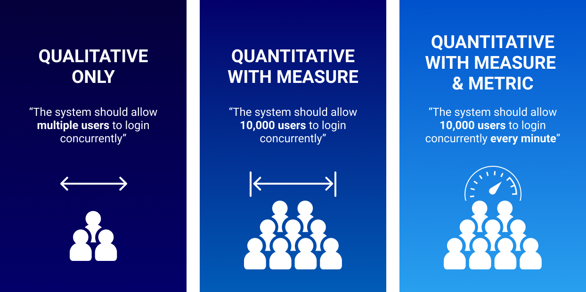

# 1. Definition

Im Projektmanagement unterscheidet man unter anderem zwischen [Funktionalen](https://github.com/seriousTake/ManagingProjectsSuccessfully.github.io/blob/main/kb/Funktionale_Anforderungen.md) und Nicht-Funktionalen Anforderungen.
Während funktionale Anforderungen vorgeben was ein Produkt (z.B. Software) können soll bzw. was für Funktionen und Features es haben soll,
werden bei nicht-funktionalen Anforderungen Randbedingungen, Qualität und Leistung betrachtet.[^1]

## 1.1. Am Beispiel: Smartphonespiel

Zur Veranschaulichung wird ein möglicher Auftrag betrachtet. Der Kunde verlangt von einem Softwareentwicklungshaus ein Puzzle-Spiel mit Fussballelementen.
Dieses soll sowohl auf Android als auch auf iOS spielbar sein. 
Kernanforderungen, also funktionale Anforderungen, sind in unserem Fall ein Smartphonespiel, welches für zwei verschiedene Smartphonebetriebssysteme entwickelt werden soll.
Das Endprodukt soll ein Fussball-Puzzlespiel sein.
Nicht-funktionale Anforderungen, die der Kunde nicht explizit nennt, aber erwartet sind z.B. schnelle Ladezeiten, geringe Speicherbelastung, minimale Systemanforderungen
und weitere Leistungs- bzw. Qualitätsanforderungen.

# 2. Unterschied zu Funktionalen Anforderungen

Auch wenn im [Projektmanagement](https://github.com/seriousTake/ManagingProjectsSuccessfully.github.io/blob/main/kb/Projektmanagement.md) zwischen funktionalen und nicht-funktionalen Anforderungen unterschieden wird, ist für den Kunden beides
meist dasselbe.[^2] Deshalb muss der Auftragnehmer von Beginn an, die Anforderungen kategorisieren.
weiter ausgebaut und verbessert.

Funktionale Anforderungen beschreiben ein System, während nicht-funktionale Anforderungen die Qualitätseigenschaft eines Systems beschreiben.
Außerdem bestimmen, wie bereits erwähnt, meist nicht die Kunden die nicht-funktionalen Anforderungen, sondern Fachkräfte mit besonderer Expertise
wie z.B. Techniker, Softwareentwickler oder Architekten. Zudem sind nicht-funktionale Anforderungen nicht unbedingt zu erfüllen.[^3]

In der Leistungsanforderung wird z.B. die "Zeit" betrachtet, also beispielsweise, wie lange eine Software für die Ausführung braucht. Durchsatzraten, Ressourcenverbrauch
oder Anzahl von gesammelten Daten können weitere leistungsbezogene Anforderungen darstellen. Randbedingungen sind z.B. Gesetze oder gesellschaftliche Grundlagen.

## 2.1. Weitere Unterschiede[^5]:

|| Funktionale Anforderungen  | Nicht-funktionale Anforderungen |
| ------------- | ------------- | ------------- |
|Dokumentation| Im Use Case dokumentiert  | Als Qualitätseigenschaft dokumentiert  |
|Tests| Komponenten, API, UI, wird vor NFA getestet  | Performance-, Nutzen-, Sicherheitstests  |

# 2. [Erfolgsmessung](https://github.com/seriousTake/ManagingProjectsSuccessfully.github.io/blob/main/kb/Erfolgsmessung.md)

Kunden können durch qualitative und quantitative Anforderungen, auch nicht-funktionale Anforderungen, den Erfolg des Projekts bemessen.
Wie man so gerne sagt: "Zahlen sprechen für sich."
Deshalb sind Anforderungen wie z.B. "der Spieleserver soll mit bis zu 10.000 Benutzern problemlos umgehen können".
Erfüllt man solche Anforderungen bzw. übertrifft sie sogar, können Kunden den Erfolg eher bemessen.
Auftragnehmer sollten sich deshalb stets geeignete, quantitativ bemesserbare Anforderungen überlegen. Diese können vom Kunden
in vielen Fällen vorgegeben sein.[^3]

*Abbildung 1: Bemessung von Anforderungen* [^4]

Auf der letzten Abbildung wird das Beispiel "Quantitative with measure und metric" aufgeführt.
Man schaut sich also mehrere Kennzahlen bzw. Bemessungen an, welche dadurch weitaus genauer den Erfolg anzeigen können.

# 3. Dokumentation von nicht-funktionalen Anforderungen

Für die Dokumentation von Anforderungen in der Softwareentwicklung gibt es die sogenannte "software requirements specification", kurz SRS. Dies geschieht oft in Absprache mit dem Kunden und wird womöglich basierend auf Feedback
angepasst. Man versucht eine detaillierte Liste aller möglichen Anforderungen zu kreiieren, welche jede Erwartung des Kunden erfüllen soll.[^5]

Für die Qualitätsanforderungen gibt es Qualitätsmodelle wie "Quality in use Model(ISO 25010)", "Product Quality Model (ISO 25010)" oder "Data Quality Model (ISO 25012)".[^1]
Im "Quality in use Model" werden Anforderungen wie Übertragbarkeit, Wartbarkeit, Sicherheit, Zuverlässigkeit usw. in weitere Unteranforderungen unterteilt.
Dies führt selbstverständlicherweise zu einer besseren Planung für die Erfüllung aller Qualitätsmerkmale.

# 4. Fazit

Wichtige Anhaltspunkte im Thema nicht-funktionale Anforderungen sind:

* Werden oft nicht explizit vom Arbeitgeber vorgegeben
* Entscheidend für Erfolg
* Quantitative Anforderungen wichtig für Messbarkeit des Erfolgs
* Bestehen aus Qualitäts-, Leistungs- und Randbedingungen[^1]

Vor allem in der Softwareentwicklung spielen nicht-funktionale Anforderungen aufgrund von technischen Grundlagen eine große Rolle.[^1]

# 5. Siehe auch

* [Anforderungsanalyse](https://www.can-do.de/info/wissen/anforderungsanalyse#:~:text=Beim%20Durchf%C3%BChren%20einer%20Anforderungsanalyse%20wird,werden%20in%20einem%20Lastenheft%20festgehalten.)

# 6. Quellen

[^1]: [Nicht funktionale Anforderungen - LMU](https://www.pst.ifi.lmu.de/Lehre/wise-15-16/jur-pm/braun-praesentation.pdf)
[^2]: [Blueshoe - Projektmanagement](https://www.blueshoe.de/blog/anforderungsanalyse-projektmanagement/)
[^3]: [Jamasoftware NFR vs FR](https://www.jamasoftware.com/requirements-management-guide/writing-requirements/functional-vs-non-functional-requirements)
[^4]: [Metric Graphic](https://www.jamasoftware.com/media/2021/03/graphic3.png)
[^5]: [Altexsoft.com SRS](https://www.altexsoft.com/blog/business/functional-and-non-functional-requirements-specification-and-types/)

