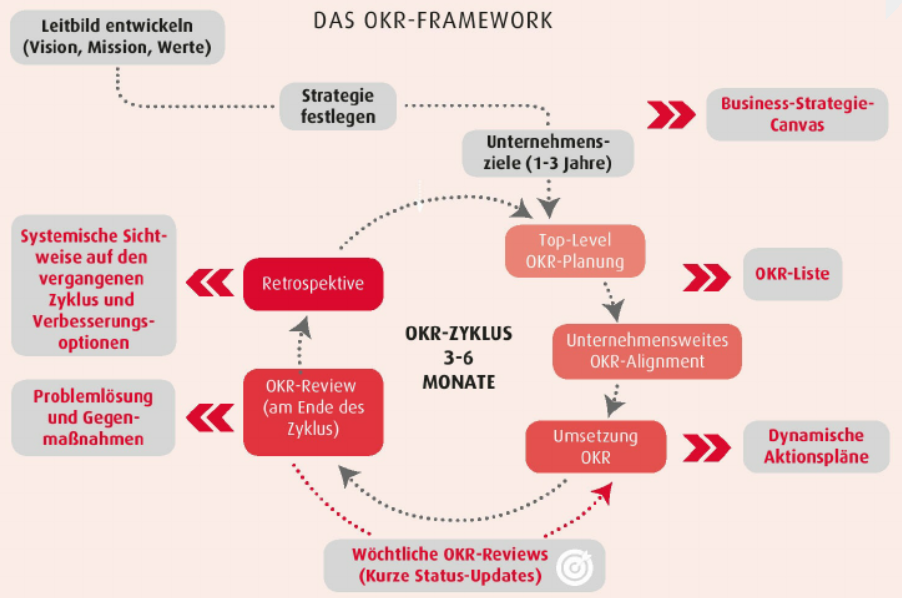

Der "Objectives-and-Key-Results-Ansatz" (kurz OKR) geht auf ein in den 1970er Jahren entwickeltes Konzept zurück, das eine Managementmethode aus qualitativen (Objectives) und zugehörigen quantitativen (Key Results) Zielen implementiert. Größere Bekanntheit hat der OKR-Ansatz vor allem durch die Verwendung von Google erlangt[^1].

# Beschreibung der Methode
## Grundlagen
Die Basis des OKR-Ansatzes bildet der Strategieplanungsprozess. Hierbei werden klassisch die mittel- und längerfristigen Ziele des Unternehmens (Leitbild und Strategie) abgebildet. In Abgrenzung zu anderen Methoden werden in der konkreten Strategieumsetzung quartalsweise Zyklen definiert, in denen die OKRs von oben nach unten ([Top Down Planning](Top_Down_Planning.md)) geplant und aufeinander abgestimmt werden. Die Ziele sollen innerhalb des Zyklus umgesetzt und deren Erreichung regelmäßig überprüft werden[^1].

Abbildung: [Objectives and Key Results : Die Grundlagen der agilen Managementmethode OKR](https://ebookcentral.proquest.com/lib/erlangen/reader.action?docID=6668403)

## Objectives
Objectives sollen in einem Satz beschreiben, was im nächsten Zyklus erreicht werden soll und gleichzeitig alle [Stakeholder](Stakeholdermanagement.md) begeistern [^2].
Sie bilden somit ab, was es im folgenden Quartal zu erreichen gilt[^1].
Für die Definiton ist es wichtig, dass das Management sich auf die wichtigsten Ziele der kommenden Periode fokussiert, diese Initiativen dann in die einzelnen Teams trägt und so  alle Ebenen des Unternehmens klare Prioritäten vorgegeben bekommen, nach denen jede:r handeln möchte und handelt.
Zur Evaluation werden am Ende Objectives und Key Results gegenübergestellt[^3].

**Beispiele:**[^4]
1. "Unser Prozess der Software-Entwicklung ist jetzt schneller, effizienter und hochwertiger, um zuverlässigere Produkte zu ermöglichen"
2. "Wir steigern das Vertrauen in uns, indem wir transparenter und persönlicher auftreten"
3. "Unsere Kunden wollen nicht auf Neuerungen warten, sondern diese schneller testen und im Alltag nutzen"

## Key Results
Key Results greifen die inspierend ausgedrückten Objectives auf und quantifizieren diese. Sie bilden damit ab, wie die Ziele zu erreichen sind[^2].
In der Regel sollten zwei bis vier Key Results pro Objective formuliert werden, wodurch eine messbare Verbindung zu den Objectives geschaffen wird, um während der Periode überprüfbare Zwischenstände und am Ende eine klare Evaluation des Erfüllungsgrads zu ermöglichen.
Der Grund für die Mehrdimensionalität der Key Results ist die Vermeidung von Zielkonflikten, die bei Verfolgung nur eines quantitativen Ziels auftreten können[^1].

**Beispiele:**[^4]
*(bezugnehmend auf die Objectives-Beispeiele)*
1. : 
   * In jedem [Sprint](SCRUM.md) werden mindestens 69 [Story Points](SCRUM.md) erreicht
   * Von der Idee zum Release vergehen 4 Wochen weniger
   * Die durchschnittliche Anzahl von Bugs pro Feature darf zwei nicht übersteigen
2. :
   * Die Vertrauensrate im Team wird um 10% gesteigert
   * Die Anzahl ausgetauschter Nachrichten soll um 10% gesteigert werden
   * Bei Anfragen haben wir nicht weniger als acht Berührungspunkte
   * 70% der Angestellten nehmen an Team-Aktivitäten teil
3. :
   * Es nehmen 15% mehr Kunden an unseren Launch-Events teil
   * 28% der Kunden nutzen ein neues Feature schon im ersten Monat
   * Pro Person und Woche werden 25 Schlüsselaktivitäten durchgeführt

# Abgrenzung zu anderen Methoden
## Balanced Scorecard
Während die [Balanced Scorecard](Balanced_Scorecard.md) vor allem bei der Wahl der Ziele unterstützt, fokussieren OKRs auf der Zielerreichung. In der Praxis begünstigt die ähnliche Philosophie beider Methoden eine erfolgreiche, gegenseitige Ergänzung[^5].

## SMART-Methode
Bei der Formulierung der Ziele haben die [SMART-Methode](SMART_Ziele.md) einige Gemeinsamkeiten:
| SMART                      | OKR                                                                  |
| -------------------------- | -------------------------------------------------------------------- |
| S: Spezifisch, konkret     | Objectives: klare Richtung - Key Results: konkrete Erfolgskriterien  |
| M: Messbar                 | Key Results: konkrete Erfolgskriterien                               |
| A: Attraktiv, akzeptiert   | Objectives als ambitionierte Ziele                                   |
| R: Realisierbar, relevant  | OKRs sind immer relevant und ausgerichtet auf die Unternehmensziele  |
| T: Terminiert              | OKR-Zyklus: feste Gültigkeiten, häufig ein Quartal oder ein Jahr     |

Tabelle(gekürzt): [Projekte leicht gemacht](https://projekte-leicht-gemacht.de/blog/definitionen/okr-kpi-smart-mbo/)

Im Gegensatz zu OKRs bietet die SMART-Methode aber nicht mehr als eine Formulierungshilfe, während OKR ein ganzes Framework zur Ausrichtung strategischer Ziele implementiert[^6].

# Bezug zum Projektmanagement
Beim Management einzelner Projekte sollten diese an den OKRs ausgerichtet sein. Dies kann mithilfe von ausschließlich als OKR formulierter Projektziele samt regelmäßigem OKR-Zyklus gewährleistet werden, oder das vorhandene OKR-Framework eher als Leitlinie für das Projekt verstanden werden. Somit bietet der OKR-Ansatz für das Projektmanagement einen Rahmen zur Erreichung eines Objectives sowie zur Motiviation und Priorisierung. Außerdem hilft er bei der Definition klarer Ziele und messbarer Ergebnisse[^7].

# Siehe auch
* [Projektmanagement](Projektmanagement.md)
* [SCRUM-Ansatz](SCRUM.md)
* [Top Down Planning](Top_Down_Planning.md)
* [Stakeholder](Stakeholdermanagement.md)
* [Balanced Scorecard](Balanced_Scorecard.md)
* [SMART-Methode](SMART_Ziele.md)

# Weiterführende Literatur
* Growe, Andrew: High Output Management
* Kudernatsch, Daniela: Objectives and Key Results : Die Grundlagen der agilen Managementmethode OKR
* Doerr, John: OKR - Objectives & Key Results: Wie Sie Ziele, auf die es wirklich ankommt, entwickeln, messen und umsetzen

# Quellen

[^1]: [Objectives and Key Results : Die Grundlagen der agilen Managementmethode OKR](https://ebookcentral.proquest.com/lib/erlangen/reader.action?docID=6668403)
[^2]: [The Art of the OKR](https://eleganthack.com/the-art-of-the-okr/)
[^3]: [OKR: Objectives & Key Results: Wie Sie Ziele, auf die es wirklich ankommt, entwickeln, messen und umsetzen](https://www.beck-elibrary.de/10.15358/9783800657742/okr)
[^4]: [9 OKR examples for different departments](https://www.workpath.com/magazine/okr-examples)
[^5]: [OKRs und Balanced Scorecard](https://www.workpath.com/magazin/okr-balanced-scorecard)
[^6]: [OKR, KPI, SMART & MBO: Gemeinsamkeiten und Unterschiede](https://projekte-leicht-gemacht.de/blog/definitionen/okr-kpi-smart-mbo/)
[^7]: [So funktionieren OKR im Projektmanagement](https://projekte-leicht-gemacht.de/blog/pm-in-der-praxis/okr-projektmanagement/)
