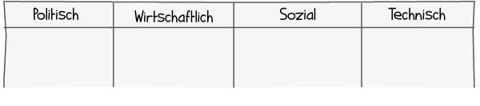

Kurzbeschreibung zu PEST_Analyse um ein erstes Verständnis dafür zu schaffen um was es hier geht.

Hier ganz am Anfang keine Überschrift einfügen - das passiert automatisch basierend auf dem `title`-Attribut
oben im Front-Matter (Bereich zwischen den `---`).

# PEST - Analyse

Die PEST-Analyse ist ein eine Analysemethode, welche ursprünglich aus dem stretegischen Unternehmensmanagement kommt.[^1]  
Ziel der Analyse ist es externe Einflussfaktoren auf eine Organisation zu erkennen, sowie Chancen und Risiken zu identifizieren um anschließend geeignete
Maßnahmen definieren zu können. Im Projektmanagement wird die PEST - Analyse unter anderem zu folgenden Zwecken eingesetzt:[^2]  

* Um neue Projekte zu identifizieren
* Zur Priorisierung von Projekten
* Für das identifizieren von Risiken im Rahmen einer [Risikoanalyse](https://github.com/ManagingProjectsSuccessfully/ManagingProjectsSuccessfully.github.io/blob/main/kb/Risikoanalyse_und_Visualisierung.md)
* Um Einflussfaktoren im Rahmen einer [Umfeldanalyse](https://github.com/ManagingProjectsSuccessfully/ManagingProjectsSuccessfully.github.io/blob/main/kb/Umfeldanalyse.md) zu sammeln

## Faktoren der PEST - Analyse
In einer PEST - Analyse werden die Einflussfaktoren in die folgenden vier Bereiche eingeteilt[^3]:
* Political - Politische Faktoren
* Economic - Wirtschaftliche Faktoren
* Socio-Cultural - Sozio-kulturelle Faktoren
* Technical - Technische Faktoren  
  
Innerhalb von Projekten wird die PEST - Analyse meist in einer frühen Projektphase im Rahmen einer umfassenderen Umfeld- oder Risikoanalyse eingesetzt. 
Da es nicht einfach ist auf Anhieb mögliche Einflussfaktoren auf Projekte zu ermitteln, hilft die PEST - Analyse vor allem dabei nichts zu vergessen und sich von
den verschiedenen Kategorien inspirieren zu lassen.[^2]  

[^2]  

Je nachdem ob man die PEST - Analyse für ein einzelnes Projekt durchführt oder aber für eine gesamte Organisation, ergeben sich innerhalb der Faktoren ganz unterschiedliche Fragestellungen. Im Folgenden werden für jeden Faktor mögliche Fragestellungen aufgelistet
### Politische Faktoren
| Organisationsbezogen  | Projektbezogen |
| ------------- | ------------- |
| Wie sehen die gesetzlichen Rahmenbedingungen aus?[^1]  | Wie wirkt sich die Unternehmensstrategie auf das Projekt aus?[^2]  |  
| Könnte sich der politische Kurs ändern und könnten neue Gesetze erlassen werden?[^2]   | Wie sehr stehen die Stakeholder hinter meinem Projekt?  |

### Wirtschaftliche Faktoren
| Organisationsbezogen  | Projektbezogen |
| ------------- | ------------- |
| Wie sieht das Wirtschaftswachstum aus?[^1] | Wie sehr ist das Projekt von Geldgebern abhängig?[^2]  |  
| Wie entwickeln sich die Zinsen in einem Land?[^1]  | Gibt es wirtschaftliche Risiken für das Projekt?[^2] |

### Sozio-kulturelle Faktoren
| Organisationsbezogen  | Projektbezogen |
| ------------- | ------------- |
| Wie ist die demographische Lage? | Wie wirkt sich die Teamstruktur auf das Projekt aus?[^2]  |  
| Gibt es bestimmte kulturelle Tabu- Themen?[^2]  | Existieren zwischenmenschliche Stolperfallen im Projekt?[^2] |  

### Technische Faktoren
| Organisationsbezogen  | Projektbezogen |
| ------------- | ------------- |
| Welche neuen Technologien könnten entwickelt werden[^2] | Welche Technologien benutzt mein Kunde?[^3]  |  
| Wir wirken sich neue Technologien aus?[^2]  | Welche Unsicherheiten können bei neuen Technologien auftreten[^2] |  

## Wichtige Schritte zum Durchführen einer PEST - Analyse
1. Wichtige relevante Faktoren bestimmen.  

# Erweiterungen der PEST - Analyse
Die PEST - Analyse ist im Lauf der Zeit um einige Faktoren erweitert worden, wodurch sich weitere Analysemethoden ergeben haben.
Einige der weiterführenden Analysen sind: 
* SLEPT, in welcher noch die legalen Faktoren hinzukommen[^1]
* STEPE, bei der zusätzlich noch ecological - ökolöogische Faktoren betrachet werden[^1]
* PESTEL, bei der noch legale und environmental - Umwelt Faktoren analysiert werden[^1]  

Zudem gibt es noch weitere Analysen bei denen zum Beispiel zusätzliche noch regulatorische und/oder demographische Faktoren betrachtet werden.  

# Siehe auch

* Verlinkungen zu angrenzenden Themen
* [Link auf diese Seite](PEST_Analyse.md)

# Weiterführende Literatur

* Weiterfuehrende Literatur zum Thema z.B. Bücher, Webseiten, Blogs, Videos, Wissenschaftliche Literatur, ...

# Quellen

[^1]: https://en.wikipedia.org/wiki/PEST_analysis
[^2]: https://projekte-leicht-gemacht.de/blog/methoden/projektrisiken/pest-analyse/
[^3]: https://www.youtube.com/watch?v=TNLLyS0nrM8
[^4]: https://www.youtube.com/watch?v=mCdcdf-b8AU

