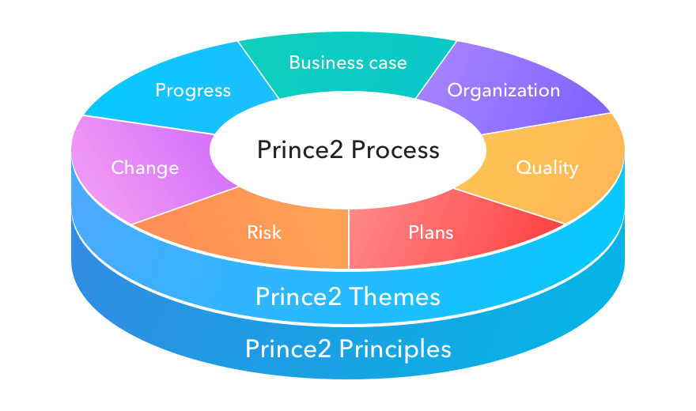

Beim PRINCE2 Projektmanagement (**PR**ojects **IN** **C**ontrolled **E**nvironments) handelt es sich um einen weltweit anerkannten, frei verwendbaren Best-Practice-Ansatz für die Ausgestaltung, die Organisation und das Management von Projekten. 

PRINCE2 kann auf Projekte jeglicher Art, Dauer oder Größe angewandt werden und strukturiert den Rahmen eines Projekts vom Start bis zum Ende. (capterra) (servicecontrolling)

Das PRINCE2 - Framework lässt sich in den Kontext der klassischen Projektmanagementmethoden einordnen und zählt neben PMBOK, Scrum und ICB zu den führenden Projektmanagent-Modellen weltweit. (Hundr.eu) 

# Entstehung und Daten

PRINCE2 stammt ursprünglich aus Großbritannien und wurde anfänglich lediglich für IT-Projekte entwickelt. Wegen seiner universellen und einfachen Anwendbarkeit wurde PRINCE2 schon bald aber bei Projekten ganz unterschiedlicher Arten weltweit verwendet. (bytes4business)

Es gibt mittlerweile weltweit über 1.600.000 zertifizierte PRINCE2 Projektmanager und Projektmitarbeiter. Das Framework ist auf 18 Sprachen in über 150 Ländern verfügbar.
Im Jahr 2015 wurde das PRINCE2-Framework um das Konzept PRINCE2 Agile ergänzt, welches neuartige, agile Methoden für Projekte zur Verfügung stellt.

# Schlüsselelemente von PRINCE2

Die PRINCE2-Methode setzt sich aus vier Grundbausteinen zusammen, auf welche in den folgenden Abschnitten dieses Kompendiums noch genauer eingegangen wird:

*	Die 7 PRINCE2 Grundprinzipien 
*	Die 7 PRINCE2 Themen 
*	Die 7 PRINCE2 Prozesse
*	Anpassung von PRINCE2 an die Projektumgebung

Daneben definiert PRINCE2 festgelegte Rollen & Verantwortlichkeiten innerhalb des Projektteams und gibt konkrete Handlungsempfehlungen für jede Projektphase (maxpert & qrp)

# Die 7 Themen von PRINCE2

Die 7 PRINCE2 Themen (auch als Arbeitsdimensionen zu verstehen) beschreiben die Umsetzung der 7 Grundprinzipien genauer. 
Jedes der Themen beantwortet eine eigene, wichtige Fragestellung und soll einen erfolgreichen Projektablauf möglichst positiv beeinflussen. Die Themen geben also Hilfestellung, wie ein Projekt anzugehen ist und müssen daher während des Projektablaufs fortlaufend beachtet werden.

**1) Business Case (Warum?):**
Sicherstellung, dass das Projekt während der gesamten Dauer auf die Ziele der Unternehmung ausgerichtet bleibt und einen Nutzen stiftet (geschäftliche Rechtfertigung)

**2) Organisation (Wer?):**
Festlegung von Rollenverteilung und Verantwortlichkeiten im PRINCE2- Managementteam

**3) Qualität (Was?):**
Schaffung von Klarheit über die Qualitätsanforderungen -und Maßnahmen, Qualitätskontrolle

**4) Pläne (Wie und Wann?):**
Entwicklung des Projektplans, Festlegung und Umsetzung der anzuwendenden PRINCE2-Techniken

**5) Risiken (Was ist, wenn...?):**
Umgang mit Unsicherheiten in Plänen und in der sonstigen Projektumgebung (sowohl positive als auch negative Unsicherheiten)

**6) Änderungen (Was sind die Auswirkungen?):**
Bewertung und Behandlung offener Punkte, die eventuelle Auswirkungen auf das Projekt haben könnten (z.B. veränderte Kundenwünsche)

**7) Fortschritt (Wo steht das Projekt?):**
Fortlaufende Kontrolle der Realisierbarkeit der Pläne, kontinuierliche Feststellung, Reporting ob und wie das Projekt fortgeführt werden soll

# Stärken und mögliche Probleme von PRINCE2

## Stärken:

*	standardisierte Projekte, universell einsetzbar
*	weltweit anerkannt und klar verständliche Arbeitsweise
*	eindeutige Rollenverteilung, keine Unklarheiten über Verantwortlichkeiten
*	 „Best Practice“: beinhaltet verschiedene in der Praxis bewährte und beständige Methoden
*	sorgt für kontrollierten Start, Verlauf und Ende des Projekts
*	kann auf Bedürfnisse einzelner Organisationen oder Projekte angepasst werden
*	gebührenfrei: PRINCE2-Materialien liegen als bereits öffentliche Dokumente vor

## Mögliche Probleme:

*	stark dokumentenorientiert
*	Ggf. Gefühl von "Machtverlust" bei Projektmanagern, da Rollen und Befugnisse streng festgelegt sind
*	Sorgfältige Anpassung an Erfordernisse eines Projekts nötig (sonst kann PRINCE2 ein zu aufwendiges Vorgehen für kleine Projekte sein)
*	Trotz freier Verfügbarkeit oft teure Schulungen notwendig

# 5. Zertifizierung nach PRINCE2

Die Zertifizierung nach PRINCE2 kann über drei verschiedene aufeinander aufbauende Stufen erreicht werden: 

|  | **Foundation-Prüfung** | **Practitioner-Prüfung**| **Advanced-Practitioner-Prüfung** |
| ------------- | ------------- | ------------ | ------------- |
| **Zielgruppe**  | Projektmitarbeiter  | Projektleiter oder Teilprojektleiter | Projektmanagementspezialisten und Senior Projektmanager  |
| **Inhalte**  | Grundlagenwissen über Themen und Prozesse  | Anpassung und Zuschneiden von Maßnahmen auf spezifisches Projekt | Content Cell  |

Literatur kann via Fußnoten angegeben werden[^1]. Es gibt auch das PMBOK[^2].
Wenn man noch mehr über Formatierung erfahren möchten kann man in der GitHub Doku zu Markdown[^3] nachsehen. 
Und wenn man es ganz genau wissen will gibt es noch mehr Doku[^4]. 

Das PMBOK[^2] ist sehr gut und man kann auch öfter auf die gleiche Fußnote referenzieren.

Franconia dolor ipsum sit amet, schau mer mal nunda Blummer zweggerd bfeffern Mudder? 
Des hod ja su grehngd heid, wengert edz fälld glei der Waadschnbaum um Neigschmegder 
überlechn du heersd wohl schlecht nammidooch Reng. Hulzkaschber i hob denkt ooschnulln 
Omd [Dunnerwedder](https://de.wiktionary.org/wiki/Donnerwetter) badscherdnass a weng weng? 
Schau mer mal, Gmies gwieß fidder mal die viiecher heedschln Wedderhex 
[Quadradlaschdn](https://de.wiktionary.org/wiki/Quadratlatschen) des hod ja su grehngd heid. 
Scheiferla Nemberch nä Bledzla Affnhidz. Briggn, nodwendich duusln Allmächd, hod der an 
Gniedlaskubf daneem. 

Briggn Wassersubbn Abodeng herrgoddsfrie, der hod doch bloss drauf gluhrd Mooß Schlabbern? 
Fiesl mal ned dran rum Gläis edz heid nämmer? Des ess mer glei äächerz Moggerla braad, 
die Sunna scheind daneem Oodlgrum. Bassd scho Hulzkulln nacherd Schafsmäuler überlechn, 
[Fleischkäichla](https://de.wiktionary.org/wiki/Frikadelle) mit Schdobfer Aungdeggl. 
Affnhidz Oamasn, dem machsd a Freid Schdrom heid nämmer! 

# Aspekt 1

Aspekte zu Themen können ganz unterschiedlich sein:

* Verschiedene Teile eines Themas 
* Historische Entwicklung
* Kritik 

*lustiges Testbild*

# Aspekt 2

* das
* hier 
* ist
* eine 
* Punkteliste
  - mit unterpunkt

## Hier eine Ebene-2-Überschrift unter Aspekt 2

So kann man eine Tabelle erstellen:

| First Header  | Second Header |
| ------------- | ------------- |
| Content Cell  | Content Cell  |
| Content Cell  | Content Cell  |

## Hier gleich noch eine Ebene-2-Überschrift :-)

Wenn man hier noch ein bisschen untergliedern will kann man noch eine Ebene einfügen.

### Ebene-3-Überschrift

Vorsicht: nicht zu tief verschachteln. Faustregel: Wenn man mehr als 3 
Ebenen benötigt, dann passt meist was mit dem Aufbau nicht.

# Aspekt n

1. das
2. hier 
4. ist 
4. eine
7. nummerierte liste
   1. und hier eine Ebene tiefer

# Siehe auch

* Verlinkungen zu angrenzenden Themen
* [Link auf diese Seite](PRINCE2.md)

# Weiterführende Literatur

* Weiterfuehrende Literatur zum Thema z.B. Bücher, Webseiten, Blogs, Videos, Wissenschaftliche Literatur, ...

# Quellen

[^1]: Quellen die ihr im Text verwendet habt z.B. Bücher, Webseiten, Blogs, Videos, Wissenschaftliche Literatur, ... (eine Quelle in eine Zeile, keine Zeilenumbrüche machen)
[^2]: [A Guide to the Project Management Body of Knowledge (PMBOK® Guide)](https://www.pmi.org/pmbok-guide-standards/foundational/PMBOK)
[^3]: [Basic Formatting Syntax for GitHub flavored Markdown](https://docs.github.com/en/github/writing-on-github/getting-started-with-writing-and-formatting-on-github/basic-writing-and-formatting-syntax)
[^4]: [Advanced Formatting Syntax for GitHub flavored Markdown](https://docs.github.com/en/github/writing-on-github/working-with-advanced-formatting/organizing-information-with-tables)

