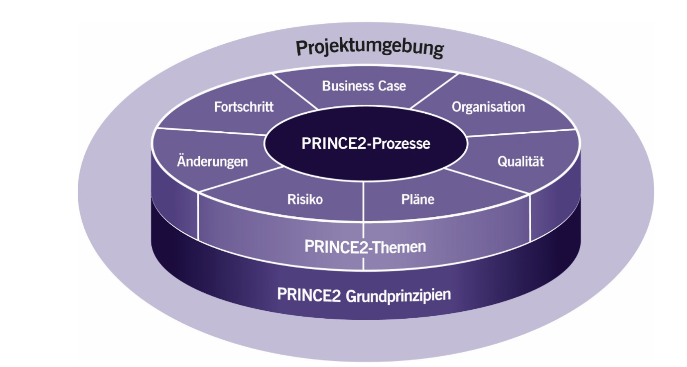
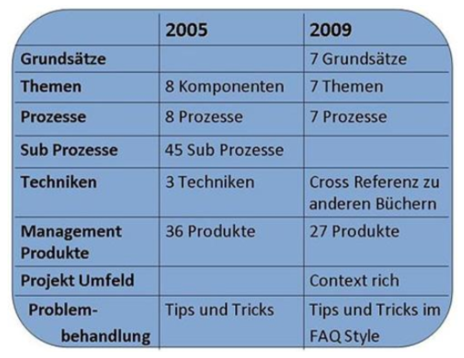

[PRINCE2](PRINCE2.md) besteht aus 4 Elementen: 
- 7 Grundprinzipien
- 7 Themen
- [PRINCE2_7_Prozesse](PRINCE2_7_Prozesse.md)
- [PRINCE2_Projektumgebung](PRINCE2_Projektumgebung.md)

*Aufbau von PRINCE2[^1]*

Im Folgenden Bericht wird der Fokus auf die 7 Grundprinzipien gelegt. Wie in Abbildung 1 zu erkennen ist, bilden diese die Grundlage eines jeden PRINCE2 Projekts.

# PRINCE2 - Die 7 Grundprinzipien

# Agenda

1. Begriffserklärung
2. Die 7 Grundprinzipien    
   1. Fortlaufende geschäftliche Rechtfertigung
   2. Lernen aus Erfahrungen
   3. Definierte Rollen und Verantwortlichkeiten
   4. Definierte Phasen 
   5. Steuern nach Ausnahmeprinzip
   6. Produktorientierung
   7. Angepasste Projektumgebung       
3. Vor- und Nachteile

## 1. Begriffserklärung[^2]
PRINCE2 steht für "Projects in Controlled Environments"[^3] oder auf Deutsch "Projekte in kontrollierten Umgebungen". Über den ganzen Projektverlauf wird für jede Projektphase eine Handlungsempfehlung definiert und gestaltet. Die Herstellung des Produkts steht weniger im Vordergrund, viel mehr liegt der Fokus auf die Rollenverteilung und das Zeitmanagement eines Projektes. Durch die Trennung beider Aspekte, können PRINCE2 Projekte sehr gut mit anderen Methoden, die sich auf die Produktherstellung spezialisiert haben, zusammenarbeiten. 

Die weltweit führende Projektmanagementmethode basiert auf 7 Grundprinzipien, welche sich auf die Erfahrung guter und schlechter Projekte stützen. Diese wurden im Jahr 2009 neu eingeführt. 

In der folgenden Abbildung werden die Änderungen aus dem Jahr 2009 im Vergleich zu dem Jahr 2005 deutlich hervorgehoben[^4]. 

*Änderungen in 2009[^4] *

## 2. Die 7 Grundprinzipien[^5]

### 1. Fortlaufende geschäftliche Rechtfertigung   
   *Folgende Anforderungen müssen gegeben sein:* 
   - Berechtigter Grund für Projektstart 
   - Gültigkeit der Rechtfertigung muss während des gesamten Projekts beibehalten werden
   - Dokumentierte und genehmigte Rechtfertigung
   - Dokumentation in Form eines Business Case
   - Ziel: Sicherstellen, dass Projekt geschäftlichen Ziele und angestrebten Nutzen erfüllt 
   
### 2. Lernen aus Erfahrungen
   - Projektteam lernt aus früher gemachten Erfahrungen 
   - Über gesamten Projektverlauf: Sammlung, Aufzeichnung, Umsetzung neuer Erfahrungen 
   - Bei Projektstart: Überprüfung früherer Erfahrungen aus vergangenen Projekten
   - Während des Projekts: Umsetzung möglichst vieler Verbesserungen
   - Bei Projektabschluss: Weitergeben der gemachten Erfahrungen
   
### 3. Definierte Rollen und Verantwortlichkeiten
   - Innerhalb einer Organisationsstruktur klar definierte Rollenverteilung 
   - Wichtigsten Stakeholder: Unternehmen, Lieferanten, Benutzer
   - Interessen werden jeweils vertreten 
   - *Vertreter der geschäftlichen Unternehmensinteressen:* Sicherstellung, dass Zielsetzung des Projekts geschäftlich sinnvoll ist
   - *Vertreter der Benutzer:* Erzielung des angestrebten Nutzens, durch Einsetzen hergestellter Produkte 
   - *Vertreter der Lieferanten* Bereitstellung von Ressourcen und erforderlichen Kenntnissen für Herstellung der Produkte 
   
### 4. Definierte Phasen 
   - Planung, Überwachung, Steuerung    
   - Prüfung des Fortschritts 
   - Am Ende einer jeden Phase: Bewertung des Projektstatus und Überprüfung von Business Case und Plänen
   - Entscheidung über Weiterführung des Projekts  
   - Management-Phasen: Grober Projektplan mit detailliertem Phasenplan für aktuelle Phase
   - Mindestens 2 Management-Phasen sind notwendig
   - Aufwendige kurze Phasen ermöglichen engere Steuerung
   - Längere Phasen entlasten Management-Ebene 
   
### 5. Steuern nach Ausnahmeprinzip
   - Definierung bestimmter Toleranzen für jedes Projektziel (6 Dimensionen)
   - 6 Dimensionen: Zeit, Kosten, Qualität, Umfang, Nutzen, Risiko
   - Zeitliche Entlastung der Führungskräfte
   - Beibehaltung der Kontrolle über Projekt 
   - Treffen von Entscheidungen auf richtigen Ebenen 
   - Festlegung der Handlungsrahmen für delegierte Befugnisse 
         
### 6. Produktorientierung: 
   - Ausrichtung auf Definition und Lieferung von Produkten 
   - Fokus auf Qualitätsanforderungen    
   - Basis für Planung und Steuerung: Menge der Produkte, definiert Inhalt und Umfang des Projekts
   - Durch Produktbeschreibungen gemeinsames Verständnis der Stakeholder über Produkt 
   - Produktbeschreibungen enthalten Festlegungen zu Zweck, Zusammensetzung, Herkunft, Format, Qualitätskriterien und Qualitätsprüfmethoden
   - Erschließung von Aufwand, Ressourcenbedarf, Abhängigkeiten
   
### 7. Angepasste Projektumgebung
   - Universelle Projektmanagement-Methode
   - Abhängig von Umgebung, Komplexität, Umfang, Leistungsfähigkeit und Risiken des Projekts
   - Anpassung an jedes Unternehmen und Projekt 
   
   

## 3. Vor- und Nachteile[^6]

| Vorteile                | Nachteile     |
| -------------           | ------------- |
| Flexibel                | Dokumenten lastig |
| Skalierbar              | Vernachlässigung der Teammotivation
| Einheitliche Sprache    | Vernachlässigung des Konfliktmanagements  |
| Weltweite Anerkennung   | Abhängigkeit von Lieferanten |
| Ansehen                 | Keinen Einfluss auf Produktherstellung  |
| Produktorientiert       | Mangelnde Qualität |
| Kompatibilität          | Für kleinere Projekte ungeeignet  |

# Siehe auch

* [PRINCE2](PRINCE2.md)
* [PRINCE2_7_Prozesse](PRINCE2_7_Prozesse.md)
* [PRINCE2_Projektumgebung](PRINCE2_Projektumgebung.md)

# Weiterführende Literatur

* https://www.youtube.com/watch?v=if__T71U2ss
* [What is PRINCE2?]https://www.youtube.com/watch?v=61RnrsWQE7A
* [Die 7 Prinzipien](https://www.prince2.com/de/blog/prinzipien-themen-prozesse)

# Quellen

[^1]: [Aufbau von PRINCE2](PRINCE2_7_Grundprinzipien/Aufbau.PNG)
[^2]: [Was ist PRINCE2](https://www.tiba-business-school.de/prince2-methode-vorteile/)
[^3]: [Projects in Controlled Environments](https://en.wikipedia.org/wiki/PRINCE2)
[^4]: [Änderungen im Jahr 2009](PRINCE2_7_Grundprinzipien/PRINCE2.PNG)
[^5]: [PRINCE2 Grundprinzipien](https://dieprojektmanager.com/prince2-7-grundprinzipien-themen-prozesse/#Die_7_Grundprinzipien_von_PRINCE2)
[^6]: [Vor- und Nachteile](https://de.education-wiki.com/9075849-prince2-principles)
