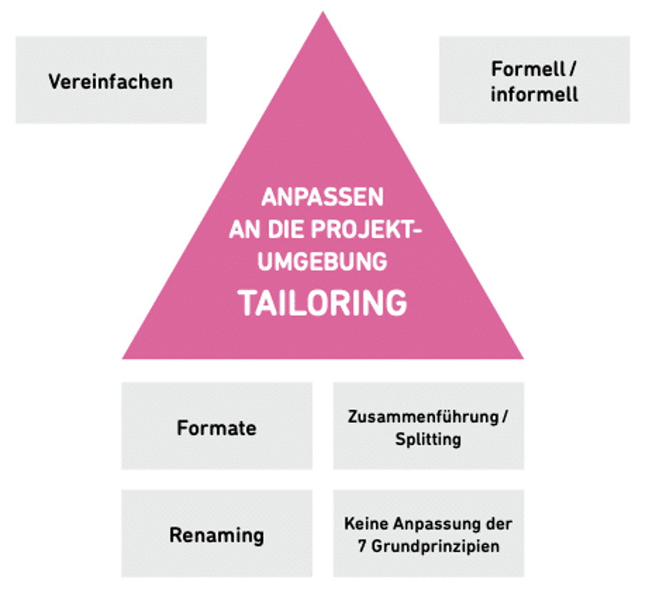

PRINCE2 steht für Projects in Controlled Environments oder auch Projekte in kontrollierten Umgebungen und ist eine auf Prozessen basierende Methode für effektives Projektmanagement. PRINCE2 gilt als das "How to" des Projektmanagements: Es ist flexibel, skalierbar und kann auf die spezifischen Anforderungen eines Unternehmens angepasst werden[^1]. Im folgenden Beitrag soll daher die Projektumgebung von PRINCE2 näher betrachtet werden.

# PRINCE2 Projektumgebung

PRINCE2 gehört zu den am häufigsten verwendeten [Projektmanagementmethoden](Projektmanagement.md) [^2]. Dank dieser Methode ist es möglich, jederzeit den Beginn, den Verlauf und den Abschluss von Projekten zu kontrollieren. Was genau unter einem [Projekt](Projekt.md) zu verstehen ist, kann man in der Verlinkung nachlesen. Um mehr über PRINCE2 zu erfahren empfehle ich das Kompendium [PRINCE2](PRINCE2.md). 

# Was sind die Bestandteile von PRINCE2?
* [Sieben Grundprinzipien](PRINCE2_7_Grundprinzipien.md): Sie definieren die grundlegenden Regeln
* Sieben Prozesse: Sie beschreiben das schrittweise Vorgehen während dem Projekt 
* Sieben Themen: Das sind die Aspekte des Projektmanagements, die kontinuierlich behandelt werden müssen [^3]
 
Als wichtigstes Grundprinzip von PRINCE2 kann die Anpassung (Tailoring) an die Projektumgebung genannt werden. Anpassung bezeichnet in diesem Fall die angemessene Anwendung von PRINCE2 auf ein bestimmtes Projekt. Dabei muss der Umfang von Planung und Steuerung sowie der Einsatz von Prozessen und Themen richtig auf das Projekt abgestimmt werden. Nicht zu verwechseln ist die Anpassung mit dem Begriff der Integration, mit dem die reine Einführung (oder auch Embedding) von PRINCE2 in eine Organisation gemeint ist. Oft liegt die Verantwortung nicht zentral bei einer Person, sondern verteilt sich je nach Kompetenz auf mehrere [^4]. 
 

Die Anpassung an die Projektumgebung kann wie in der Abbildung [^5] erfolgen: 

*Anpassung an die Projektumgebung*

Zum einen können die Techniken/Praktiken durch die Methodik vereinfacht werden. Es wird z.B. auf Dokumente und Berichte verzichtet. 
Zum anderen finden Meetings weniger formell, sondern auch mal beim Mittagessen statt. 
Formate werden aufgrund externer Anforderungen, wie Style-Guides, umgestaltet. 
Die Zusammenführung von einzelnen Berichten zu einem großen kann zu einer Verschlankung bei Projekten führen. 
PRINCE2 gibt zwar klar definierte Rollen vor, z.B. wird ein Kunde im Projekt als "Abnehmer" definiert, beim Renaming können jedoch in PRINCE2 bestehende Rollen an die im Unternehmen etablierten Terminologien angepasst werden. Nicht angepasst werden hingegen die sieben Grundprinzipien. 

PRINCE2 ermöglicht also für jedes Unternehmen bzw. teilweise sogar für jedes Projekt eine individuelle Anpassung, um so optimal auf die spezifischen Anforderungen hinsichtlich Umgebung, Umfang, Komplexität, Wichtigkeit, Leistungsfähigkeit und Risiko eingehen zu können [^6]. 

PRINCE2 stellt eine flexible und leicht wiederholbare Anleitung zur Projektplanung dar. Der ursprüngliche Zweck war das Managen von [IT-Projekten](IT-Projekte.md), worauf es aber heutzutage nicht mehr beschränkt ist. Die Erweiterung wäre PRINCE2 agile, wobei es darum geht klassische Projekte mit agilen Methoden wie z.B. [Kanban](Kanban.md) oder [SCRUM](SCRUM.md) kombiniert werden [^7].  

# Fazit

PRINCE2 lässt sich an nahezu jede Projektumgebung anpassen und erweist sich dadurch als äußerst flexibel. Da aber die sieben Grundprinzipien nicht angepasst werden, bleibt immer ein gewisser Rahmen für große und kleine Projekte bestehen, an dem man sich orientieren kann [^8].

# Siehe auch

* [Projekt](Projekt.md)
* [Projektmanagement](Projektmanagement.md)
* [PRINCE2](PRINCE2.md) 
* [PRINCE2_7_Grundprinzipien](PRINCE2_7_Grundprinzipien.md)

# Weiterführende Literatur

* Buch "Managing Successful Projects with PRINCE2 6th Edition"

# Quellen

[^1]: https://www.axelos.com/certifications/propath/prince2-project-management 
[^2]: Buch PRINCE2: Die Erfolgsmethode einfach erklärt. Version 2017 von Fabian Kaiser, Roman Simschek
[^3]: https://www.maxpert.de/de/profil/schulungsspektrum/prince2-methode-definitionen/506 
[^4]: https://www.youtube.com/watch?v=zl4zHUtwmSg 
[^5]: https://www.agile-heroes.de/magazine/prince2-projektumgebung/
[^6]: https://de.wikipedia.org/wiki/PRINCE2
[^7]: Benefits and Issues in Managing Project by PRINCE2 Methodology (2017)
[^8]: https://www.certnow.de/itsm-blog/10-prince2/77-prince2-2017-anpassen-an-die-projektumgebung.html  
