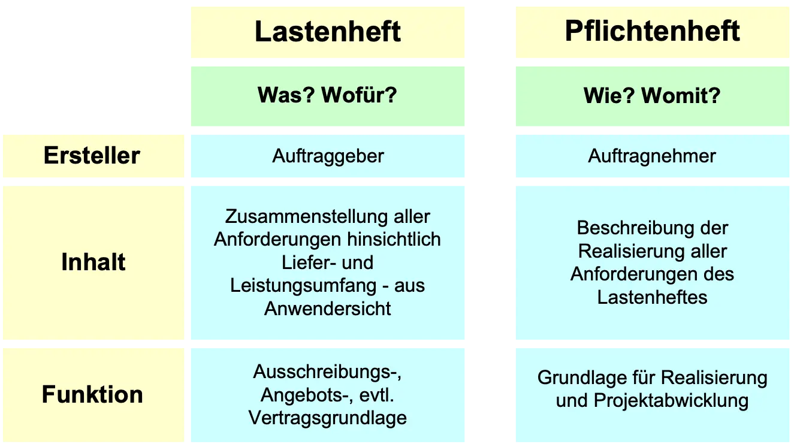

# Pflichtenheft
Pflichtenheft hilft bei der problemlosen Umsetzung eines Projektes. In einem Pflichtenheft beschreibt der Auftragsnehmer/in in ganz konkreter Form, wie er/sie das Projekt für den Auftragsgeber/in umsetzten kann und würde. Die Anforderungen der Kunden werden im Lastenheft detailliert aufgeführt und das Pflichtenheft beschreibt demnach einen Lösungsansatz jener Anforderung. Der Auftragsnehmer hat das Ziel, das Lastenheft des Auftragsgeber zu erfüllen. Dieses bildet sozusagen die Antwort auf das Lastenheft.
Die Übereinstimmung des Lasten- und Pflichtenhefts ist sehr wichtig, da hierüber ein Großteil der Projektkommunikation erfolgt.

## Inhaltsverzeichnis:
   1. Lastenheft
   2. Gesetzliche Definitionen 
   3. Der Aufbau des Lastenhefts
   4. Der Aufbau des Pflichtenheft
   5. Pflichtenheft Gliederung

## Lastenheft
Um das Pflichtenheft besser zu verstehen, wird im Folgenden das [Lastenheft](Lastenheft.md) kurz definieren.
In einem Lastenheft legt der Kunde fest, was er von dem Projekt erwartet. Er beschreibt und definiert mit diesem seine gesamten Anforderungen an das Projekt. So kann man das Lastenheft als Anforderungskatalog beschreiben. Der Kunde muss sich Gedanken darüber machen, was er eigentlich vom Projekt erwartet und was er genau bekommen möchte.
Eine Abbildung zu einer bessern Übersicht:

*Abbildung 1: Lastenhaft-Pflichtenheft*

## Gesetzliche Definitionen
Das Pflichtenheft ist nach der [DIN 66001](DIN66001.md) "die ausführliche Beschreibung der Leistungen, die erforderlich sind oder gefordert werden, damit die Ziele des Projektes erreicht werden".[^1]
Das Lastenheft wurde in der [VDI 2519](VDI2519.md) wie folgt definiert: „alle Anforderungen aus Anwendersicht einschließlich aller Randbedingungen beschreiben soll. Sie sollten quantifizierbar und prüfbar sein. Im Lastenheft wird definiert, was und wofür zu lösen ist. Das Lastenheft wird vom Auftraggeber oder in diesen Auftrag erstellt. Es dient als Ausschreibungs-, Angebots-, oder Vertragsgrundlage“.[^1] "Das, was in der VDI 2519 als Lastenheft definiert ist, wird unter Juristen schon eher als Pflichtenheft verstanden, als das, was die DIN 66001 darunter versteht".[^1]

## Der Aufbau des Lastenhefts
Das Lastenheft sollte so aufgebaut werden:
* Der Ist-Zustand bzw. die Voraussetzungen, die bereits gegeben sind
* Die Ziele sollen grob definiert werden
* Sammlung der Anforderungen an das Produkt 
* Definition von den Rahmenbedingungen für das Produkt und Leistungserbringung
* Aufteilung der Zuständigkeiten

## Der Aufbau des Pflichtenheft
Das Pflichtenheft sollte so aufgebaut werden:
*	Die Ausgangssituation dokumentieren und die Ziele detailliert beschreiben
*	Die Beschreibung der Prozessabläufe und die Stärken und Schwächen sollten aufgeführt sein
*	Erstellung eines Soll-Konzeptes, in dem die Anforderungen des Auftragsgebers bzw. der Kunden beschreiben werden
*	Erstellung und Beschreibung der technischen Strukturen (wenn Technik erforderlich ist)
*	Erstellung einer tabellarischen Übersicht mit wichtigen Daten, Anmerkungen und Notizen
*	Checklisten, Ablaufplane und gegebenenfalls Belege als Anhang dem Pflichtenheft beifügen

## Pflichtenheft Gliederung
Es gibt verschiedene Ansätze, um ein Pflichtenheft zu gliedern. Ich möchte hier nur eine Möglichkeit darstellen:
### 1. Bestimmung der Ziele:
Im Pflichtenheft werden die Ziele konkret umfassen. Die Ziele werden in drei Gruppen gegliedert:
* Muss Kriterien sind wesentlich, damit die Anwendung funktioniert
* Wunsch Kriterien bleiben entbehrlich. Die Indienststellung wäre ohne sie auch realisierbar. Die Pflicht besteht trotzdem, um diese Kriterien umzusetzen
* Abgrenzungskriterien sind die Kriterien, die die Anwendung nicht beinhalten soll
### 2. Einsatz:
Die Analyse des späteren Einsatzumfelds ist sehr wichtig. Dazu gehören: Zielgruppen, Anwendungsbereiche usw. Die Umgebung, Zeit und Qualifikationen werden festgelegt.
### 3. Produktübersicht:
Übersicht über alle Geschäftsprozesse und die beteiligten Akteure.
### 4. Funktionen:
Hier erfolgt die Erklärung über die Funktionen, die Beteiligten und weitere Geschäftsprozesse. Wer ist beteiligt? Wie und unter welchen Bedingungen läuft die Funktion ab? Wie wirkt sich das auf die weiteren Geschäftsprozesse aus?
### 5. Leistungen:
Hier werden die Anforderungen an die Funktonen beschreibt. Zum Beispiel: Die Dauer, die Genauigkeit der Berechnung und die Ausführungszeit.Hier stehen auch Anmerkungen, ob diese Anforderungen überhaupt erreicht werden können.
### 6. Qualitätsanforderungen:
Eine Qualitätsstufe wird nach bestimmten Merkmalen zugeordnet.
### 7. Benutzeroberfläche:
Grundlegende Anforderungen werden festgelegt, wie zum Beispiel: Art des Layouts und der Zugriffsrechte.
### 8. Sonstige Anforderungen:
Dokumentation, [Buchführung](Buchführung.md) und Sicherheitsanforderungen.
### 9. Technisches Umfeld:
Die Soft- und Hardwaresysteme, die für die Anwendung zu installieren sind, werden aufgelistet.
### 10. Gliederung:
Ein komplexer Prozess wird sich in Teilaufgaben gliedern, damit ein besserer Überblick über das gesamte Projekt erfolgt.
### 11. Ergänzungen:
Hier stehen die zu berücksichtigten Normen und Vorschriften, sowie Hinweise zu [Patenten](Patenten.md) und [Lizenzen](Lizenzen.md). Die Anmerkungen des Arbeitgebers werden auch aufgelistet. 
### 12. Tests:
Prüfung des Produktes vor der Fertigstellung in Bezug auf Funktionen, Eigenschaften und Qualitätsmerkmale. Tests, die den Anforderungen erfüllten, werden hier im Pflichtenheft dokumentiert. Nach einem fehlerfreien Durchlauf kann das Produkt verkündigt werden.

## Siehe auch:
1. [Lastenheft](Lastenheft.md)
2. [Projektsteuerung](Projektsteuerung.md)
3. [Projektplanung](Projektplanung.md)
4. [Projektmanagement](Projektmanagement.md)
5. [Projekt_Kick_Off](Projekt_Kick_Off.md)
6. [Projektstrukturplan](Projektstrukturplan.md)

## Quellen
1. Digital Guide Ionos, [Das Pflichtenheft: Alle Anforderungen eines Projekts im Blick](https://www.ionos.de/digitalguide/websites/web-entwicklung/pflichtenheft/)
2. FMEA, [Lastenheft => Pflichtenheft](https://www.fmea.net/lexikon/lastenheft-pflichtenheft/)
3. Projektmagazin, [Pflichtenheft](https://www.projektmagazin.de/glossarterm/pflichtenheft)
4. Projektmagazin, [Lastenheft](https://www.projektmagazin.de/glossarterm/lastenheft)
5. InLoox, [Pflichtenheft](https://www.inloox.de/projektmanagement-glossar/pflichtenheft/)
6. BrightSolutions, [Warum es wichtig ist, ein Pflichtenheft zu erstellen](https://www.brightsolutions.de/blog/warum-es-wichtig-ist-ein-pflichtenheft-zu-erstellen/)
7. ProLogistik, [Pflichtenheft](https://www.prologistik.com/logistik-lexikon/pflichtenheft/)
8. Induux Wiki, [Pflichtenheft - Zweck, Inhalt, Aufbau](https://wiki.induux.de/Pflichtenheft)
9. Vario Lexikon, [Pflichtenheft - einfach erklärt mit Beispielen](https://www.vario-software.de/lexikon/pflichtenheft/)
[^1]: [Das Pflichtenheft I](https://www.anwaltskanzlei-online.de/2008/05/15/das-pflichtenheft-i/)
