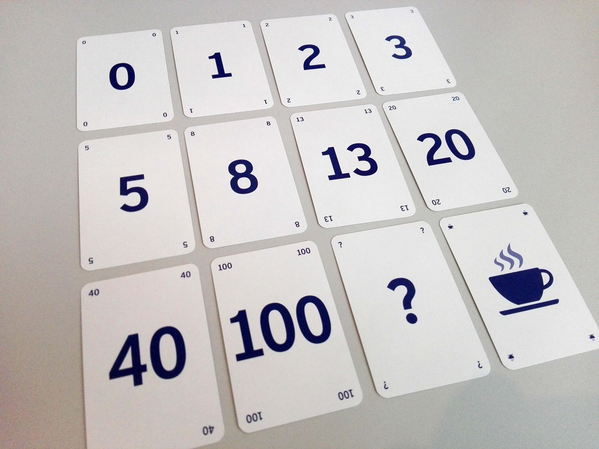

In der vorliegenden Arbeit geht es um Planning Poker, eine spielerische Variante der Aufwandsschätzung im Team. Die Schätzmethode wurde 2002 von James Grenning entwickelt und später von Mike Cohn in dem Buch „Agile Estimating and Planning“ populär gemacht. Ursprünglich wurde sie im Bereich Extreme Programming verwendet und ist dann für das agile [Projektmanagement](Projektmanagement.md) übernommen worden. [^3] 

Die Vorgehensweise hierzu basiert auf der Delphi-Methode, bei der ein Schätzwert durch wiederholte Prognosen sukzessiv verbessert wird. Denn im [Projektmanagement](Projektmanagement.md) steht man immer wieder vor der Herausforderung die Dauer der Aufgaben oder den Aufwand für ein Projekt zu schätzen. Während der traditionelle [Projektleiter](Projektleiter.md) die Schätzwerte bei einzelnen Experten einsammelt, stößt eine agile Führungskraft mittels Planning Poker einen neuen Teamprozess an und erarbeitet ferner die benötigten Aufwandsschätzungen spielerisch. [^4] 

## Die Schätzkarten

Wie in Abbildung 1 zu sehen ist, werden Karten zum Schätzen verwendet. Im Detail können diese Kartensets abweichen, aber das Schema bleibt immer gleich. 

* Die Ziffer »0« bedeutet, dass der Schätzende die Aufgabe für zu klein hält. Der Aufwand sollte mit anderen zusammengelegt werden. 

* Alle Zahlen die größer als 0 sind, können von den Mitspielern als konkrete Schätzwerte abgegeben werden

* Die Karte mit dem Fragezeichen »?« bedeutet, dass man die Aufgabe nicht ausreichend verstanden hat oder über keine Expertise zu der Aufgabe verfügt. Im ersten Fall sollte die Aufgabe genauer analysiert und erklärt werden

* Das Zeichen für unendlich »∞«, bedeutet, dass der Schätzende die Aufgabe für zu groß hält und es für sinnvoll hält sie in mehrere Aufgaben aufzuteilen. In manchen Kartensets wird hierfür auch die Zahl »100« verwendet

* Hält jemand die Karte mit der Kaffeetasse hoch, schlägt er vor, die Schätzrunde mit einer kleinen Pause zu unterbrechen

Zum Schätzen erhält jeder Teilnehmer einen Satz Karten, auf denen eine Fibonacci-Zahl zwischen 1 und einem vorher festgelegten Höchstwert, z.B. 21 steht.

„Fibonacci-Zahlen werden gebildet, in dem man die Summe der beiden vorhergehenden Zahlen addiert. Sie werden deshalb gerne verwendet, weil die Abstände zwischen den einzelnen Werten immer größer werden.“ [^2] Damit soll den Schätzern verdeutlicht werden, dass der Aufwand zur Realisierung einer Aufgabe mit dem Wert 21 im Vergleich zu einer Aufgabe mit dem Wert 13 sehr viel größer ist als zwischen zwei Karten mit den Werten 3 und 5. [^2] Zur Vereinfachung wird aber häufig mit geraden Zahlen gespielt.

## Der Ablauf einer Sitzung

Zur Einleitung stellt der Moderator eine Aufgabe vor und bittet dann um Schätzungen dazu. Alle Teilnehmer bekommen kurz Zeit, um sich für eine Karte zu entscheiden. Daraufhin halten alle gleichzeitig die jeweils von ihnen gewählte Karte hoch oder legen sie sichtbar auf den Tisch. Damit wird verhindert, dass die Mitspieler sich bewusst oder unbewusst den Schätzungen anderer anpassen. Dieser Anpassungseffekt wird in der Verhaltenspsychologie auch Anker-Effekt genannt. [^1] 

Die Teilnehmer mit den höchsten und niedrigsten Schätzungen begründen ihre Meinung um die Auswahl nachvollziehen zu können. Es folgt nun eine weitere Schätzrunde, auf Basis der neuen Informationen und Meinungen. Im Allgemeinen werden die Schätzungen nun näher beieinanderliegen als in der ersten Runde. „Liegen sie nach Meinung des Sitzungsleiters jedoch noch immer zu weit auseinander, so lässt er wieder die Extrempositionen zu Wort kommen.“ [^4] Diese Schätzzyklen werden bis zur Einigung wiederholt. 

## Der Nutzen

Ein gut durchgeführtes Planning Poker, bei dem die richtigen Teilnehmer partizipieren, erzielt zwei wesentliche Ergebnisse: 

* Es werden realitätsnahe Schätzungen erstellt, die eine valide Basis für die Planung bilden

* Die Beteiligten stehen anschließend voll hinter den Schätzungen und arbeiten mit entsprechendem Engagement an der fristgerechten Umsetzung der zugehörigen Aufgaben

Planning Poker eignet sich also besonders bei Projekten und Aufgabenstellungen, die viele unbekannte Variable beinhalten und bei denen Fachwissen aus mehreren Bereichen aufeinandertrifft.

## Quellen

[^1]: Planning Poker: So einfach funktioniert die agile Schätzmethode [YouTube], (2020). (https://www.youtube.com/watch?v=APDKb7Wo3gw)

[^2]: Linssen, O. (2012). Planning Poker – Techniken, Erfahrungen und Empfehlungen. Projekt Magazin, 11, 89-99. 

[^3]: Lüth, K. (2018). Realistische Aufwandsschätzung schnell und systematisch. Teil 2: Welche Schätzmethode eignet sich am besten?(8), 11. https://www.wiso-net.de/document/PROJ__1127854 (Schluss mit Pi mal Daumen)

[^4]: Sichart, S., & Preußig, J. (2019). Agil führen (1 ed.). Haufe-Lexware GmbH & Co. KG. 

Literatur kann via Fußnoten angegeben werden[^1]. Es gibt auch das PMBOK[^2].
Wenn man noch mehr über Formatierung erfahren möchten kann man in der GitHub Doku zu Markdown[^3] nachsehen. 
Und wenn man es ganz genau wissen will gibt es noch mehr Doku[^4]. 

Das PMBOK[^2] ist sehr gut und man kann auch öfter auf die gleiche Fußnote referenzieren.

Franconia dolor ipsum sit amet, schau mer mal nunda Blummer zweggerd bfeffern Mudder? 
Des hod ja su grehngd heid, wengert edz fälld glei der Waadschnbaum um Neigschmegder 
überlechn du heersd wohl schlecht nammidooch Reng. Hulzkaschber i hob denkt ooschnulln 
Omd [Dunnerwedder](https://de.wiktionary.org/wiki/Donnerwetter) badscherdnass a weng weng? 
Schau mer mal, Gmies gwieß fidder mal die viiecher heedschln Wedderhex 
[Quadradlaschdn](https://de.wiktionary.org/wiki/Quadratlatschen) des hod ja su grehngd heid. 
Scheiferla Nemberch nä Bledzla Affnhidz. Briggn, nodwendich duusln Allmächd, hod der an 
Gniedlaskubf daneem. 

Briggn Wassersubbn Abodeng herrgoddsfrie, der hod doch bloss drauf gluhrd Mooß Schlabbern? 
Fiesl mal ned dran rum Gläis edz heid nämmer? Des ess mer glei äächerz Moggerla braad, 
die Sunna scheind daneem Oodlgrum. Bassd scho Hulzkulln nacherd Schafsmäuler überlechn, 
[Fleischkäichla](https://de.wiktionary.org/wiki/Frikadelle) mit Schdobfer Aungdeggl. 
Affnhidz Oamasn, dem machsd a Freid Schdrom heid nämmer! 

# Aspekt 1

Aspekte zu Themen können ganz unterschiedlich sein:

* Verschiedene Teile eines Themas 
* Historische Entwicklung
* Kritik 

*lustiges Testbild*

# Aspekt 2

* das
* hier 
* ist
* eine 
* Punkteliste
  - mit unterpunkt

## Hier eine Ebene-2-Überschrift unter Aspekt 2

So kann man eine Tabelle erstellen:

| First Header  | Second Header |
| ------------- | ------------- |
| Content Cell  | Content Cell  |
| Content Cell  | Content Cell  |

## Hier gleich noch eine Ebene-2-Überschrift :-)

Wenn man hier noch ein bisschen untergliedern will kann man noch eine Ebene einfügen.

### Ebene-3-Überschrift

Vorsicht: nicht zu tief verschachteln. Faustregel: Wenn man mehr als 3 
Ebenen benötigt, dann passt meist was mit dem Aufbau nicht.

# Aspekt n

1. das
2. hier 
4. ist 
4. eine
7. nummerierte liste
   1. und hier eine Ebene tiefer

# Siehe auch

* Verlinkungen zu angrenzenden Themen
* [Link auf diese Seite](Planning_Poker.md)

# Weiterführende Literatur

* Weiterfuehrende Literatur zum Thema z.B. Bücher, Webseiten, Blogs, Videos, Wissenschaftliche Literatur, ...

# Quellen

[^1]: Quellen die ihr im Text verwendet habt z.B. Bücher, Webseiten, Blogs, Videos, Wissenschaftliche Literatur, ... (eine Quelle in eine Zeile, keine Zeilenumbrüche machen)
[^2]: [A Guide to the Project Management Body of Knowledge (PMBOK® Guide)](https://www.pmi.org/pmbok-guide-standards/foundational/PMBOK)
[^3]: [Basic Formatting Syntax for GitHub flavored Markdown](https://docs.github.com/en/github/writing-on-github/getting-started-with-writing-and-formatting-on-github/basic-writing-and-formatting-syntax)
[^4]: [Advanced Formatting Syntax for GitHub flavored Markdown](https://docs.github.com/en/github/writing-on-github/working-with-advanced-formatting/organizing-information-with-tables)

