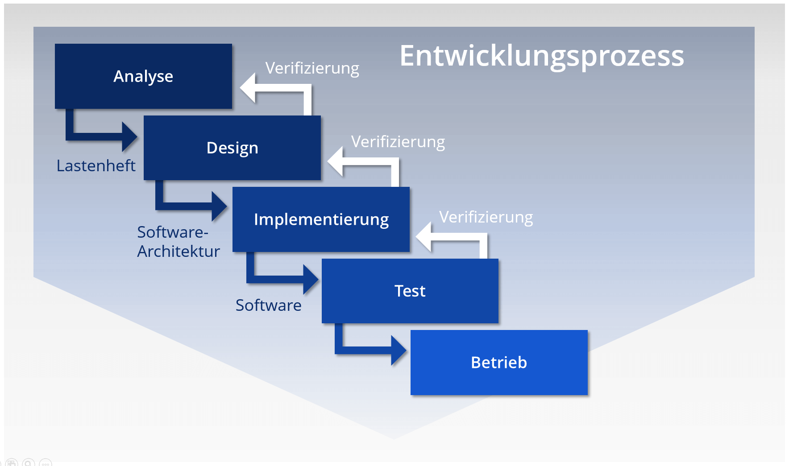

Die Planungssicherheit beschreibt das voraussichtliche Analysieren und frühzeitige Erkennen von möglichen Problemen, die während eines Projekts auftreten. 
Um so bestmöglich und selbst bei unberechenbaren Umständen handeln zu können.[^1]
Dabei kann die Planungssicherheit in vielen Bereichen im Projekt genutzt werden, wie beispielsweise der Zeiterfassung, Kosten oder der Produktion.

Das Planen hat eine wichtige Funktion in unserem Leben, es verschafft vermeintliche Sicherheit.
So orientiert man sich leichter an vorgegebenen Zielen oder kann den Verlauf bis zu einem bestimmten Grad steuern, 
um das gewünschte Ergebnis zu erreichen. [^2] 
Typisch für das klassische Projektmanagement ist die detaillierte Planung des gesamten [Projektes](Projekt.md).
Prinzipiell steht das klassische Projektmanagement daher vor allem für eine große Planungssicherheit. [^3]
Planungssicherheit im Allgemeinen bedeutet: „Sicherheit in bestimmten für eine Planung bedeutsamen Fragen.“ [^4]
Eines der wichtigsten Schritte beim [Projektstart](Projektstart.md) ist daher die Planung. 
Dabei kann diese in vielen unterschiedlichen Arten und Methoden ausfallen, von der Planung großer [Meilensteine](Meilensteine.md) 
bis zur genauen Dokumentation der Einzeltätigkeiten. Grundlegend versteht man bei der Planung im klassischen Sinn die rechtzeitige 
Dokumentation der einzelnen [Projektphasen-klassisch](Projektphasen_klassisch.md), um so möglichst viel Sicherheit zu schaffen. [^2]
Die Planungssicherheit steht daher eng mit der gesamten [Projektplanung](Projektplanung.md) im Zusammenhang.

# 1.	Projektzeiterfassung für höhere Planungssicherheit

Häufig scheitern Projekte an der nicht eingehaltenen Planungszeit und die demnach überraschend hohen Kosten der Zeitüberschreitung. [^5]
Wie beispielsweise dem Bau des Berliner Flughafens, der Elbphilharmonie oder Stuttgart 21. [^2]
Um dies zu vermeiden, sollten während des Projekts die Zeitaufwände erfasst werden. 
Zeiterfassung erklärt die Dokumentation von allen projektbezogenen Aufwendungen, um so eine genaue Zuordnung von Zeiten und Aktivitäten herzustellen. 
So lässt sich die Planungssicherheit steigern.[^5]
Diese wird hauptsächlich in den Bereichen Datenqualität und Projektcontrolling erworben, 
somit kann der Bereich „Aufwand“ wahrheitsgemäß dargestellt werden, welcher die Grundlage für die Planungssicherheit bildet.
Hieraus resultiert eine Sicherheit, die auch bei einem laufenden Projekt kontrolliert werden kann und somit langfristig gesehen 
dem Unternehmen Wettbewerbsvorteile verschafft. [^5]

# 2.  Planungssicherheit am Beispiel des Wasserfallmodells

Das [Wasserfall_Modell](Wasserfall_Modell.md) ist im klassischen Projektmanagement eine Methode, die für hohe Planungssicherheit steht, 
welche den größten Nutzen des Modells ausmacht. [^6]
Das Modell wird häufig in hierarchisch strukturierten Unternehmen, vor allem aber auch in großen und umfassenden Projekten genutzt. [^7]
Hierbei teilt man das Projekt in zusammenhängende Stufen auf und lässt es in einer im Vorhinein geregelten Reihenfolge ablaufen.
Für eine hohe Planungssicherheit führt in dem Modell die strikte Ausführung der ausgearbeiteten Phasen. [^7]

 [^10]
*Abbildung: Das Wasserfallmodell*

# 3.	Kritik der Planungssicherheit im klassischen Projektmanagement

Vorzeitige Planung stößt meistens an ihre Grenzen. Dies kann anhand von viele bekannten klassischen Projekten beobachten werden. 
Langfristige und frühzeitige Planungen werden in Zukunft belangloser. Unsicherheiten, die auf dem Markt auftreten, 
spielen vermehrt im Projektmanagement eine große Rolle, dadurch wird die Planung erschwert und so vermindert sich auch die Planungssicherheit. [^8]
Einen guten Überblick verschafft die Studie der Standish Group.

Projekterfolgsquoten Agil vs. Wasserfall: (Standish Group Chaos Report 2020)

| Methode       | erfolgreich   |   teilweise-erfolgreich  |   nicht erfolgreich  |
| ------------- | ------------- |--------------------------|----------------------|
| Agil          |      42%      |            47%           |          11%         |
| Wasserfall    |      13%      |            59%           |          28%         |
 
[^11]

Sie zeigt, dass vermehrt Wasserfall Projekte teilweise oder nicht erfolgreich beendet wurden.
Das erklärt aber nicht, dass die klassischen Methoden im Projektmanagement nicht gewinnbringend sind.[^3]
Sie ist aber eher unpassend für Projekte mit hoher Flexibilität. Da die einzelnen geplanten Phasen strikt eingehalten werden und somit fehlerhafte 
Abläufe erst spät auffallen und die Korrektur dieser meist zu kostenintensiv ist.  [^7]

# 4. Fazit
Wichtig ist, dass vor dem Projektstart eingeschätzt wird, welche Methode am besten für das geplante Projekt geeignet ist, 
um eine möglichst hohe Planungssicherheit zu erreichen. Das klassische Projektmanagement bildet diese besonders in den [Meilensteine](Meilensteine.md), 
[Projektphasen-klassisch](Projektphasen_klassisch.md) und Kosten aus.[^3]
Auch im agilen Projektmanagement spielt die Planungssicherheit eine wichtige Rolle, jedoch wird hier nicht vollständig im Vorhinein geplant, 
sondern bis zum nächsten voraussehbaren Schritt. [^9]

# Siehe auch

* [Projektstart](Projektstart.md)
* [Meilensteine](Meilensteine.md)
* [Projektphasen-klassisch](Projektphasen_klassisch.md)
* [Projektplanung](Projektplanung.md)
* [Projekt](Projekt.md)
* [Wasserfall_Modell](Wasserfall_Modell.md)

# Weiterführende Literatur

* Weiterfuehrende Literatur zum Thema Wasserfallmodell:[Wirtschaftsinformatik & Management,2019](https://link.springer.com/article/10.1365/s35764-019-00193-7)
                                                       [Video Das Wasserfallmodell - Einfach erklärt]( https://www.youtube.com/watch?v=YBwqVx2Prlk)
* Weiterfuehrende Literatur zum Thema Projekte: 
[Informationen über gescheiterte klassische Projekte]( http://projekt-manager.eu/gescheiterte-projekte.html)

# Quellen

[^1]: [vgl. Germanedge, MANUFACTURING NETWORKS: DAS MITTEL GEGEN DEN PRODUKTIONSKOLLAPS, (18.12.2021)]( https://www.germanedge.com/schlauer-raum-blog/manufacturing-networks/)
[^2]: [vgl. Jürgen Rohr, Mythos Planungssicherheit, 2014, ( 16.11.2021)](https://books.google.de/books?hl=de&lr=&id=8XOQAwAAQBAJ&oi=fnd&pg=PA5&dq=Planungssicherheit+in+Projekten&ots=yVQHLggrPE&sig=XH8vEIV_nv5SkuaSuKd2qLMjToM#v=onepage&q&f=false)
[^3]: [vgl. Domenik Boss,WAS IST KLASSISCHES PROJEKTMANAGEMENT?,2020, (15.11.2021)](https://www.agile-heroes.de/magazine/was-ist-klassisches-projektmanagement/)
[^4]: [Duden, Planungssicherheit, (16.11.2021)](https://www.duden.de/rechtschreibung/Planungssicherheit)
[^5]: [vgl. Projektmagazin, Mit Projektzeiterfassung zu mehr Planungssicherheit in Projekten, (18.11.2021)](https://www.projektmagazin.de/artikel/mit-projektzeiterfassung-zu-mehr-planungssicherheit-projekten_77071)
[^6]: [vgl. Anastasia Galani, Scrum oder klassische Methoden für das Projektmanagement?,2015 (18.11.2021)](https://galaniprojects.de/2015/09/14/scrum-oder-klassische-methoden-fuer-das-projektmaangement/)
[^7]: [vgl. Jan Philip Riehle, Projektmanagement: Wasserfall-Modell vs.agiles Vorgehen, (19.11.2021)](https://www.pinuts.de/projektmanagement-wasserfall-modell-gegen-agiles-arbeiten)
[^8]: [vgl. Sabine Jaritz, Agile Methoden als potenzielle Game Changer für das Projektportfolio-Management,2019, ( 19.11.2021)](https://link.springer.com/chapter/10.1007/978-3-658-26260-0_6)
[^9]: [vgl. Inge Hanschke, Agile Planung — nur so viel planen wie nötig, 2016 ( 20.22.2021)](https://link.springer.com/article/10.1007/s35764-016-0063-1)
[^10]: [Bildquelle: Abbildung:Das Wasserfallmodell, 2021 ( 21.11.2021)](https://www.ionos.de/digitalguide/websites/web-entwicklung/wasserfallmodell/)
[^11]:[Tabelle: Why Agile is Better than Waterfall (Based on Standish Group Chaos Report 2020),2020, (23.11.2021)](https://vitalitychicago.com/blog/agile-projects-are-more-successful-traditional-projects/)
