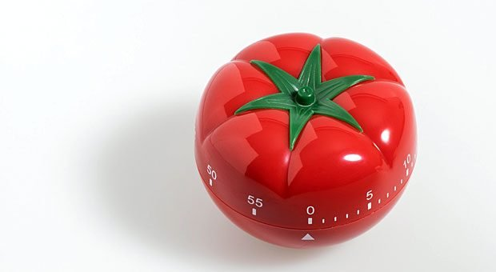

*Pomodoro-Timer*

Die Pomodoro-Technik (orig. pomodoro technique von italienisch pomodoro = Tomate und englisch technique = Methode, Technik) ist eine Methode des Zeitmanagements, die von Francesco Cirillo in den 1980er Jahren entwickelt wurde. Das System verwendet einen Kurzzeitwecker, um Arbeit in 25-Minuten-Abschnitte – die sogenannten pomodori – und Pausenzeiten zu unterteilen. Der Name pomodoro stammt von der Küchenuhr, die Cirillo bei seinen ersten Versuchen benutzte.[^1]

Die Methode basiert auf der Idee, dass häufige Pausen die geistige Beweglichkeit verbessern können.

# So funktioniert die Pomodoro-Technik

Das Grundprinzip der Pomodoro-Technik ist simpel: Phasen konzentrierter Arbeit wechseln sich ab mit regelmäßigen kurzen und längeren Pausen. So soll es möglich sein, produktiver zu arbeiten. In einem Pomodoro – so nennt man die 25-minütigen Arbeitseinheiten – widmet man sich voll und ganz nur einer einzigen Aufgabe. Dieses Prinzip des Monotaskings ist ganz zentral für die Methode.

Auf seiner [Webseite](https://francescocirillo.com/pages/pomodoro-technique) skizziert Cirillo folgende Schritte für einen Pomodoro-Zyklus:
1. Aufgabe auswählen.
2. Wecker auf 25 Minuten stellen.
3. Aufgabe bis zum Klingeln bearbeiten.
4. Wenn der Timer klingelt, die erledigte Aufgabe von der To-do-Liste abhaken.
5. Drei bis fünf Minuten Pause machen.
6. Punkte 2 bis 5 wiederholen.
7. Nach dem vierten Durchgang 20 bis 30 Minuten Pause machen.

Dadurch entsteht folgender Ablauf:

🍅 Pomodoro 1

- 5 Minuten Pause

🍅 Pomodoro 2

- 5 Minuten Pause

🍅 Pomodoro 3

- 5 Minuten Pause

🍅 Pomodoro 4

- 30 Minuten Pause

Für einen kompletten Pomodoro-Zyklus werden also 2:25 Stunden gebraucht.

# Anwendung und Tipps zur Pomodoro-Technik

Ein Problem und Kritikpunkt an der Pomodoro Technik sind die 25-Minuten-Einheiten. Welche Aufgabe dauert schon exakt 25 Minuten? Damit die Zeitmanagement-Methode optimal funktioniert, sollten Sie daher folgende Tipps zur Vorbereitung nutzen:

**Aufgaben priorisieren**

**Zeitaufwand schätzen**

**Tag einteilen**

**Fokussiert bleiben**

## Beispieltabelle für die Pomodoro-Technik

So kann man eine Tabelle erstellen:

| Priorität  | Aufgaben | Zeiteinheiten | +/- | OK |
| -----------| -------- | ------------- | --- | -- |
| HIGH       |  MPS Kompendium | ⬛⬛⬛⬛🔲| / |  ✅ |
|            |          |               |     |    |
|            |          |               |     |    |
|            |          |               |     |    |

Die Tabelle von links nach rechts:

In der ersten Spalte wird die Priorität eingetragen, was nichts anderes bedeutet, als die Reihenfolge für den heutigen Tag.

Die zweite Spalte ist für die Aufgaben reserviert. Sonst nichts.

Jetzt wird es etwas interessanter. In der Spalte „Zeiteinheiten“ sind fünf leere Kästchen. Jedes steht für eine Pomodoro-Einheit. Bei der Planung überlege ich mir vorab, wie groß der Zeitbedarf für eine Aufgabe etwa sein könnte. Gehe ich von drei Pomodori aus, ziehe ich einen Rahmen um drei Kästchen. So kann ich im Nachhinein überprüfen, inwieweit es mir gelungen ist, den Zeitbedarf einzuschätzen. Abweichungen von der Schätzung sind eine Spalte weiter (+/-) einzutragen.

In der letzten Spalte ist zum Abhaken der erledigten Aufgaben.

Kopf- und Fußzeile geben die Möglichkeit für Notizen, beziehungsweise wann und in welchem Kontext gearbeitet wurde.[^2]

# Vorteile und Nachteile 
Wirkliche Pomodoro-Technik Nachteile gibt es nicht. Sie lässt genügend Flexibilität, die Zeitintervalle und den Tag so einzuteilen, dass es für Sie passt. Dafür sind die Vorteile umso zahlreicher.
+ Simplizität:

Einfacher geht es kaum: Für die die Pomodoro Technik brauchen Sie nur einen Timer, Zettel und Stift.
+ Impulskontrolle:

Die Technik hilft, für die Dauer von 25 Minuten oder länger den Wunsch zu unterdrücken, sich ablenken zu lassen.
+ Motivation:

Die regelmäßigen Pausen sorgen nicht nur für neue Energie. Sie geben ebenso einen Motivationskick, weil Sie sich damit für jeden Teilschritt und Teilerfolg belohnen.

+ Selbstdisziplin

Durch das feste Gerüst der Pomodoro-Intervalle haben lernen Sie, diszipliniert an einer Sache zu arbeiten – ganz gleich, ob es 10, 15 oder 25 Minuten sind.
+ Regeneration

Weil Sie gezwungen sind, Pause zu machen, schützen Sie die Pomidori vor Überanstrengung und Selbstausbeutung. So bleiben Sie über den Tag hinweg geistig fit.
+ Konzentration

Studien zeigen: Länger als 90 Minuten kann sich niemand am Stück konzentrieren. Die Pomodoro-Einheiten sind deutlich kürzer und verbessern so zusätzlich die Konzentration.
+ Produktivität

Die Pomodoro Technik verhindert Multitasking und die Gefahr, sich zu verzetteln. Das steigert die Effizienz.
+ Zielerreichung

Indem Sie sich nur auf eine Sache pro Intervall konzentrieren, arbeiten Sie insgesamt zielgerichteter. Und weil Sie große Aufgaben in überschaubare Teile zerlegen, fällt auch das Anfangen leichter. Effekt: Sie erreichen am Ende mehr und müssen sich weniger überwinden.[^3]

# Kritik
Natürlich gibt es auch an der Pomodoro-Technik Kritik. Die Hauptvorwürfe sind:

◾ Zu unflexibel:

Die 25-Minuten-Abschnitte seien ein zu enges Korsett. Manche Aufgaben lassen sich einfach nicht darauf zuschneiden. So führe die Einhaltung doch nur zu einer anderen Unterbrechung. Dagegen lässt sich allerdings einwenden, dass sich die Methode den jeweiligen Bedürfnissen anpassen lässt. Entscheidend ist, dass Sie das Grundprinzip – den Wechsel aus fokussierter Arbeit und regelmäßigen Pausen – beibehalten.

◾ Zu unrealistisch:

Kritiker monieren, dass niemand einen solchen Rhythmus den ganz Tag lang durchhalten könne. Einen derart ablenkungsfreien, strikt durchgetakteten und fokussierten Tag gibt es nicht. Mag sein. Sie können sich den Tag allerdings auch in Blöcke einteilen: jene, in denen Sie mit der Pomodoro-Technik arbeiten und andere, die freier bleiben.[^3]

# Siehe auch

* [Projektmanagement](Projektmanagement.md)
* [Selbstoffenbarung](Selbstoffenbarung.md)
* [Aufgabenteilung](Aufgabenteilung.md)

# Weiterführende Literatur

* Francesco Cirillo: The Pomodoro Technique. 3. Auflage. FC Garage, Berlin 2013, ISBN 978-3-9815679-0-8 
* Staffan Nöteberg: Die Pomodoro-Technik in der Praxis. dpunkt, Heidelberg 2011, ISBN 978-3-89864-717-5

# Quellen

[^1]: pomodorotechnique.com
[^2]: [Zeitakrobat](https://zeitakrobat.de/pomodoro-methode-einfach-und-wirkungsvoll)
[^3]: [Karrierbibel.de](https://karrierebibel.de/pomodoro-technik/)

