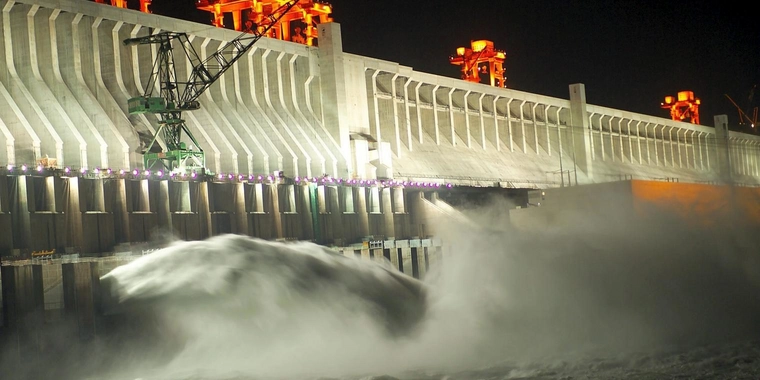
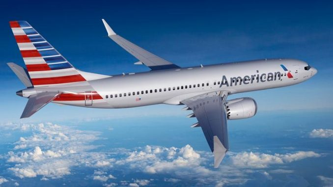

Dieser Artikel handelt von exemplarischen erfolgreichen Großprojekten, die Unternehmen und sogar einen Staat maßgeblich vorangebracht haben. Wie Erfolg im Projektmanagement definiert ist und gemessen wird, könnnen Sie [hier](https://github.com/ManagingProjectsSuccessfully/ManagingProjectsSuccessfully.github.io/blob/main/kb/Erfolgsmessung.md) nachlesen. 

# Einführung des iPhones

[Steves Jobs](https://de.wikipedia.org/wiki/Steve_Jobs), der Gründer von Apple und damaliger CEO, hatte die Idee in den Mobiltelefonmarkt einzusteigen im Jahr 2005. Er sah die Gefahr, dass der Markt der MP3-Player und damit auch des iPods schrumpfen wird, weil die damaligen Handy-Modelle inzwischen ebenfalls Musik speichern und abspielen konnten. Die verantwortlichen Projektleiter für die Entwicklung des iPods bekamen von Steve Jobs den Auftrag, unter dem Projektnamen "Project Purple" aus dem bestehenden iPod ein Mobiltelefon zu konstruieren.[^1] Da das Navigieren mittels Click Wheel, wie zum Beispiel beim Wählen von Telefonnummern, sehr umständlich war, wurde das bis dahin geheime Projekt, welches die Machbarkeit eines Tablet-Computers prüfte, hinzugezogen. Es entstand ein Mobiltelefon mit einem verglasten 3.5 Zoll Display, welches durch Berührungen mit den Fingern bedient werden konnte. Durch die Innovationskraft von diesem Projekt war das iPhone ein Pionier auf dem Mobiltelefon-Markt. Das iPhone wurde am 9. Januar 2007 an der Apple Messe MacWorld vorgestellt und ging am 29. Juni dieses Jahres in Amerika in den Verkauf. Bereits am ersten Verkaufswochenende wurden eine halbe Million Exemplare verkauft.[^2] Das iPhone ist bis heute ein gigantischer finanzieller Erfolg. Steve Jobs ebnete mit diesem Projekt den Weg für das modere Smartphone.

Steve Jobs stellt das erste iPhone vor.[^9]

# Drei-Schluchten-Talsperre China

Eines der größten Multi-Milliarden-Projekte der frühen 2000er, welches sogar die Erdrotation beeinflusst, war die Drei-Schluchten-Talsperre in China. [^3] Das Wasserkraftwerk wurde im längsten Fluss Chinas, dem [Jangste](https://de.wikipedia.org/wiki/Jangtsekiang), errichtet. Auch wenn es anfänglich viel Kritik an dem Projekt gab, hauptsächlich durch die unfassbaren Projektkosten von ca. 75 Milliarden USD bis 2013 und Zwangsumsiedelungen von mehr als einer Millionen Menschen, war das Projekt ein voller Erfolg. China bezieht ca. 75% der Energiegewinnung aus höchst umweltschädlichen Kohlekraftwerken, mit einer jährlich gewonnen Energie von 22,5 Gigawatt konnte durch das Wasserkraftwerk die Verstromung von über 49 Millionen Tonnen Kohle pro Jahr vermieden werden.[^4] Bis heute ist es das produktionsstärkste Kraftwerk der Welt.[^5] Der Staudamm greift extrem in die Natur ein, was erstmal sehr dramatisch klingt hat aber auch Vorteile. China fällt fast jährlich riesigen Fluten und Überschwemmungen zum Opfer, welche tausenden Tote fordern. Der Staudamm beugt genau das seit mehr als 18 Jahren erfolgreich vor.[^6] 

Die Drei-Schluchten-Talsperre.[^10]

# Projektmanagement bei American Airlines

Durch die Fusion von American Airlines und US Airways kam es zu Überschneidungen bei Technologien und internen IT-Programmen. Das Management entschloss sich dazu, ein Projekt zu etablieren mit dem Ziel, die IT der Unternehmen und Datenbanken zu einer zusammenzuführen und dadurch einen kommerziellen Erfolg und effektivere Arbeitszeiten zu schaffen.
Die Datenbanken, die zuvor benutzt wurden, waren für die Verwaltung von Ressourcen und komplexen Projekten unzureichend. Um einen Überblick über die kommerziell erfolgreichsten Daten und Projekte zu bekommen, begann das Unternehmen mit ihren Projektmanagern ein smartes System zu entwickeln, welches alle Daten automatisch auswertet. Infolgedessen konnte die Airline die Planungszeiten für Projekte und Routen verkürzen und dabei weniger Arbeiter einsetzten, was sich positiv auf den Gewinn auswirkte und mehrere Millionen Dollar einbrachte. Das Unternehmen hat nun Zugang zu besseren und zuverlässigeren Daten, um wichtige Entscheidungen über Projekte und Ressourcen zu treffen.[^7] Dank diesem erfolgreichen Projektmanagements ist American Airlines bis heute eine der größten Fluggesellschaften der Welt.[^8]

Ein Flugzeug der American Airlines.[^11]

# Siehe auch

* [Praxisbeispiele gescheiterter Projekte](https://github.com/ManagingProjectsSuccessfully/ManagingProjectsSuccessfully.github.io/blob/main/kb/Praxisbeispiele_gescheiterte_Projetke.md)
* [Erfolgsmessung](https://github.com/ManagingProjectsSuccessfully/ManagingProjectsSuccessfully.github.io/blob/main/kb/Erfolgsmessung.md)

# Weiterführende Literatur
* [Manager-Magazin: Geheminis erfolgreicher Projekte](https://www.manager-magazin.de/harvard/management/das-geheimnis-erfolgreicher-projekte-a-00000000-0002-0001-0000-000159313152)
* [Simple Flying: Making The World’s Largest Airline: The History Of American Airlines](https://simpleflying.com/history-american-airlines/)

# Quellen
[^1]: [Apple's Phone: From 1980s' Sketches to iPhone](https://mobile-review.com/articles/2010/iphone-history3-en.shtml)
[^2]: [Verkaufszahlen iPhone](https://www.spiegel.de/netzwelt/mobil/handy-hype-apple-verkauft-hunderttausende-iphones-a-491832.html)
[^3]: [Erdrotation: Wieviel Einfluss hat der Drei-Schluchten-Damm?](https://www.mz.de/panorama/erdrotation-wieviel-einfluss-hat-der-drei-schluchten-damm-2292042)
[^4]: [NTV: Energierekord am Drei-Schluchten-Damm](https://www.n-tv.de/wirtschaft/Energierekord-am-Drei-Schluchten-Damm-article14247201.html)
[^5]: [Das sind die größten Kraftwerke der Welt](https://www.handelsblatt.com/technik/energie-umwelt/circular-economy/wasser-wind-kohle-atom-das-sind-die-groessten-kraftwerke-der-welt/14849820.html?ticket=ST-3508956-DO6yaiY0yaqKcLYJpJOx-cas01.example.org)
[^6]: [Der Drei-Schluchten-Stausee gibt fast 90% seiner Kapazität zum Hochwasserschutz frei](http://german.china.org.cn/txt/2021-06/03/content_77546264.htm)
[^7]: [Project Report on Merger of American airlines and US airlines](https://de.slideshare.net/reenasisodiya10/project-report-on-merger-of)
[^8]: [RND: Die größten Fluggesellschaften der Welt](https://www.rnd.de/reise/iata-ranking-das-sind-die-25-groessten-airlines-der-welt-LDHUXKVAC5FCJLHKY2JTZJP4ZU.html)
[^9]: [Steve Jobs stellt das erste iPhone vor](https://www.t-online.de/digital/handy/id_81539520/vor-10-jahren-wurde-das-erste-iphone-verkauft.html)
[^10]: [Die Drei-Schluchten-Talsperre](https://mar.prod.image.rndtech.de/var/storage/images/haz/nachrichten/panorama/uebersicht/drei-schluchten-damm-in-china-macht-neue-probleme/12794797-1-ger-DE/Drei-Schluchten-Damm-in-China-macht-neue-Probleme_reference_4_3.jpg)
[^11]: [Ein Flugzeug der American Airlines](https://www.frankfurtflyer.de/wp-content/uploads/2019/11/american-airlines-737-max750xx1173-660-44-0-678x381.jpg)
