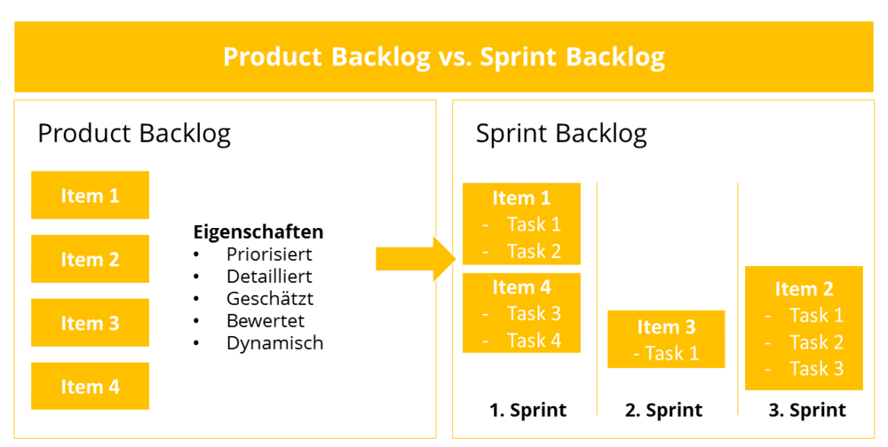

Der Product Backlog ist bei Scrum die Liste aller Anforderungen für ein zu erstellendes Produkt[^1].

# Was ist das Product Backlog?

Bereits die Wahl der Bezeichnung "Backlog" (Auftragsbestand) weist darauf hin, dass das Product Backlog eine dynamische Liste ist und somit kein Lastenheft im traditionellen Sinn ist. Konsequent definiert der Scrum Guide den Product Backlog als Dokument des Product Lifecycle Managements und nicht als temporäres Projektdokument[^1]. Der Product Owner ist für das jeweilige Backlog verantwortlich, er muss Erweiterungen genehmigen, sowie Anforderungen für das Team priorisieren. Das Product Backlog enthält Eigenschaften, Funktionen, Anforderungen, Verbesserungen und Fehlerbehebungen, wobei jeder Eintrag mit Aufwandsschätzung, Beschreibung und Priorität versehen ist. 

Anforderungen aus dem Product Backlog werden im Planning in die jeweiligen Sprint Backlogs gezogen und während eines Sprints bearbeitet. 

*Product-Backlog vs. Sprint-Backlog*

# Wie erstelle ich die ersten Fassung des Scrum Product Backlogs? [^2]

Die erste Version wird oft auch als “Initial Product Backlog” bezeichnet, diese erste Fassung ist das Ergebnis der Kombination von Informationen aus verschiedenen Quellen:

* Die Produktvision: Von der ersten Produktvison können schon viele Product Backlog Items abgeleitet werden.
* Eine Product Roadmap: Sie legt Eckpunkte fest und gibt einen Rahmen wie das Product später genutzt werden soll.
* Das Minimum Viable Product (MVP): Ein MVP ist das minimale Produkt, mit dem eine Organisation dem Kundenwunsch entsprechen kann. Ein Scrumteam hat i.d.R. zuerst diese erste Produktversion im Blick. Denn anhand des MVP bekommt es Feedback auf sein Arbeitsergebnis. [^2]
* Stakeholder: Spätere Nutzer des zu entwickelnden Produktes sind die wichtigste Quelle für Input des Product Backlogs, sie wissen was sie benötigen oder stört. Wer das Scrum-Projekt gut angeht, hört genau zu, was die Stakeholder zu sagen haben.
* Das Entwicklerteam: Das Team arbeitet multidisziplinär, die Mitglieder sind Spezialisten auf ihrem Gebiet und haben das nötige Fachwissen. Sie steuern wertvolle Ergänzungen bei, sodass bei der Backlog Erstellung nichts vergessen wird.

# Wie sieht ein guter Product Backlog aus?  [^2]

Ein guter Backlog zeichnet sich durch die vier Elemente "DEEP" aus:

* Detailed (detailliert): Items, die im nächsten oder übernächsten Sprint bearbeitet werden sollen, müssen „fertig für den Sprint“ sein. Gemeint ist damit, dass sie vom Entwicklerteam verstanden werden, klein genug sind und sowohl Akzeptanzkriterien als auch eine Definition of Done deutlich formuliert sind.
* Emergent (entwickelt sich nach und nach): Ein Product Backlog entwicklet sich im Verlauf des Projektes stetig weiter, vor dem ersten Sprint ist es dementsprechend noch nicht  vollständig.
* Estimated (abgeschätzt): Die Items sind abgeschätzt, oftmals geschieht das in einer Planning Poker Session mittels Story Points.
* Prioritized (mit Prioritäten versehen): Der Product Owner hat die Items im Product Backlog mit Prioritäten versehen, sodass das Team anhand der Priorität das Sprint Backlog füllen kann.

# Wie verbessere ich das Backlogs durch "Backlog Grooming"? [^2]

Bei Backlog Grooming (auch als Refinement bezeichnet) handelt es sich um ein Meeting, das kein fester Bestandteil des Scrum-Prozesses gemäß der Definition im Scrum Guide ist. In der Praxis hat sich diese Meeting jedoch als sehr wertvoll erwiesen. Gemeinsam mit dem Team schärft und bereitet der Product Owner die Backlog Items vor, die dann im nächsten Sprint Planning in den Sprint gezogen werden. Dabei werden folgende Schritte durchgeführt:

* User Stories gemäß neuester Erkenntnisse aktualisieren
* User Stories mit Prioritäten versehen
* Details in User Stories anbringen und sie aufteilen
* Abschätzen von User Stories durch das Entwicklerteam

# Siehe auch

* [Sprint_Backlog](Sprint_Backlog.md)
* [Sprint](Sprint.md)
* [Sprint_Planning](Sprint_Planning.md)
* [Product_Owner](Product_Owner.md)

# Weiterführende Literatur

* Weiterfuehrende Literatur zum Thema z.B. Bücher, Webseiten, Blogs, Videos, Wissenschaftliche Literatur, ...

# Quellen

[^1]: https://www.projektmagazin.de/glossarterm/product-backlog 
[^2]: https://agilescrumgroup.de/product-backlog/ 
[^3]: https://www.inloox.de/projektmanagement-glossar/backlog/ 

Hilfe für später:

## Hier eine Ebene-2-Überschrift unter Aspekt 2

So kann man eine Tabelle erstellen:

| First Header  | Second Header |
| ------------- | ------------- |
| Content Cell  | Content Cell  |
| Content Cell  | Content Cell  |

## Hier gleich noch eine Ebene-2-Überschrift :-)

Wenn man hier noch ein bisschen untergliedern will kann man noch eine Ebene einfügen.

### Ebene-3-Überschrift

Vorsicht: nicht zu tief verschachteln. Faustregel: Wenn man mehr als 3 
Ebenen benötigt, dann passt meist was mit dem Aufbau nicht.

