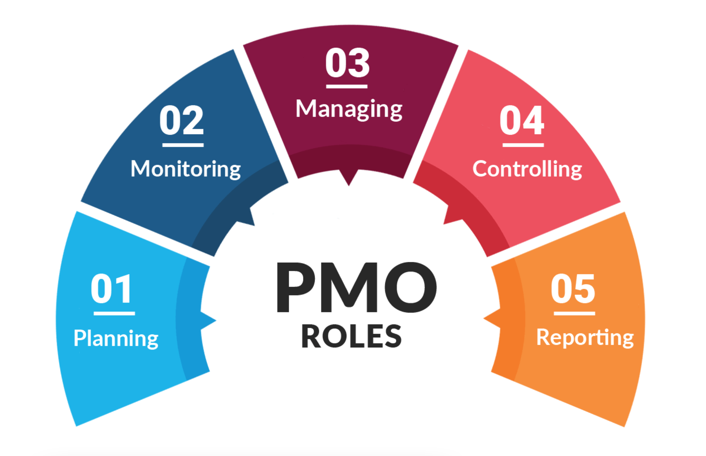

## 1.	Grundlagen und Verwendung
Das **Project Management Office** (kurz PMO) ist eine permanente organisatorische Einheit im Unternehmen, ähnlich einer Stabsstelle, die für das zentralisierte und koordinierte Management aller [Projekte](https://github.com/nicolasrmg/ManagingProjectsSuccessfully.github.io/blob/main/kb/Projekt.md) zuständig ist.[^1] Es befindet sich häufig direkt unterhalb der Geschäftsführung und setzt die Vision und Mission des Unternehmens in Strategien und Ziele um.[^6]

„Das PMO sollte den Stakeholdern in der Multiprojekt-Landschaft das gute Gefühl geben, alles im Griff zu haben.“ - Johann Strasser, Managing Partner TPG [^5]

Der Einsatzbereich eines PMOs, variiert stark mit der Rolle des [Projektmanagements](https://github.com/nicolasrmg/ManagingProjectsSuccessfully.github.io/blob/main/kb/Projektmanagement.md) im Unternehmen. In kleineren Unternehmen mit wenigen Projekten kann auf ein PMO eher verzichtet werden als in einem größeren Betrieb mit vielen abteilungs- und standortübergreifenden Projekten.[^6] Aufgrund seines flexiblen Einsatzbereiches ist es schwierig konkret festzulegen, was die genauen Tätigkeiten eines PMOs sind, da sich diese stets an den individuellen Anforderungen orientieren.[^3]

## 2.	PMO-Strukturen 
Das PMO ist eine Managementstruktur, die projektbezogene Governance-Prozesse standardisiert und die gemeinsame Nutzung von Ressourcen, Methoden, Tools und Techniken erleichtert. Seine Zuständigkeiten reichen von der Unterstützung des Managements bis zur direkten Leitung eines oder mehrerer Projekte. Es gibt mehrere Arten von PMO-Strukturen. Diese unterscheiden sich durch den Grad der Kontrolle und des Einflusses, den sie auf die Projekte innerhalb der Organisation haben.[^1]

### 2.1	Supportive PMO
Das unterstützende PMO hat eine beratende Funktion für die Projekte. Es unterstützt durch die Bereitstellung von Vorlagen, Best Practices, Schulungen, Zugang zu Informationen und Erfahrungen aus anderen Projekten.[^1] Es steht den Projektleitern jedoch frei, ob sie diese Vorschläge annehmen. Daher ist der Grad der Kontrolle über die Projekte insgesamt eher gering.[^2]

### 2.2	Controlling PMO
Das steuernde PMO bietet Unterstützung und fordert die Einhaltung der Vorschriften mit verschiedenen Mitteln. Die Einhaltung kann die Übernahme bestimmter Managementrahmen oder -methoden unter Verwendung bestimmter Vorlagen, Formulare und Tools oder die Einhaltung der Governance umfassen. Der Grad der Kontrolle ist hier moderat.[^1]

### 2.3	Directive PMO
Das weisende PMO übernimmt die Kontrolle über die Projekte, indem es die Projekte direkt verwaltet. Es übernimmt selbst die Funktionen der Initiierung, Planung, Durchführung, Überwachung und des Abschlusses der Projekte.[^3] Der Grad der Kontrolle ist daher sehr hoch.[^1]

## 3.	Aufgaben
Das PMO unterstützt die [Projektleiter](https://github.com/nicolasrmg/ManagingProjectsSuccessfully.github.io/blob/main/kb/Projektleiter.md) in vielfältiger Weise und übernimmt verschiedene Funktionen:[^3]

Es verwaltet zum einen die gemeinsamen Ressourcen aller Projekte und ermöglicht eine effiziente Zuteilung.[^5] Ein effizientes [**Ressourcenmanagement**](https://github.com/nicolasrmg/ManagingProjectsSuccessfully.github.io/blob/main/kb/Ressourcenplanung.md) ist von großer Bedeutung, da sichergestellt werden muss, dass die richtigen Kompetenzen zur richtigen Zeit im richtigen Projekt eingesetzt werden.[^2]

Des Weiteren identifiziert und entwickelt es Projektmanagement-Methoden, [Best Practices](https://github.com/nicolasrmg/ManagingProjectsSuccessfully.github.io/blob/main/kb/Best_Practices.md), [Lessons Learned](https://github.com/nicolasrmg/ManagingProjectsSuccessfully.github.io/blob/main/kb/Lessons_Learned.md) und Standards, die bei zukünftigen Projekten angewendet werden können. Durch diese einheitlichen **Projektmanagement-Standards** wird allen Projektbeteiligten ein möglichst einfacher und klaren Leitfaden vermittelt.[^2] Dadurch kann zum einen die gewünschte Planungsqualität sichergestellt werden, während sich gleichzeitig der administrative Verwaltungsaufwand verringert.[^1] Außerdem wird so eine leichtere Vergleichbarkeit zwischen den Projekten ermöglicht.[^3] Solche organisatorischen Standards sind zum Beispiel bereits vordefinierte Rollen oder die Nutzung einheitlicher Formulare und Checklisten. Gleichzeitig **überwacht** das PMO auch die **Einhaltung** der festgelegten Projektmanagementstandards.[^4]

Zudem übernimmt es **Coaching**, **Mentoring**, **Schulung** und die **Aufsicht** bei Projekten. Bevor diese überhaupt an das [Projektteam](https://github.com/nicolasrmg/ManagingProjectsSuccessfully.github.io/blob/main/kb/Projektmitarbeiter.md) abgegeben werden können, muss erst einmal das nötige Knowhow durch eine **Personalentwicklung** vermittelt werden.[^2]

Darüber hinaus ist es verantwortlich für die Entwicklung und Verwaltung von Projektrichtlinien, -verfahren, -vorlagen und anderen [Dokumentationen](https://github.com/nicolasrmg/ManagingProjectsSuccessfully.github.io/blob/main/kb/Projektdokumentation.md). Die Projektergebnisse werden in einer zentralen Wissensdatenbank archiviert und für eine zukünftige Nutzung bereitgestellt.[^6] Ein projektorientiertes [**Wissensmanagement**](https://github.com/nicolasrmg/ManagingProjectsSuccessfully.github.io/blob/main/kb/Wissensmanagament.md) wird erfahrungsgemäß erst durch ein aktives PMO gelebt.[^4]

Zuletzt übernimmt es die **Koordinierung und Kommunikation** und gewährleistet so einen reibungslosen Informationsfluss über alle Projekte hinweg.[^3]

## 4.	Einordnung im klassischen und agilen Projektmanagement
Abschließend kann nicht genau gesagt werden, ob das PMO eher dem klassischen oder dem agilen Projektmanagement zugeordnet werden kann. Im ersten Moment klingen Stichworte wie einheitliche Projektmanagement-Standards erst einmal sehr starr und unflexiblen, aber man darf nicht vergessen, dass sich das PMO stets an den Anforderungen des Unternehmens anpasst und durchaus auch in einem agilen Umfeld funktionieren kann.

### *Die Hauptaufgaben eines PMO*
(https://i.pinimg.com/originals/98/01/86/98018650736a4a909dd1e3bc73375506.png)

# Siehe auch

* Verlinkungen zu angrenzenden Themen
* [Link auf diese Seite](Project_Management_Office.md)

# Weiterführende Literatur

* Weiterfuehrende Literatur zum Thema z.B. Bücher, Webseiten, Blogs, Videos, Wissenschaftliche Literatur, ...

# Quellen

[^1]: [AIMS Education, UK (2016): „What is Project Management Office Definition & PMO Roles and Responsibilities | AIMS (UK)“](https://www.youtube.com/watch?v=WFO2sZd8oh4)
[^2]: [Martins, Julia (2021): „Wie ein Project Management Office (PMO) Zusammenarbeit und Informationsaustausch fördert“](https://asana.com/de/resources/pmo-project-management-office)
[^3]: [Ortner, Gerhard/Stur, Bettina (2019): „Das Projektmanagement-Office“](https://link.springer.com/book/10.1007/978-3-662-59486-5)
[^4]: [Pavlik, Franz (2017): „PMO – Project Management Office“](https://dieprojektmanager.com/project-management-office-pmo/)
[^5]: [Strasser, Johann/Schmidt-Sibeth, Achim (2021): „Warum ein PMO? Definition, Vorteile und Mehrwert eines Projektmanagement Office“](https://www.theprojectgroup.com/blog/pmo-project-management-office/)
[^6]: [Widmer, Annegret (2021): „Was ist ein Project Management Office, ein PMO – und warum brauche ich das?“](https://meisterplan.com/de/blog/was-ist-ein-project-management-office/)

