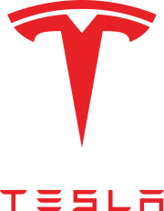
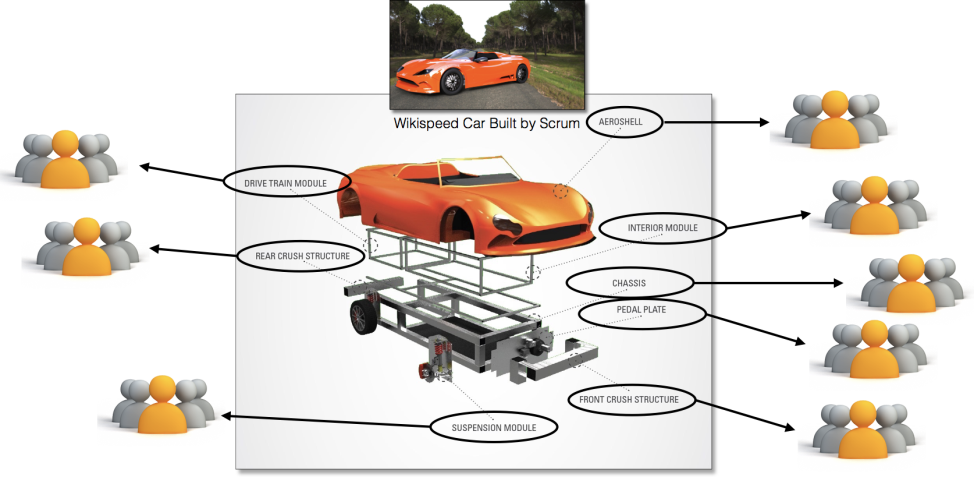

# Das Unternehmen Tesla 

Tesla ist ein US-Amerikanischer Konzern, der sich auf die Entwicklung und Fertigung von Elektroautos spezialisiert hat. 
Neben dem Autombilgeschäft, vertreibt Tesla weitere Produkte, die den Übergang zu einer CO2 neutralen Mobilität und Energiegewinnung ermöglichen sollen[^1]. 
Gründer und CEO von Tesla ist der innovative und teils auch polarisierende Unternehmer [Elon Musk](https://de.wikipedia.org/wiki/Elon_Musk) [^2].

[^1]

| Tesla Inc.|[^1] |
| ------------- | -------------          | 
| **Gründung**      | 1. Juli 2003           |
| **CEO**           | Elon Musk              |
| **Hauptsitz**     | Palo Alto, Kalifornien |

# Agiles Projektmanagement bei Tesla 

Anders als bestehende Automobilkonzerne arbeitet Tesla, ähnlich wie ein [Software-Unternehmen](Spotify_Projectmanagement_Model.md) bevorzugt mit agilen Projektmanagement-Methoden. Anstatt über einen langen Zeitraum Verbesserungspotentiale zu identifizieren, zu erforschen und letztendlich in einem Face-Lift Modell zu veröffentlichen, hat Tesla ein andere Philosophie [^3]. 
Tesla verbessert seine Produkte kontinuierlich weiter. Sowohl die Software als auch die Technik bzw. die Hardware der Fahrzeuge werden laufend überarbeitet. So werden in kürzeren Intervallen die Produkte geringfügig verbessert. Bei anderen Autoherstellern werden im vier Jahres Rhythmus Face-Lifts mit marginalen Verbesserungen und alle sechs bis acht Jahre neue Modelle mit größeren Veränderungen herausgebracht. Innherhalb dieser Zeitperioden erfolgen keine weiteren Verbesserungen [^4]. 
Durch den agilen Ansatz bietet Tesla seinen Kunden z.B. neue Softwarefeatures, so bald wie möglich, über over-the-air Updates an. Diese werden dann bei Bedarf im Laufe der Zeit verbessert. Auch bei technischen Verbesserungen an seinen Fahrzeugen wartet Tesla unter Umständen nicht bis zur Veröffentlichung eines neuen Modells. Stattdessen werden kleinere Änderungen ohne große Ankündigungen implementiert. So zum Beispiel aktuell geschehen, als Tesla eine neue Version des Model 3 mit neuen Batterien und damit mit mehr Reichweite eingeführt hat [^5]. 

## Scrum in der Fertigung von Autos / Produktion

Tesla ist eines der ersten Unternehmen, welches die agile Projektmanagementmethode [Scrum](SCRUM.md) für die Fertigung seiner Autos einsetzt [^3]. 
Grundsätzlich wird Scrum bei der Entwicklung von Software eingesetzt. Das produzierende Gewerbe hingegen bedient sich meist klassischer Projektmanagement-Methoden, wie zum Beispiel dem [Wasserfallmodell](https://de.wikipedia.org/wiki/Wasserfallmodell) [^6]. Grundsatz der agilen Methoden ist die Annahme, dass das Endprodukt einige Änderungen verglichen zum ursprünglich Geplanten aufweist [^6]. Im Softwarebereich ist dies oft weniger problematisch als bei der Produktion von tangiblen Gütern. Dennoch weist die agile Methode auch dort einige Vorteile auf. So kann das Unternehmen noch während der Produktion auf Kundenwünsche oder Marktbedürfnisse eingehen und reagieren. So erlangt das Unternehmen einen potentiellen Wettbewerbsvorteil [^6]. 
Auf Tesla übertragen bedeutet dies, das Tesla flexibel auf mögliche in- und externe Änderungen reagieren kann. Die [Gigafactorys](https://www.tesla.com/de_de/giga-berlin) des Unternehmens sind so aufgestellt, dass Änderungen im laufenden  Produktionsprozess, durch Re-Programmierung einzelner Teilbereiche durchgeführt werden können. Wenn das Scrum-Team, welches z.B. für den Bau und die Entwicklung der Türen zuständig ist, leichtere, sicherere und günstigere Türen entwickelt hat, können diese unproblematisch in den bestehenden Fertigungsprozess eingebunden werden [^3].  

Quelle: Field (2018)[^3]

*Beispielhafter Aufbau einer Scrum-Implementierung im Fahrzeugbau. 
    Zu sehen sind die einzelnen Scrum-Teams, eingeteilt in die verschiedenen Bauteile eines Fahrzeugs.*
 
      

## Nachteile agiler Methoden in der Automobilbranche 

Ein Nachteil dieses Arbeitsansatzes besteht darin, dass das Produkt im Beta-Zustand an die Kunden ausgeliefert wird. So hat Tesla noch immer Probleme mit Spaltmaßen, Softwarebugs oder lauten Abrollgeräuschen [^3]. Ein weiterer Punkt, der bei Kunden für Verärgerung sorgen könnte, sind die unangekündigten, kleinen inkrementellen Verbesserungen an den Fahrzeugen. Zum einen freuen sich Neukunden über z.B. eine gestiegene Reichweite, zum anderen sind Bestandskunden, die ihr Fahrzeug erst vor einigen Wochen bzw. Monaten erworben haben, möglichweise über die unerwarteten technischen Verbesserungen verärgert. 
Neue Softwarefeatures oder Verbesserungen kommen hingegen allen Beteiligten zugute. 

# Siehe auch 
* [Scrum](SCRUM.md)
* [Projektmanagement](Projektmanagement.md)
* [Branchenspezifisches Projektmanagement](Projektmanagement_Branchenspezifisch.md)

# Quellen

[^1]: [Wikipedia; *Tesla Inc.*](https://de.wikipedia.org/wiki/Tesla,_Inc.)
[^2]: [FAZ; *Elon Musk*](https://www.faz.net/aktuell/wirtschaft/thema/elon-musk)
[^3]: [Field K.; *Tesla Has Applied Agile Software Development To Automotive Manufacturing*; 2018; CleanTechnica](https://cleantechnica.com/2018/09/01/tesla-has-applied-agile-software-development-to-automotive-manufacturing/)
[^4]: [Grünweg, T. (2013, 10. Februar). *Eine Industrie kommt auf Speed*; spiegel.de; Abgerufen am 21. November 2021](https://www.spiegel.de/auto/aktuell/warum-lange-entwicklungszyklen-fuer-autohersteller-zum-problem-werden-a-881990.html)
[^5]: [Hebermehl G.; *Umbenennung Teil der Modellpflege*; 2021; auto-motor-sport](https://www.auto-motor-und-sport.de/elektroauto/tesla-model-3-mit-neuer-batterie-umbenennung-modellpflege/)
[^6]: [Abrudan, C. I., Baru, P. E., & Lungu, R. (2019). *Applying Scrum Methodology into the Production Processes of a Logistic Equipment Producer*; International Journal of Current Science Research and Review](https://ijcsrr.org/wp-content/uploads/2020/01/1-7.pdf)

