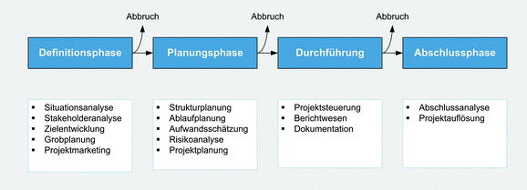

Ein Projekt ist ein Vorhaben, dass durch bestimmte Merkmale gekennzeichnet ist. Diese wurden innerhalb der DIN-Norm 69901 festgehalten. 
Dazu zählt unter anderem die Eigenschaft, dass gewisse Tätigkeiten nur einmal stattfinden. Neben der Einmaligkeit der Tätigkeit gibt es außerdem eine Zielvorgabe und 
eine zeitliche, finanzielle sowie personelle Begrenzung. Zusätzlich wird für die Durchführung des Projekts eine projektspezifische Organisation gebildet. 
Innerhalb eines Projekts schließen sich mehrere Personen zusammen, da die einzelnen Aufgaben sonst nicht bewältigt werden können. (Projektteam) 
Im weiteren Verlauf eines Projekts werden verschiedene Ressourcen beschafft, kombiniert und koordiniert.[^1]

Der Begriff Projekt lässt sich vom lateinischen Wort proicere ableiten. Das so viel bedeutet wie abwerfen.
Substantiviert man das Wort und bildet das Partizip Perfekt erhält man den Begriff proiectum. Das wiederum bedeutet das nach vorn Geworfene. In diesem Zusammenhang 
kann man den zeitlichen Aspekt eines Projektes wieder erkennen.[^2]

# Weitere Definitionen

Der Begriff Projekt wird in weiteren Quellen ähnlich definiert.

## A Guide to the Project Management Body of Knowledge (PMBOK® Guide):

„Ein Projekt ist ein zeitlich begrenztes Vorhaben mit dem Ziel, ein einmaliges Produkt, eine einmalige Dienstleistung oder ein einmaliges Ergebnis zu schaffen.“[^3]

## Leitfaden zur methodischen Prüfungsvorbereitung (PRINCE2®):

„Eine für einen befristeten Zeitraum geschaffene Organisation, die den Auftrag hat, mindestens ein Produkt entsprechend einem vereinbarten Business Case zu liefern.“[^4]

## Individual Competence Baseline für Projektmanagement (IPMA®):

„Ein Projekt ist ein einmaliges, zeitlich befristetes, interdisziplinäres, organisiertes Vorhaben, um festgelegte Arbeitsergebnisse im Rahmen vorab definierter Anforderungen 
und Rahmenbedingungen zu erzielen.“[^5]

## Projektcontrolling (Alfred Blazek):

„Ein Projekt ist eine sachlich und zeitlich begrenzte Aufgabe, die interdisziplinär angegangen wird.“[^6]

# Projekt Phasen

Ein Projekt durchläuft mehrere Phasen. Insgesamt gibt es vier grundlegende zeitliche Abschnitte, die man anhand der Tätigkeiten und dem Zeitverlauf darstellen kann.[^7]

*Abbildung Projekt Phasen*

## Definitionsphase

Die Definitionsphase ist die erste Phase direkt nach der Projektinitiierung. Das Projektziel wird festgelegt und die Chancen und Risiken sollen innerhalb von Situations- und
Stakeholderanalysen ermittelt werden. Außerdem soll eine erste Grobplanung zu den Kosten, dem Ausmaß und der benötigten Zeit erfolgen. Zusätzlich kann bei größeren Projekten
eine Machbarkeitsstudie durchgeführt werden, um weitere hilfreiche Informationen zu erhalten. Ergebnis einer erfolgreichen Definitionsphase ist der formelle Projektauftrag.[^7]

## Planungsphase

In der Planungsphase wird das Team organisiert und folgende Pläne werden angelegt:[^7]

* Aufgabenpläne
* Ablaufpläne
* Terminpläne
* Kapazitätspläne
* Kommunikationspläne
* Kostenpläne
* Qualitätspläne
* Risikomanagement

## Durchführung

Diese Phase wird auch Projektdurchführungs- und Kontrollphase oder Realisierungsphase genannt. Ein Kick-Off-Meeting, eine Besprechung oder ein Startworkshop sind der 
Beginn dieser Phase und sollen die Teamkommunikation fördern. Neben der Durchführung des Projekts ist die Kontrolle des Projektfortschritts und die Reaktion auf Störfaktoren 
für das Projektmanagement von großer Bedeutung. Abweichungen zum Projektplan erfordern Maßnahmen, um diese zu korrigieren. Der Zugriff auf den aktuellen und aktualisierten
Projektplan für jeden Projektbeteiligten ist in dieser Phase von größter Bedeutung. Änderungen und Verschiebungen in Projekten sind meistens unumgänglich. 
Daher sollten alle Beteiligten schnellstmögliche diese Informationen mitbekommen, um Anpassungen an eventuell gekoppelte Aufgaben zu tätigen. 
Aufgaben und Arbeitspakete, die in der ersten Phase definiert wurden, werden von den verschiedenen Teammitgliedern bearbeitet.[^7]

Zusammenfassung der Aufgaben:[^7]

* Arbeitspakete erledigen
* Planung der Termine und Aktualisierung der Arbeitspakete 
* Steuerung bei Abweichungen
* Kommunikation zwischen den Arbeitsgruppen 
* Abnahme der Teilerfolge
* Präsentation der Meilensteinergebnisse

Für eine funktionierende Kommunikation werden regelmäßige Projekt Besprechungen durchgeführt, um auf Probleme aufmerksam zu machen und  
Vorgesetzte zu informieren.[^7]

## Projektabschluss

In der letzten Phase, dem Projektabschluss, werden die Ergebnisse präsentiert. Abschließend wird rückblickend das Projekt bewertet und die Erfahrungen festgehalten.[^7]

# Weiterführende Literatur

# Siehe auch

# Quellen

[^1]: [Fahrplan für Projektmanagement in sechs Schritten](https://link.springer.com/book/10.1007/978-3-658-33979-1)
[^2]: [Methoden des Projektmanagements](https://link.springer.com/content/pdf/10.1007%2F978-3-8348-9008-5_2.pdf)
[^3]: [A Guide to the Project Management Body of Knowledge (PMBOK® Guide)](https://www.pmi.org/pmbok-guide-standards/foundational/PMBOK)
[^4]: [Leitfaden zur methodischen Prüfungsvorbereitung (PRINCE2®)](https://books.google.de/books?id=T97aDwAAQBAJ&pg=PA15&lpg=PA15&dq=Eine+f%C3%BCr+einen+befristeten+Zeitraum+geschaffene+Organisation,+die+den+Auftrag+hat,+mindestens+ein+Produkt+entsprechend+einem+vereinbarten+Business+Case+zu+liefern.%E2%80%9C&source=bl&ots=76aCeXxZpv&sig=ACfU3U2w7DGkw1IHDD9cpFBvw48ZtEbAPg&hl=de&sa=X&ved=2ahUKEwjBuP6CqLH0AhVS8LsIHTG3DA8Q6AF6BAgXEAM#v=onepage&q&f=false)
[^5]: [Individual Competence Baseline für Projektmanagement (IPMA®)](https://www.gpm-ipma.de/fileadmin/user_upload/GPM/Know-How/programm-icb4/IPMA_ICB4_PM_deutsch_170213.pdf)
[^6]: [Blazek A. (1994), Projektcontrolling]
[^7]: [Ampofo A. (2018), Projektmanagement. In: Betriebswirtschaftslehre für Umweltwissenschaftler. Springer Gabler, Wiesbaden](https://doi.org/10.1007/978-3-658-12517-2_10)

