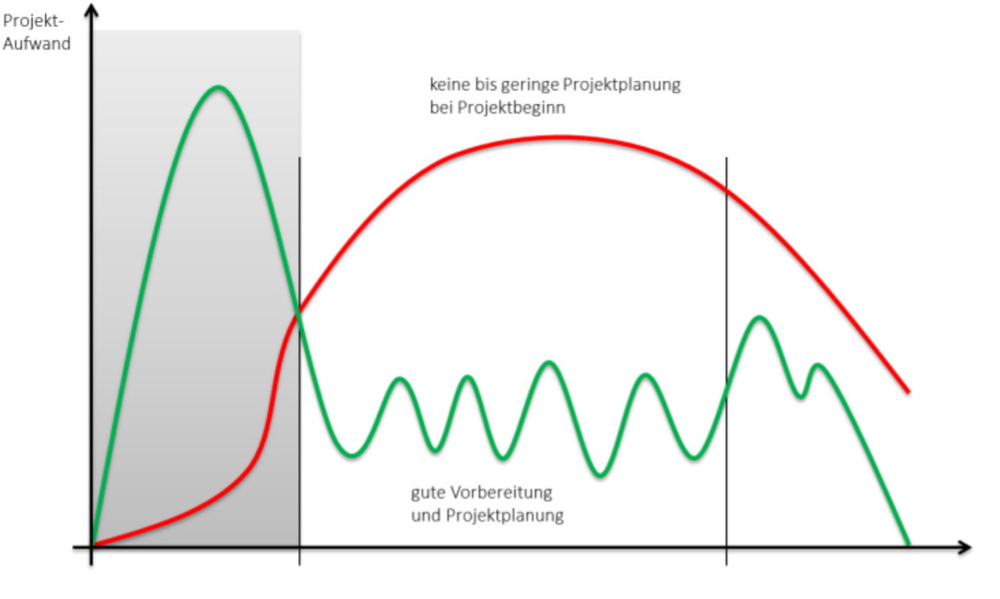

Die Projekt Charta ist ein Dokument das die wichtigsten Punkte eines Projekts schildert und dadurch einen groben Überblick über das Projekt oder einer Projektphase verschafft[^1]. 

---

# Was ist die Projekt Charta
Der Begriff "Projekt Charta" ist nicht normiert, daher wird dieses Dokument in Deutsch auch als "Projektauftrag", "Auftrag" oder "Projektvereinbarung" bezeichnet. Auf Englisch wird der Begriff des "Projekt Charter" benutzt.[^4]

Dem Projekt Charta eilt meistens ein [Projektantrag](Projektantrag.md) bzw. Projektvorschlag vor, worin Ausgangslage, Ziele, Projektergebnisse, Kosten sowie Nutzen und Organisation beinhaltet sind.[^1][^4]

Durch die Projekt Charta wird sichergestellt, dass [Sponsor](Who_is_Who_Projectmanagement.md) und der [Projektleiter](Projektleiter.md) auch das gleiche Ziel beim Projekt anstreben und den Mitteln dazu bewusst sind.[^1][^3] Bei externen Dienstleistern wird der Projektauftrag durch einen formellen Vertrag ersetzt.[^4]

## Funktionen eines Project Charta im Projektverlauf

 Die Projekt Charta begleitet den [Projektleiter](Projektleiter.md), das Team sowie weitere [Stakeholder](Who_is_Who_Projectmanagement.md) vom Projektanfang bis -ende.[^2][^7] Daher bietet es im Laufe des Projekts eine Vielzahl an Funktionen.[^1]

### Zu beginn des Projekts

 - Die Übergabe des Projekt Charta stellt, nach einem erfolgreichen und genehmigten [Projektantrag](Projektantrag.md), den offiziellen [Startschuss des Projekts](Projekt_Kick_Off.md) dar.[^1][^4]

    - Beginn des Projektes
    - Festlegung des Projektstartzeitpunkts.
    - Schaffung einer verbindlichen Vereinbarung.
 (Berufungsgrundlage für Projektinhalte und -ziele)
    - Einsetzung des verantwortlichen [Projektleiter](Projektleiter.md)s.
    - Freigabe der beantragten finanziellen Mittel für das Projekt
    - Freistellung der notwendigen Mitarbeiter für die Projektarbeit
    - ist eine grobe [Vorplanung des Projekts](Projektplanung.md)

### Während des Projekts

 - Die Projekt Charta ermöglicht eine einheitliche Übersicht der Projektinhalte für alle beteiligten.[^1]

    - Definition der Projektinhalte
    - Gleiches Bild über Projekt für [Projektleiter](Projektleiter.md) und [Sponsor](Who_is_Who_Projectmanagement.md)
    - Informationsgrundlage für später hinzukommende [Teammitglieder](Who_is_Who_Projectmanagement.md)

- Minimiert das Risiko, dass sich der Aufwand nicht gleichmäßig auf die Projektlaufzeit verteilt.[^1]

    [^1]

### Am Ende des Projekts
- Anhand der Projekt Charta bietet sich die Möglichkeit, Ziele und Ressorcen, mit erreichten Fortschritten und verwendeten Ressourcen abzugleichen.[^1][^7]
    - Überprüfung ob Ziele erreicht sind
    - Überprüfung ob Projektdauer eingehalten wurde
    - Grundlage zur [Planung](Projektplanung.md) von zukünftigen, ähnlichen Projekten
---

## Bestandteile eines Project Charta

Wie der Begriff ist auch der Inhalt und somit die Bestandteile eines Projekt Charta nicht normiert.[^1][^4] Daher kann der Projekt Charta nur eine Seite als auch ein ganzes Handbuch umfassen.[^8] Da die Projekt Charta auf dem Projektantrag basiert, kommen einige Elemente im Projekt Charta nochmal vor.

- Folgendes wird als fester Bestandteil eines Projekt Charta angesehen[^5][^6]:

  - Projektname und Projektbezeichnung
  - Projektdauer (konkret Beginn und Ende, Zwischenziele, bestimmte Ereignisse, etc.)
  - Projektziele, Begründung für die Durchführung des Projektes
  - Projektteam (interne u. externe Mitarbeiter, Dienstleister, etc.)
  - Projektorganisation, Rollenverteilung

- Folgendes kann in einem Projekt Charta enthalten sein[^1]:

  - Initiator des Projektes, Projektauftraggeber, Projektleiter
  - Datum und Unterschrift von Auftraggeber und Projektleiter (bei internen Projekten große symbolische Wirkung)
  - Leistungsumfang des Projektes, Unternehmensbedarf, Zusammenfassung der wichtigsten Vereinbarungen, etc.
  - Vorprojektphase, Nachprojektphase,
  - Projekt-Nichtziele
  - Projektbudget (erwartete Projektkosten, aber auch benötigte [Ressourcen](Ressourcenplanung.md), Mitarbeiter, Nachlaufkosten, etc.)
  - Verantwortlichkeiten und Befugnisse
  - Projektzweck, Hindernisse, Beschränkungen, etc.
  - Projektmeilensteine, Projektplan, Projektphasen, etc.
  - Zu erfüllende Hauptaufgaben
  - Termin- und Kommunikationsplan, Terminvorgaben, etc.
  - Projektmanagementplan: Anforderungen an das Projektmanagement
  - Anzuwendende Managementsysteme (z.B. für Risikomanagement, Qualitätsmanagement, Konfigurationsmanagement)
  - Vertragsbezogene Inhalte (insbes. Vergütungsvereinbarungen)

## Häufige Fehler beim erstellen einer Projekt Charta[^9]
- Unklare Zielsetzungen
- Unzureichende Formulierung der Problemstellung
- Viele Statistiken einbauen
- Unklare definition der Rollen und Verantwortlichkeiten

### Wie vermeiden?
- Einfache Wortwahl treffen
- Formulierungen und Definitionen mit kurzen Sätzen bilden
- Auf Anschaulichkeit und klare Übersichtlichkeit achten

## Beispiel einer Projekt Charta
Durch folgende Projekt Charta[^10], ist ein Projekt, das eine Fast Food App abzielt, übersichtlich dargestellt.

# Fazit
Eine Projekt Charta ist ein Dokument, das eine Übersicht über das Projekt verschafft und als Wegweiser sowie checkliste im laufe des Projekts eingesetzt werden kann. Der Inhalt ist dabei nicht normiert, daher können Elemente je nach Bedarf eingesetzt werden. Dafür ist es wichtig es kurz und genau zu halten.

---
---
# Siehe auch
 
[Rollen im Projektmanagement](Who_is_Who_Projectmanagement.md)
 
[Stakeholdermanagement](Stakeholdermanagement.md)  

[Faehigkeiten_Projektleiter](Faehigkeiten_Projektleiter.md) 

[Projekt Meilensteine](Meilensteine.md)

[Projekt Kick Off](Projekt_Kick_Off.md)

# Weiterführende Literatur

 [Customized project charter for computational scientific software products](https://content.iospress.com/articles/journal-of-computational-methods-in-sciences-and-engineering/jcm778)

 [The Project Charter–Blueprint for Success](http://citeseerx.ist.psu.edu/viewdoc/download?doi=10.1.1.208.9423&rep=rep1&type=pdf)

 [PMBOK® Guide](https://www.pmi.org/pmbok-guide-standards/foundational/PMBOK)

[Guidance on project management (ISO 21500:2012)](https://www.beuth.de/de/norm/din-iso-21500/207461260#inhaltsverzeichnis)

---

# Quellen

[^1]: [www.kvp.de](https://www.kvp.de/wp-content/uploads/2017/07/methodenblatt-project-charter.pdf) 

[^2]: [www.wrike.com](https://www.wrike.com/de/project-management-guide/faq/was-ist-eine-projektcharta-im-projektmanagement/)

[^3]: [www.springerprofessional.de](https://www.springerprofessional.de/die-project-charter-der-projektauftrag/15976004)

[^4]: [wikipedia.org](https://de.wikipedia.org/wiki/Projektauftrag)

[^5]: [/blog.minitab.com](https://blog.minitab.com/de/verwalten-sie-projekte-beginnen-sie-mit-einer-projektcharta)

[^6]: [asana.com](https://asana.com/de/resources/project-charter)

[^7]: [kissflow.com](https://kissflow.com/project/project-charter/)

[^8]: [YouTube:alphadiTV](https://youtu.be/qqiqNb16nbI)

[^9]: [www.processexcellencenetwork.com](https://www.processexcellencenetwork.com/lean-six-sigma-business-performance/articles/5-common-mistakes-in-project-charters)

[^10]: [thedigitalprojectmanager.com](https://thedigitalprojectmanager.com/project-charter/)
