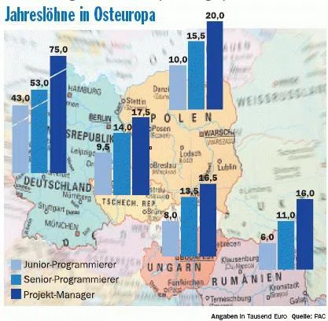

[Projekt](Projekt.md) Nearshoring (auf Deutsch Nahverlagerung) gilt als Sonderform des [Projekt Offshorings](Projekt_Offshoring.md) und bedeutet, dass betriebliche Aktivitäten in nahegelegene Länder z.B. aus Westeuropa nach Osteuropa verlagert werden. Besonders beliebt ist es im High-Tech Dienstleistungsbereich wie der IT-Branche, bei den Finanzen, im Management sowie in der Steuerberatung. Das Gegenteil davon ist das Farshoring, wobei Aktivitäten in weiter entfernte Länder wie Indien oder China umgesiedelt werden. Abgesehen von geografischen Verlagerungen gibt es organisatorische Verlagerungen, die als Outsourcing bezeichnet werden.[^1][^2]

# Ziele des Nearshorings

Ein Grund für die Delokalisierung von Unternehmen ist, dass in den Industrienationen Fachkräftemangel herrscht und die Auslandsmärkte stetig wachsen. Deshalb werden verschiedene Ziele verfolgt, die die nahe Verlegung besonders attraktiv machen. Zum einen können Personalkosten gesenkt werden, aufgrund des niedrigeren Einkommensniveaus im Ausland. Andererseits soll durch die Nähe der dienstleistenden Unternehmen ein zeitnaher Abschluss des Projekts gewährleistet werden. Hierbei illustriert eine [Grafik](https://www.computerwoche.de/a/der-holprige-weg-zum-nearshoring,558176) den starken Lohnunterschied zwischen den Ländern.[^3]

Die Abbildung zeigt, dass Deutschland ein sehr hohes Einkommensniveau hat und im Vergleich dazu die osteuropäischen Staaten deutlich geringere Löhne auszahlen. Rumänien bietet die niedrigsten Löhne für Projektmanager und Programmierer und stellt sich als kostengünstigste Variante dar. Jedoch sind die Gehaltsunterschiede zwischen Tschechien, Polen, Ungarn und Rumänien so niedrig, dass es alle valide Optionen sind und andere Faktoren ausschlaggebend. Im weiteren Verlauf werden die Vor- und Nachteile beleuchtet.[^4]

## Vorteile
* Die [Kommunikation](Kommunikation_Projektbeteiligte.md) und Kooperation wird erleichtert und verbessert, weil es eine größere kulturelle und räumliche Nähe gibt. Die Zeitzone ist nahezu gleich und somit ist der Zeitunterschied deutlich kleiner als zu fernöstlichen Ländern. 
* Auch die geringeren sprachlichen Barrieren bauen mehr Nähe zu den Kunden auf dem jeweiligen Markt auf. Davon profitiert auch die [Projektkommunikation](Projektkommunikation.md).
* Transportkosten und -zeiten können durch die deutlich niedrigere Distanz gesenkt werden.
* Die Europäische Union ist ein harmonisiertes Rechtssystem, wodurch die gleichen Rechte und Pflichten für alle gelten.
* Datenschutzgesetze sind aufeinander abgestimmt und gewährleisten Sicherheit für die Kunden und Unternehmen.
* In der EU (Schengen Raum) werden keine Zölle für Mitgliedstaaten entrichtet und damit verläuft der Waren- und Dienstleistungsverkehr reibungslos und effizient.
* In den genannten Nearshoring Regionen liegt eine hohe Qualifikation in fachlicher (und sprachlicher) Hinsicht vor. Des Weiteren sind sie durch Flexibilität, bessere Reaktion auf Marktveränderungen und eine einfachere [Risikoanalyse](Risikoanalyse_und_Visualisierung.md) gekennzeichnet.[^5][^1]

## Nachteile

*	Hier kann es zu [Zielkonflikten](Zielkonflikte.md) durch die Verlagerung kommen, da ein höherer Kommunikationsaufwand für das Unternehmen entsteht.
*	Es werden Arbeitsplätze im eigenen Land abgebaut mit den entsprechenden sozialen Folgen.
*	Der Konkurrenzdruck nimmt in der Belegschaft und durch die Partnerunternehmen zu. Dies kann zu Konflikten führen.
*	Die Komplexität bei Funktionen und Prozessen zwischen den Unternehmenseinheiten steigt.
*	Die Auswahl von möglichen Partnern ist geringer im Vergleich zum Farshoring.
*	Der monetäre Vorteil durch Lohnunterschiede ist weniger hoch als bei weniger wohlhabenden Staaten.
*	Durch die hohen Umweltstandards und Arbeitnehmerschutzrechte in der EU sind der Aufwand und die Kosten höher als in Ländern mit geringeren gesetzlichen Auflagen. [^5]

# Fazit

Das Potential des Projekt Nearshorings ist noch nicht ausgereizt und die Anwendung wird voraussichtlich in der Zukunft stark steigen, wenn das Beste aus den Strategien von Offshoring (die geringeren Kosten) und Backshoring (die Flexibilität sowie geografische Nähe) verbunden wird.[^5][^3]

# Siehe auch

* [Projekt](Projekt.md)
* [Projekt Offshoring](Projekt_Offshoring.md)
* [Projektkommunikation](Projektkommunikation.md)

# Weiterführende Literatur

* [Backshoring and nearshoring: An overview](https://onlinelibrary.wiley.com/doi/full/10.1111/grow.12316)

# Quellen

[^1]: [Enzyklopädie](https://www.enzyklopaedie-der-wirtschaftsinformatik.de/lexikon/uebergreifendes/Globalisierung/Nearshoring/index.html)
[^2]: [Wikipedia](https://de.wikipedia.org/wiki/Nearshoring)
[^3]: [Wirtschaftslexikon](https://wirtschaftslexikon.gabler.de/definition/nearshoring-54118)
[^4]: [Computerwoche](https://www.computerwoche.de/a/der-holprige-weg-zum-nearshoring,558176)
[^5]: [Wiley](https://onlinelibrary.wiley.com/doi/full/10.1111/grow.12316)

