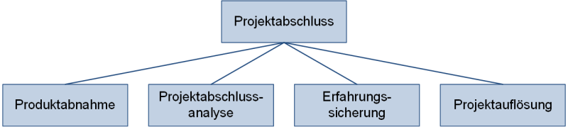

Jedes zielgerichtete, einmalige [Projekt](Projekt.md) besitzt, neben einem klar bestimmten Anfang, auch ein eindeutiges Ende. Das definierte Ende und somit der letzte Schritt im [Projektabschluss](Projektabschluss.md), aber auch im gesamten Projekt ist, die Projektauflösung. [^1] Die Phase „Auflösung“ eines Projekts endet, sobald das Projektpersonal auf neue Aufgaben und neue Projekte übergeleitet wurde und alle verwendeten Ressourcen zurückgegeben bzw. neuen Projekten zugeführt wurden. Alles Weitere kann schlussendlich den Archiven und der Geschichtsschreibung überlassen werden. [^2] Wird das Projekt jedoch beendet bevor die Projektziele erreicht wurden, so spricht man vom [Projektabbruch](Projektabbruch.md). [^3]  
# Inhaltsverzeichnis
* [Archivierung der Unterlagen](#archivierung-der-unterlagen)
* [Rückgabe aller Ressourcen](#rückgabe-aller-ressourcen)
* [Abschluss der Buchhaltung und der Projektkostenstellen](#abschluss-der-buchhaltung-und-der-projektkostensetellen)
* [Vermittlung des Projektpersonaös](#vermittlung-des-projektpersonals)
* [Organisation von Abschlussveranstaltungen und Erfahrungsaustausch](organisation-von-abschlussveranstaltungen-und-erfahrungsaustausch)
* [Siehe auch](#siehe-auch)
* [Quellen](#quellen)
<!-- 
Hier ganz am Anfang keine Überschrift einfügen - das passiert automatisch basierend auf dem `title`-Attribut
oben im Front-Matter (Bereich zwischen den `---`). -->

*Projektabschluss*[^8]
# 	Archivierung der Unterlagen 

Bei der Auflösung eines Projekts sind verschiedene Aufgaben zu erledigen, um dieses erfolgreich abzuschließen. Alle erarbeiteten Daten, Passwörter, Zugänge, Unterlagen und die [Projektdokumentation](Projektdokumentation.md) sind ordnungsgemäß zu archivieren. [^4] Dadurch wird bei möglicher zukünftiger Einsicht des Projekts sichergestellt, dass auf jegliche Unterlagen problemlos zugegriffen werden kann. 

# 	Rückgabe aller Ressourcen

Im Projekt wurden diverse Ressourcen verwendet. Nach Beendigung müssen die Sachmittel zurückgeführt werden. [^5] Beispielsweise sollen Mobiliar, Hardware, Mittel zur [digitalen Kommunikation](Digitate_Kommunikation.md) und vieles mehr[^4] abgegeben werden, da nun kein Nutzen mehr für jene gegeben ist. Weitere Sachmittel, welche einen Nutzen in Zukunft haben könnten, sollten ebenfalls zurückgeführt werden. 

# 	Abschluss der Buchhaltung und der Projektkostenstellen
Die Buchhaltung listet die letzten noch offenen Rechnungen auf. Zum Schluss werden dann die Projektkonten und die Projektkostenstelle im Buchhaltungssystem geschlossen. [^6]
# Vermittlung des Projektpersonals
Zunächst wird durch die Auflösung des Projekts der [Projektleiter](Projektleiter) entlastet[^5] und es werden die Projektteams und Gremien offiziell aufgelöst. Über die Auflösung des Projektteams muss weiterhin kommuniziert werden. Jeder [Projektmitarbeiter](Projektmitarbeiter.md), aber auch der Projektleiter müssen einen neuen Aufgabenbereich finden bzw. einem neuen Aufgabenbereich zugeteilt werden. [^4]Dies erweist sich als einfacher, wenn das Projekt ein Erfolg war und die angestrebten Ziele erreicht wurden. Die schwierigste, aber auch die wichtigste Aufgabe bei der Projektauflösung, ist die Integration jedes Beteiligten in ein neues Projekt und in ein neues Aufgabengebiet.[^5] Im Laufe des Projekts haben sich oft Kompetenzen und Beziehungen gebildet, welche unbedingt für den weiteren allgemeinen Führungs- und Leistungsprozess gesichert werden müssen.[^2] Außerdem sind diese Kompetenzen und Beziehungen sehr wertvoll für zukünftige Projekte. Bevor also komplett aufgelöst wird, sind diese unbedingt zu sichern. Nachdem verstanden wurde, welche Stärken eine Person im letzten Projekt gezeigt hat, kann dieser Mitarbeiter in eine für ihn perfektes Projekt vermittelt werden. Auch der Projektleiter soll anhand seiner Kompetenzen in ein für ihn vorteilhaftes Projekt übergeben werden. Hier ist vor allem ein sozialer und psychologischer Hintergrund gegeben[^5], welcher nachvollzogen und verstanden werden muss. 
#	Organisation von Abschlussveranstaltungen und Erfahrungsaustausch
Die Organisation von Abschlussveranstaltungen ist nicht zwingend notwendig, jedoch können diese zum emotionalen Abschluss des Projekts beitragen.[^7] Das Team hat während des Projekts Höhen und Tiefen durchlebt, welche aber schlussendlich zu einem erfolgreichen Projekt geführt haben. Eine offizielle Veranstaltung ermöglicht den Mitgliedern einen persönlichen Ausstieg aus dem Projekt und hilft dem Projektteam mit bester Motivation in ihr neues Projekt zu starten. Noch dazu könnte ein Erfahrungsaustausch in regelmäßigen Abständen organisiert werden, um die Ergebnisse und die Erfahrungen eines Projektes in die Projektplanung neuer Projekte einfließen zu lassen. [^4]
# Siehe auch

* [Projekt](Projekt.md)
* [Projektabbruch](Projektabbruch.md)
* [Projektabschluss](Projektabschluss.md)
* [Projektabschlussbericht](Projektanschlussbericht.md)
* [Projektdokumentation](Projektdokumentation)
* [Projektkommunikation](Projektkommunikation.md)
* [Projektleiter](Projektleiter.md)
* [Projektmanagment](Projektmanagment.md)
* [Projektmitarbeiter](Projektmitarbeiter.md)
* [Projektphasen klassisch](Projektphasen_klassisch)

# Quellen

[^1]: [Projektabschluss](https://www.arksolutions.de/gs/project/blog/gs-projektabschluss)
[^2]: [Auflösung des Projekts,des Projektmanagements,der Projektstrukturen,
der Projektorganisation.](http://www.begriffe.vpma.de/phasen/phasen_08.html)
[^3]: [Time to say Goodbye: Projektabbruch in 4 Schritten!](https://www.rolandgareis.com/time-to-say-goodbye-projektabbruch-in-4-schritten/)
[^4]: [Projektmanagement: Projektabschluss](https://www.ibim.de/projekt/5-5.htm)
[^5]: von Känel, S. (2020). Projektabschluss, Projekteinführung. In Projekte und Projektmanagement (pp. 293-295). Springer Gabler, Wiesbaden.
[^6]: Schneider, H., & Marti, A. (2006). Projektabschluss. Krisen vermeiden in IT-Projekten(pp.176-177). Springer Gabler, Wiesbaden.
[^7]: [Auflösung der Projektorganisation](https://mediencommunity.de/system/files/wbts/projektmanagement/le05/34_auflsung_der_projektorganisation.html)
[^8]: [Phasen des Projektabschlusses](https://www.peterjohann-consulting.de/projektabschluss/)
