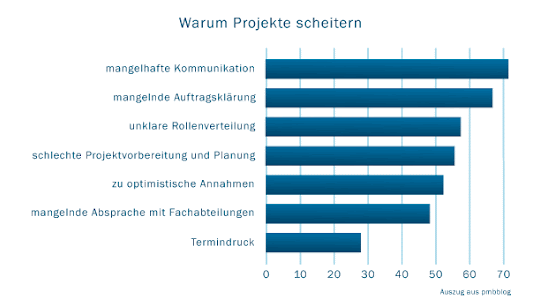

Der Begriff Projekt leitet sich aus dem lateinischen Wort "proiectum" ab und bedeutet übersetzt "nach vorn geworfen". Im Kontext von Projekten versteht man unter "nach vorn" eine zeiliche Bedeutung wie beispielsweise einen Terminplan [^1].

Unter einem Projekt versteht man ein einmaliges und zielorientiertes Vorhaben, welches im Rahmen von verschiedenen Kriterien und einem definierten Ziel erfüllt werden soll. Beispiele für Kriterien eines Projektes sind Zeit, Betriebsmittel, verfügbare Ressourcen, Qualitätsansprüche oder Arbeits- und Produktionsbedingungen. 
Besonders in Unternehmen spielen Projekte eine sehr zentrale Rolle, da sie die Vorraussetzung für die Wertschöpfung und somit sehr bedeutungsvoll für das langfristige und erfolgreiche Wirtschaften des Unternehmens sind. Aus diesem Grund sind Projekte ein essenzieller Baustein und daher allgegenwärtig und unverzichtbar für Unternehmen[^1].
 
Jedoch können Projekte sehr schnell komplex und unübersichtlich werden, was dazu führt, dass sie an einem sehr breiten Spektrum an Problemen scheitern können. Die häufigsten Ursachen für das Scheitern eines solchen Projektes sind unzureichende Kommunikation zwischen den Mitarbeitern und dem Auftraggeber oder auch mangelnde Auftragsklärung. Dadurch führen viele solcher Besprechungen zu keinem aussagekräftigen Ergebnis und sind daher oftmals nicht profitabel für das Unternehmen. In diesem Fall greifen Unternehmen gerne auf das Konzept der Projektberatung externer Firmen zurück [^2].

# Die Funktion von Projektberatungen

Im Zuge einer Projektberatung werden externe Projektberatungs-Unternehmen engagiert, deren erfahrene Experten an den Projekten eines Unternehmens teilnehmen. Diese unterstützen das Unternehmen mit vielseitigen Kompetenzen wie IT-Software, Projektmanagement-Strategien oder Krisencoaching und analysieren zusätzlich Probleme der Besprechungen, um dem Unternehmen diverse Lösungsansätze bereitzustellen [^4].
Zusätzlich sind diese Dienstleistungsunternehmen nicht direkt am Projekt beteiligt, was ihnen eine sehr objektive Sicht auf die Problemlage des Klienten ermöglicht und ihm dadurch auch einen Aufschwung an Erfahrung und Strukturierung des Projektes bieten kann [^2].

Durch diese fachliche Unterstützung und Zusammenarbeit von Experten hat das Unternehmen die Möglichkeit, effektiver und strukturierter an Projekten zu arbeiten, potenzielle Fehler zu vermeiden und ihre Aufträge zielgerichteter zu verrichten [^3].

Da jedes Projekt unterschiedlich und individuell ist, setzen Projektberatungsunternehmen hohen Wert auf Flexibilität und individuell an jedes Unternehmen angepasste Lösungen für Ihre Probleme. Dadurch ist jeder Lösungsansatz des Beratungsunternehmen perfekt auf die Problemlage und Bedürfnisse der Kunden abgestimmt. Dies ermöglicht eine sehr hohe Qualität des Endproduktes und hervorragende Kundenzufriedenheit der Auftraggeber [^4].

# Mögliche Ursachen für das Scheitern eines Projektes

Ein Projekt orientiert sich stets an einem strategischen Vorgehen, das von der Definition eines vom Kunden beschriebenen Projektziels abhängt. Alle Entscheidungen innerhalb eines Projektes leiten sich also von diesem Projektziel ab und sollen auf direktem Weg zur Erreichung und erfolgreichem Abschluss des Projektes führen. 
Basierend darauf werden nötige Tätigkeiten und Prozesse in Gang gesetzt und der Umgang mit den verfügbaren Ressourcen definiert [^1].

Nach Aussagen einer erfahrenen Expertin für Kommunikation und Kollaboration scheitern mehr als 50% aller Projekte in Unternehmen. Diese überschritten zudem auch den Rahmen des Budgets, sprengten den geplanten Zeitrahmen oder erfüllten nicht den erwarteten Nutzen [^5]. 

Mögliche Gründe für diese hohe Misserfolgsquote können sehr vielseitig sein oder auch kombiniert zum Scheitern eines Projekts führen [^1]:

   *häufigste Gründe für das Scheitern von Projekten*

# Aspekt 2

* das
* hier 
* ist
* eine 
* Punkteliste
  - mit unterpunkt

## Hier eine Ebene-2-Überschrift unter Aspekt 2

So kann man eine Tabelle erstellen:

| First Header  | Second Header |
| ------------- | ------------- |
| Content Cell  | Content Cell  |
| Content Cell  | Content Cell  |

## Hier gleich noch eine Ebene-2-Überschrift :-)

Wenn man hier noch ein bisschen untergliedern will kann man noch eine Ebene einfügen.

### Ebene-3-Überschrift

Vorsicht: nicht zu tief verschachteln. Faustregel: Wenn man mehr als 3 
Ebenen benötigt, dann passt meist was mit dem Aufbau nicht.

# Aspekt n

1. das
2. hier 
4. ist 
4. eine
7. nummerierte liste
   1. und hier eine Ebene tiefer

# Siehe auch

* Verlinkungen zu angrenzenden Themen
* [Link auf diese Seite](Projektberatung.md)

# Weiterführende Literatur

* Weiterfuehrende Literatur zum Thema z.B. Bücher, Webseiten, Blogs, Videos, Wissenschaftliche Literatur, ...

# Quellen

[^1]: https://de.wikipedia.org/wiki/Projekt
[^2]: http://www.entdecken-entwickeln.de/projektberatung.html
[^3]: https://cpc-services.de/?gclid=CjwKCAiAv_KMBhAzEiwAs-rX1NSPMrDkeYPs1tsYUfjeslCH27blFqOtn48FnbUaF3-GZZil9gjXLBoCS64QAvD_BwE
[^4]: https://www.pmcc-consulting.com/kompetenzen/projektmanagement/?gclid=CjwKCAiAv_KMBhAzEiwAs-rX1Nab-UuWxjKJAyHdjgzy5-NMN--GWtfk7fFmFaP0GTt2OsT5lxPMThoCvlUQAvD_BwE
[^5]: https://smodin.io/de/text-automatisch-in-deutscher-sprache-umformulieren

