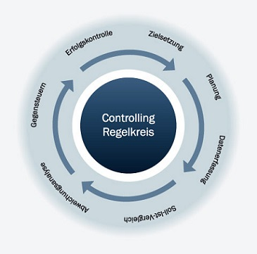

Projektcontrolling ist ein Bestandteil des [Projektmanagements](Projektmanagement.md).[^6] Der Begriff (Projekt-)Controlling wird häufig fälschlicherweise synonym für Kontrolle verwendet, umfasst allerdings weitaus mehr. Es handelt sich vielmehr um einen Steuerungs- und Koordinationsprozess[^4], der durch die [DIN 69901-5](https://de.wikipedia.org/wiki/DIN_69901) als "Sicherung des Erreichens der Projektziele durch: Soll-Ist-Vergleich, Feststellung der Abweichungen, Bewerten der Konsequenzen und Vorschlagen von Korrekturmaßnahmen, Mitwirkung bei der Maßnahmenplanung und Kontrolle der Durchführung" [^5]
definiert wird.
In der folgenden Abbildung ist der projektspezifische „Controlling Regelkreis“ illustriert.

*Controlling Regelkreis.* [^3]

Dieser beschreibt einen sich wiederholenden Zyklus, dessen Häufigkeit sich nach dem [Projektumfang](Projektumfang.md) richten sollte. Dabei kann sowohl das gesamte Projekt, als auch nur einzelne Phasen betrachtet werden.

# Teilbereiche des Projektcontrollings 
Das Projektcontrolling lässt sich in die drei fundamentalen Teilbereiche Kalkulation, Leistung und Kontrolle untergliedern. Diese dienen Unternehmen als Basis zur Planung, Durchführung und Erfolgsbeurteilung der Projekte. 

## Projektkalkulation
In der Vorbereitungs- und Planungsphase erfolgt die Kalkulation des Projektes. In diesem Zeitraum werden Gesamtkosten, variable Kosten sowie Fixkosten systematisch erhoben. Je eher die Kosten ermittelt werden, desto schneller kann das Budget aufgestellt und die Projektumsetzung eingeleitet werden. Bei mittel- bis langfristigen Projekten ist es sinnvoll, das Projekt in mehrere Abschnitte zu untergliedern. Das hat den Vorteil, dass man jeder Etappe gesondert die entstandenen Kosten zuordnen kann.

## Projektleistung
Zu Beginn werden qualitative Merkmale des Projekts, die Projektleistung, determiniert. Das Projektcontrolling hat die Aufgabe, diese zu kontrollieren, um bei potentiellen Abweichungen frühzeitig Gegenmaßnahmen einzuleiten.

## Projektkontrolle
Soll und Ist-Kosten des Projekts werden durch die Projektkontrolle über den gesamten [Projektlebenszyklus](Projektlebenszyklus.md) im Blick behalten, um Kostenabweichungen zu identifizieren. Eine reine Gegenüberstellung der Kosten liefert nur bedingt einen Mehrwert. Diese Vorgehensweise berücksichtigt nicht, ob das Projekt durch Beschleunigungskosten vorzeitig fertiggestellt werden kann. Eine Termin-Kosten-Kontrolle hingegen, verschafft einen genaueren Einblick in die Gesamtkosten. [^2]

# Methoden und Instrumente
Mittlerweile finden viele, größtenteils standardisierte Methoden ihre Anwendung im Projektcontrolling. Bei der Wahl der geeigneten Methode(n), sollten Umfang, Dauer und Komplexität des Projektes berücksichtigt werden. Grundsätzlich gilt hier die Devise: Je einfacher und durschaubarer die Methode, desto besser.[^7]

## [Meilensteintrendanalyse](Meilensteintrendanalyse.md)
Die Definition von [Meilenstein](Meilenstein.md)en ist Grundlage dieser Methode. Die Meilensteintrendanalyse stellt Änderungen im Terminplan grafisch dar. Sie reiht alle [Meilenstein](Meilenstein.md)-Termine chronologisch auf, wodurch sich frühzeitig abzeichnende Trends erkenntlich werden. Die Überschaubarkeit der Methode ermöglicht es auch Laien, den Überblick zu behalten und zu beurteilen, ob das Projekt planmäßig verläuft.
## Earned Value Analyse
Eine weiteres Controlling-Instrument ist die Earned Value Analyse, mit der man den Fertigstellungsgrad des Projekts bzw. einzelner Phasen ermitteln kann. Sie dient dem Projekt als Kontrollinstrument des Fortschritts. Diese Methode ist ebenfalls unter den Namen Leistungswertanalyse, Fertigstellungswertmethode oder Arbeitswertanalyse bekannt.

## Projektplan

Wenn man hier noch ein bisschen untergliedern will kann man noch eine Ebene einfügen.

## Soll-Ist-Vergleich

## Ampelmethode

## Leistungswertanalyse

# Siehe auch

* Verlinkungen zu angrenzenden Themen
* [Link auf diese Seite](Projektcontrolling.md)

# Weiterführende Literatur

* Weiterfuehrende Literatur zum Thema z.B. Bücher, Webseiten, Blogs, Videos, Wissenschaftliche Literatur, ...
# Quellen

[^2]: [Projektcontrolling](https://refa.de/service/refa-lexikon/projektcontrolling)
[^3]: [Controlling-Regelkreis](https://www.projektmanagementhandbuch.de/handbuch/projektrealisierung/projektcontrolling/)
[^4]: [https://doi.org/10.1007/978-3-658-23714-1)
[^5]: [https://doi.org/10.1007/978-3-658-28032-1)
[^6]: [https://refa.de/service/refa-lexikon/projektcontrolling)
[^7]: [https://doi.org/10.1007/978-3-662-52974-4_8)
