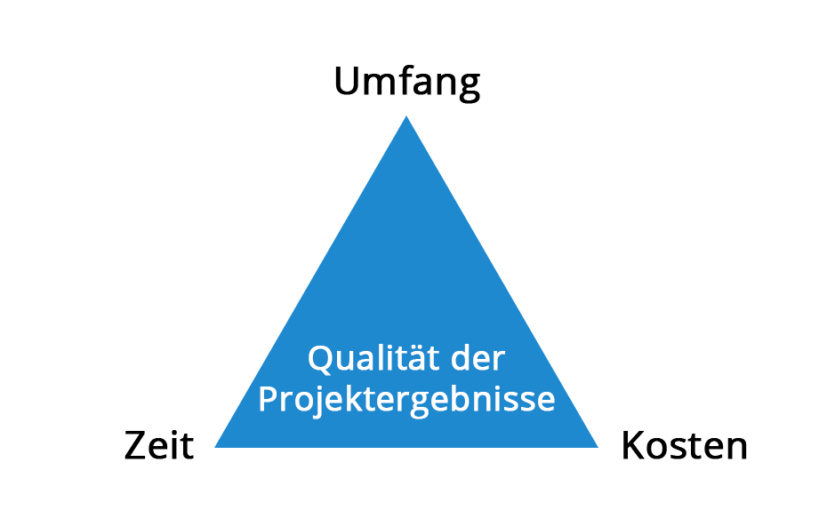

Projektmanagement lässt sich allgemein als Sammelbegriff für sämtliche Handlungen verstehen, die steuernd, planend, koordinierend und überwachend die Neu- oder Umgestaltung von Prozessen oder Systemen zum Ziel haben.[^1] Dabei kann man, unterscheidend nach Ziel und Methodik, verschiedene Arten des Projektmanagements differenzieren. Die grobe Trennung erfolgt zwischen einer klassischen und einer agilen Herangehensweise, die sich bereits durch ihre Grundauffassung, wie sich ein Problem oder Prozess lösen lässt, unterscheiden. Darüber hinaus existiert eine Mischform aus beiden Ansätzen. Welche Art gewählt wird, hängt eng mit der zu bewältigenden Projektart zusammen und wird von dieser bestimmt. Weiterhin befinden sich beide grundlegenden Herangehensweisen im Spannungsfeld des Magischen Dreiecks des Projektmanagements.

# Klassisches Projektmanagement
Das klassische Projektmanagement zeichnet sich grundsätzlich durch ein bestehendes festes Endziel des Projekts aus. Diesem Ziel werden die Ressourcen vorab bereitgestellt und nach einem festen Modell erfolgt der Projektablauf. Weiterhin wird davon ausgegangen, dass das Projektumfeld relativ stabil ist und sich demzufolge das Projekt von Start bis Abschluss durchplanen lässt. Dahingehend erfolgt die Wahl des Ablaufmodells projektbezogen. Die bekanntesten Modelle sind das Wasserfallmodell und das Spiralmodell.[^2]

## Wasserfallmodell
Das Wasserfallmodell ist ein lineares Phasenmodell. In diesem System erfolgt der Ablauf der vorab definierten Phasen nacheinander. Erst wenn der vorherige Abschnitt beendet ist, beginnt der Nächste. Die Abschnittseinteilung erfolgt projektbezogen, jedoch lassen sich 5 Grundphasen identifizieren:

1.	Anforderungen analysieren
2.	Entwurf erstellen
3.	Entwurf implementieren
4.	Test durchführen
5.	Inbetriebnahme

Dieser Aufbau ist vergleichsweise einfach und gibt den Projektmitarbeitern eine klare Vorgabe und eine einfache Orientierung. Weiterhin lässt sich der Arbeitsumfang und der Zeitplan durch die vor Beginn durchgeführte Planung bereits abschätzen. Dahingehend vereinfacht sich ebenfalls die Kalkulation des Budgets.[^3]

Problematisch ist bei diesem Modell jedoch die mangelnde Flexibilität, die sich aus der gegebenen Struktur ergibt. Ebenso wirken sich Umsetzungsfehler stark im Projektablauf aus und man muss gegebenenfalls wieder in die Entwurfsphase zurückkehren. [^3]

## Spiralmodell
Das Spiralmodell lässt sich als Modell, welches die Risikominimierung in den Fokus stellt, charakterisieren. Dabei werden durch Iteration jeweils 4 Phasen durchlaufen:

1.	Voraussetzungen
2.	Risikoanalyse
3.	Umsetzung
4.	Review der vorangegangenen Schritte und Planung der nächsten Iteration

Bei der Risikoanalyse werden die Rahmenbedingungen definiert und konkrete Lösungen vorgeschlagen. Danach erfolgt die Evaluierung der Lösungen und etwaige Risiken werden systematisiert und versucht, diese möglichst zu minimieren. Im dritten und vierten Schritt erfolgt dann die Prüfung der vorangegangenen Schritte und die Planung der nächsten Iteration.[^2]

Zentral ist hierbei die Erstellung von Prototypen, welche von Iteration zu Iteration verfeinert werden und am Projektende das Ergebnis darstellen.[^4]

# Agiles Projektmanagement
Basierend auf dem agilen Manifest aus dem Jahr 2001, besteht das agile Projektmanagement aus vier Leitsätzen:

* Individuen und Interaktionen sind wichtiger als Prozesse und Werkzeuge
* Funktionen und Software sind wichtiger als umfassende Dokumentation
*	Kundenzusammenarbeit ist wichtiger als Vertragsverhandlungen
*	Auf Änderungen reagieren ist wichtiger als einem Plan zu folgen

In diesem Rahmen nimmt der Mensch eine wichtige Rolle ein und mithin stellen Kommunikation, Einfachheit, Rückkopplung, Mut und Respekt zentrale Werte dar.[^2]

Dahingehend existiert im Gegensatz zum klassischen Projektmanagement keine fixe Struktur. Veränderung und Flexibilität finden Einzug in diesem System und der Ablauf eines Projekts baut sich iterativ auf den bisherigen Teilergebnissen auf.[^2]

Konkrete Methoden stellen hierbei Scrum, Extreme Programming und Crystal Methods dar, welche alle mit dem agilen Manifest vereinbar sind.[^2]

# Siehe auch
* [Magisches Dreieck](Magisches_Dreieck.md)
* [Wasserfallmodell](Wasserfall_Modell.md)
* [Crystal Methods](Crystal_Methods.md)
* [SCRUM](SCRUM.md)
* [Projektmanagement 4.0](Projektmanagement_4_0.md)
* [Link auf diese Seite](Projektmanagement.md)

# Weiterführende Literatur

* Handbuch Projektmanagement (https://link.springer.com/book/10.1007/978-3-662-57878-0) 

# Quellen

[^1]: Handbuch Projektmanagement (https://link.springer.com/book/10.1007/978-3-662-57878-0)
[^2]: Klassisches Projektmanagement(https://doi.org/10.1007/978-3-8349-4202-9_3)
[^3]: Wasserfallmodell - factro (https://www.factro.de/blog/wasserfallmodell/)
[^4]: Enzyklopädie der Wirtschaftsinformatik(https://www.enzyklopaedie-der-wirtschaftsinformatik.de/lexikon/is-management/Systementwicklung/Vorgehensmodell/Spiralmodell)

