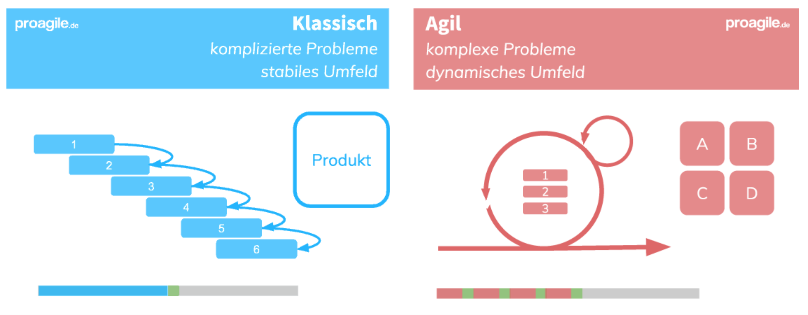

Projektmanagement ist in nahezu allen Unternehmensbranchen fundamental. Dies führt unweigerlich dazu, dass der Anwendungsbereich sehr umfangreich wird. So beinhaltet dies beispielsweise unter anderem die Baubranche, IT-Branche, Luft- und Raumfahrt und die Medienbranche[^1].  Folglich ist es wichtig zu erkennen, welche Faktoren die Auswahl des jeweils passenden Projektmanagements beeinflussen und welche grundlegende Unterscheidung es gibt.

# Projekt
Ein [Projekt](Projekt.md) beschreibt laut dem Project Management Institute (PMI) ein Vorhaben, welches zeitlich begrenzt ist und einen im Vorhinein definierten Anfang und ein Ende hat[^2]. Darüber hinaus beinhaltet auch jedes Projekt verschiedene Aufgaben in mehreren Teilbereichen, welche allerdings zur Erreichung eines gemeinsamen Ziels dienen[^3]. Das Deutsche Institut für Normung (DIN) definiert das zu erreichende Ziel als ein einmaliges Produkt, eine einmalige Dienstleistung oder ein einmaliges Ergebnis[^3].

# Projektmanagement
Das [Projektmanagement](Projektmanagement.md) besteht folglich insgesamt aus den folgenden Komponenten[^3]: 

* Führungsaufgaben
* Führungsorganisation
* Führungsmittel
* Führungstechniken 

Etwas abstrakter definiert das PMI das Projektmanagement als die „Anwendung von Wissen, Fähigkeiten, [Methoden](Methoden.md) und Techniken auf die Vorgänge innerhalb eines Projekts“[^3]. Beim Anwenden dieser Komponenten wird das Projektziel stets vor Augen gehalten. An dieser Stelle ist zu erwähnen, dass das Projektmanagement darauf hinarbeitet, dass die geplanten Ziele in der jeweils erwarteten Qualität und innerhalb des geplanten Zeitziels erreicht werden. Gleichermaßen ist es eines der Nebenziele, hierbei die verfügbaren Mittel und Ressourcen möglichst effizient einzusetzen[^3].

# Projektmanagement in verschiedenen Branchen
Die Branche, in der ein Projekt durchgeführt werden soll, ist ein relevanter Faktor bei der Wahl der jeweiligen Methode. Insbesondere bei angestrebten Softwarelösungen nimmt das branchenorientierte Projektmanagement immer mehr an Bedeutung zu[^5]. Jede Branche hat branchenspezifische Gegebenheiten und ebenso verschiedene Grade an Komplexität. Die damit verbundenen Besonderheiten aktiv in die Wahl der Vorgehensweise miteinzubeziehen, trägt maßgeblich dazu bei, eine genau passende Lösung zu entwickeln und umzusetzen. 

# Branchenspezifische Charakteristika
Jede Branche hat unterschiedliche Eigenschaften und Verhältnisse, und damit zusammenhängend branchenspezifische Rahmenbedingungen, die das Unternehmen bei seinem Projektmanagement beachten muss. Neben dem definierten Ziel und den untergeordneten Teilzielen des Projekts haben Branchen zusätzlich Einflussfaktoren wie[^4]: 
- Stakeholder
- Risiken
- Projektgröße
- Ressourcen
- Komplexität

# Unternehmensumfeld
Durch die stärkere Integration der oben genannten branchenspezifischen Faktoren in den Lösungsfindungsprozess ist es für Unternehmen leicht möglich, aus den Projekten des Unternehmensumfelds zu profitieren[^5]. So werden beispielsweise die Erfahrungen von Projekten anderer Unternehmen der eigenen Branche, welche mit ähnlichen Gegebenheiten konfrontiert sind und ähnliche Rahmenbedingungen haben, auf die eigenen Projektaufgaben angepasst und übertragen[^5].

# Branchenspezifische Anforderungen
Jede Branche hat verschiedene Grade an Unsicherheit und Komplexität der Projekte. Im Vordergrund bei der Wahl der passenden Methode für das Projektmanagement steht vor allem die Frage, wie kompliziert oder wie komplex ein angestrebtes Projekt ist[^6].

 

So ist bei einem komplizierten Projektvorhaben, welches von einem stabilen Umfeld umgeben ist, eher das klassische Projektmanagement anzuwenden[^6]. Bei komplexen Projekten mit dynamischem Umfeld ist das agile Projektmanagement besser geeignet. Von komplizierten Projekten ist dann die Rede, wenn potenziell unbekannte Probleme in einem Projektprozess mit passenden Aneignungen gelöst werden können[^6]. Des Weiteren ist bei komplizierten Projekten, wie bspw. in der [Baubranche](Bauprojekte.md) aufgrund des relativ stabilen Umfelds eine viel höhere Planbarkeit und Steuerbarkeit vorhanden[^6]. Bei komplexen Projekten wie bspw. in der [IT-Branche](IT-Projekte.md), stellt das agile Projektmanagement sicher, dass sich der Projektplan laufend an die sich ändernden Faktoren und Anforderungskriterien anpassen kann und immer aktuell bleibt[^6]. Schließlich kann man die Aussage treffen, dass bei der Wahl der geeigneten Methode die branchenspezifischen Faktoren maßgeblich sind.

# Siehe auch
* [Projekt](Projekt.md)
* [Projektmanagement](Projektmanagement.md)
* [Methoden](Methoden.md)
* [Baubranche](IT-Projekte.md)
* [IT-Branche](IT-Projekte.md)

# Quellen

[^1]:  [ProjectBase - Typische Projektmanagement-Branchen](https://project-base.org/projektmanagement/branchen/)
[^2]:  [Teamleader focus - Projektmanagement](https://www.teamleader.de/focus/projektmanagement)
[^3]: [Gabler Wirtschaftslexikon - Projektmanagement](https://wirtschaftslexikon.gabler.de/definition/projektmanagement-pm-46130)
[^4]: [Lernen - Projektmanagement](https://www.lernen.net/artikel/projektmanagement-methoden-8018/)
[^5]: [VdZ - Trends im Projektmanagement](https://www.vdz.org/personalmanagement-new-work/trends-im-projektmanagement)
[^6]: [proAgile - Unterschiede zwischen klassischem und agilem Projekten](https://proagile.de/unterschied-klassisch-agil/)

