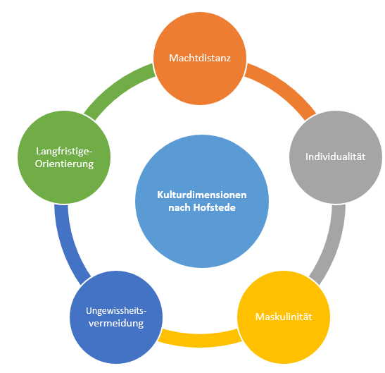

# Geographische Unterschiede im Projektmanagement

Die weltweit unterschiedliche Planung und Durchführung von [Projekten](docs.Projekt.md) resultiert häufig aus den verschiedenen kulturellen Gepflogenheiten der einzelnen Länder und Kulturen. Das [Project Management Institute](docs.PMI_Institution.md) definierte den Begriff Kultur: „Culture is the totality of socially transmitted behavior patterns, arts, beliefs, institutions and all other products of human work and thought”[^1]. Folglich handelt es sich um innere Wert, die wir von klein auf von unserem sozialen Umfeld vermittelt bekommen haben und die Einfluss auf unser tägliches Handeln und Denken haben[^2]. Die kulturelle Herkunft sorgt daher für eine unterschiedliche Herangehensweise im [Projektmanagement](docs.Projektmanagement.md). 
Nachfolgend werden verschiedene kulturelle Aspekte betrachtet, die einen Einfluss auf die geographischen Unterschiede im Projektmanagement haben. 

# Geograhische Unterschiede

## Führung

Einen großen Einfluss auf den Erfolg eines Projektes hat der jeweilige Führungsstil des Projektleiters. In seinem Werk zu Klassifizierung von Kulturen hat der niederländische Forscher Hofstede den Begriff Machtdistanz entwickelt, der das hierarchische Verhältnis zwischen Vorgesetzten und Mitarbeiter misst. Dabei weist ein sehr hoher Wert auf eine sehr hierarchische Organisationsstruktur hin, während ein niedriger Wert auf flache Hierarchien hindeutet. Im Deutschen sowie skandinavischen Raum ist die Machtdistanz tendenziell eher niedrig, in asiatischen, arabischen und südamerikanischen Ländern eher hoch. In Ländern mit niedriger Machtdistanz tritt die Führungskraft häufig als Coach auf und die [Projektmitarbeiter](docs.Projektmitarbeiter.md) agieren proaktiv und eigenverantwortlich. Währenddessen fordert der [Projektleiter](docs.Projektleiter.md) in Ländern mit hoher Machtdistanz Respekt von seinen Mitarbeitern ein und sieht sich eher als Oberhaupt an. In diesen Ländern liegt der Fokus der Angestellten auf der korrekten Erfüllung der aufgetragenen Tätigkeit und Ihre Haltung ist eher diskret und bescheiden[^3][^2].  

Grafik: Kulturdimensionen nach Hofstede[^5]: 

 

Die Grafik zeigt die verschiedenen Kulturdimensionen nach Hofstede

## Kommunikation

Neben verschiedenen Führungsstilen gibt es auch hinsichtlich der Kommunikation in Projektteams geographische Unterschiede. Im Deutschen Arbeitsalltag versucht man Probleme und Konflikte in Projekten durch ein offenes Gespräch zu lösen, gleichzeitig hat die schriftliche Kommunikation in Form der E-Mail einen sehr hohen Stellenwert [^2]. Dabei werden nicht eingehaltene Fristen häufig durch eine Erinnerungsmail adressiert. In asiatischen Ländern würde dieses Verhalten als Beleidigung aufgefasst werden, da die Harmonie am Arbeitsplatz in diesen Kulturen einen sehr hohen Stellenwert genießt [^2]. Häufig werden Probleme dann durch eine „Entschuldigungskultur“ oder durch Dritte gelöst, aber auch Ignorieren und Schweigen ist in diesen Kulturen nicht unüblich [^2][^4].  Folglich zeichnen sich asiatische Kulturen häufig durch eine indirekte Kommunikation aus, während sich die deutsche Kultur durch eine direkte Kommunikation auszeichnet. 

## Ich und Wir - Kulturen

Auch durch individualistische Ich-Kulturen sowie kollektive Wir-Kulturen können geographische Unterschiede im Projektmanagement entstehen. Gerade in westlichen Nationen sind Ich-Kulturen sehr ausgeprägt, da in diesen Kulturen das einzelne Individuum mit seinen Fähigkeiten im Vordergrund steht und dadurch Projekte mit beeinflussen kann. Dagegen sind in asiatischen, arabischen und osteuropäischen Ländern häufig kollektive Wir-Kulturen etabliert, die durch politische Systeme als auch Religionen gefestigt wurden. Dabei steht die Gemeinschaft in diesen Kulturen über allem und das jeweilige Individuum hat sich mit seinen Fähigkeiten dieser unterzuordnen [^2]. 

## Beziehungsebene

Neben den genannten Aspekten gibt es auch geographische Unterschiede in der Gestaltung von persönlichen Beziehungen in Projekten. Gerade im asiatischen, arabischen oder osteuropäischen Raum ist es durchaus üblich sich privat mit den Arbeitskollegen beispielsweise zum Sport oder zum Weggehen zu verabreden[^2][^4]. Hingegen ist dies für den Europäischen Raum eher weniger wichtig. 

# Kultureller Vergleich Deutschland - China

|                    | Deutschland                          | China                          |
| ------------------ | ------------------------------------ | ------------------------------ |
| Führung            | Flache Hierachie                     | Hierarchisch                   |
| Kommunikation      | Direkt                               | Indirekt                       |
| Ich & Wir Kulturen | Ich - Kultur                         | Wir - Kultur                   |
| Beziehungsebene    | Trennung Beruf & Privatleben         | Verbindung Beruf & Privatleben |

# Siehe auch

* [Projekten](docs.Projekt.md)
* [Project Management Institute](docs.PMI_Institution.md)
* [Projektmanagement](docs.Projektmanagement.md)
* [Projektmitarbeiter](docs.Projektmitarbeiter.md) 
* [Projektleiter](docs.Projektleiter.md)

# Weiterführende Literatur

Kulturelle Unterschiede in Projekten:
https://t2informatik.de/blog/projektmanagement/kulturelle-unterschiede-in-projekten/

# Quellen

[^1]: Kühne, A.(2011). Interkulturelle Teams: Neue Strategien der globalen Zusammenarbeit. Wiesbaden: Springer Verlag: https://link.springer.com/content/pdf/10.1007%2F978-3-8349-6822-7.pdf

[^2]: Nägele, U.(2015). Erfolgreiches Projektmanagement in interkulturellen Teams. Wiesbaden: Springer Verlag: https://link.springer.com/content/pdf/10.1007/s35764-015-0587-9.pdf

[^3]: Nägele, U. & Haller, P.(2013). Praxishandbuch Interkulturelles Management. Wiesbaden: Springer Verlag: https://link.springer.com/content/pdf/10.1007%2F978-3-658-00329-6.pdf

[^4]: Becker, L. & Gora, W. & Wagner R.(2015). Erfolgreiches interkulturelles Projektmanagement. Düsseldorf: Symposion Publishing GmbH: https://www.projektivisten.de/fileadmin/_migrated/content_uploads/Erfolgreiches-interkulturelles-Projektmanagement.pdf

[^5]: Abbildung: Kulturdimensionen nach Hofstede: https://www.wirtschafts-lehre.de/kulturdimensionen-nach-hofstede.html
